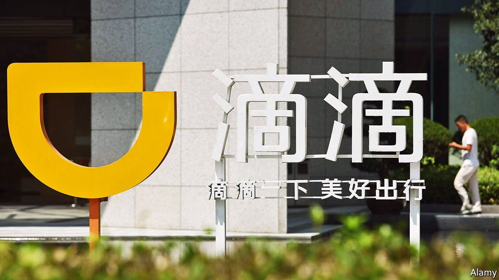

###### 

# Business this week 

#####  

 

> Jul 10th 2021 

The share prices of China’s tech giants swooned after regulators stepped up their offensive against the industry. The focus this time is on , a ride-hailing service, which was ordered to pull its app from app stores because it is being investigated for a non-specified misuse of users’ personal data. Only a few days before, Didi had completed a successful IPO in New York raising $4.4bn, the most for a Chinese company since Alibaba, which is also in the cross-hairs of officials in Beijing for becoming too powerful.

Another way that  is by cracking down on  Chinese companies that have listed their shares in America or intend to do so, this week promulgating a broad review of the rules that allow them to tap foreign capital markets. China’s actions increase the uncertainties for investors. Those who piled in to Didi’s New York offering saw the value of their stock drop by a quarter in subsequent days.


A bidding war was on the verge of breaking out for  has accepted a £6.3bn ($8.7bn) proposal from Fortress Investment, but other American private-equity firms are circling. This comes amid the fastest pace of private-equity buyouts in Britain for two decades, which some decry as a raid on companies that are undervalued on London’s stockmarket.

, avoided an IPO and listed its shares directly on the London Stock Exchange, a novelty for the City. The successful flotation of the fintech was a relief for the LSE following the disastrous IPO of Deliveroo in March, which left some wondering if tech firms should avoid the bourse.

A consortium of investors in infrastructure submitted a proposal to take over Sydney airport. At A$22bn ($17bn) it is one of Australia’s biggest-ever buyout offers.

Questions were raised about  after the cartel and its partners failed to reach an agreement on increasing oil production. Saudi Arabia and Russia want to raise output, but they were blocked by the United Arab Emirates, which wants the way its output quota is calculated to change. The White House hopes for a compromise. Without a deal, oil prices will rise, pumping up petrol prices and other inflationary pressures, hot political topics in America.

Officials from America and the European Union held talks on the EU’s proposed levy on digital companies, which America says unfairly targets its tech giants. Instead America is championing the push for a global corporate tax of at least 15%, which 130 countries agreed to on July 1st. Ireland was one of only nine countries that did not sign up.

A ransomware attack targeting users of network-management software made by Kaseya, an American firm, hit hundreds of medium-sized companies in the United States and elsewhere. It was the most widespread incident in a number of recent cyberattacks on business and governments. REvil, a ransomware gang thought to be operating in Russia, said it was responsible and demanded $70m in bitcoin to provide a universal decryptor that would unlock the affected computers.

Dozens of American states sued Google, alleging that the firm overcharges companies that sell software through its Play Store. A ruling in a similar (private) lawsuit against Apple is expected soon.

The Mexican government again signalled its dislike of private investment in the energy industry by awarding to Pemex, the state oil company, control of an oilfield that had been discovered by a private consortium. The consortium, headed by Talos, which is based in Texas, has invested $325m in the Zama field, one of Mexico’s biggest oil finds to date. Pemex, the world’s most indebted oil company, may lack the technical expertise to exploit the field.

The Pentagon scrapped a $10bn upgrade to its cloud-computing systems, saying it no longer met its needs. The Joint Enterprise Defence Infrastructure project (JEDI) had been bogged down in legal uncertainty ever since the contract was awarded to Microsoft, after Donald Trump let it be known that he did not want Amazon to get the job (Mr Trump has a long-standing feud with Jeff Bezos). The Defence Department now wants an entirely new system and will solicit proposals from both Amazon and Microsoft.

Heading for the cloud


 stepped down as Amazon’s chief executive (he is now the executive chairman). Mr Bezos still owns around 11% of the company he founded in 1994 and had led as CEO ever since. The boost to Amazon’s share price when news broke that it would once again bid for lucrative work at the Pentagon added $8.4bn to his personal fortune, taking it to $211bn, according to Bloomberg.

