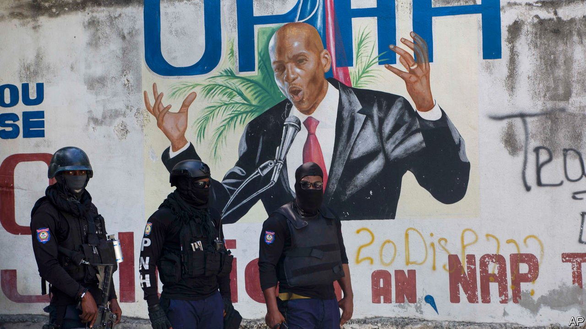

###### 

# Politics this week 

#####  

 

> Jul 10th 2021 

Haiti’s president, , was shot dead at his private residence. The police said that they killed four suspects during a gun battle and had arrested two others. It was unclear who ordered the assassination, or why. Claude Joseph, the interim prime minister, who was due to be replaced this week, said he would take charge as interim president. The opposition had been seeking Mr Moïse’s removal from office, saying his term had expired. In February the government claimed it had uncovered an attempted coup against him.

American forces left Bagram airfield, near Kabul, which had been their biggest base in Afghanistan. A small number remain in the capital, largely to protect the American embassy. After 20 years , which now looks likely to intensify. The emboldened Taliban have been seizing territory. Some of the official Afghan army have surrendered without a fight. Local warlords are raising militias to resist the jihadists.


In Brazil the Supreme Court authorised an investigation into  for failing to comply with his public duty. The case claims that the president overlooked irregularities in a deal on a covid-19 vaccine, Covaxin. A senate inquiry into the government’s handling of the pandemic is also looking into allegations that one official asked for a $1-per-dose bribe to purchase the AstraZeneca vaccine. Thousands of Brazilians took to the streets, the third mass protest in just over a month to call for Mr Bolsonaro’s impeachment.

Jacob Zuma, a former president of South Africa, was taken into custody for contempt of court. He had refused to appear before a commission investigating the corruption that was rife during his time in office.

At least 50 people were killed by security forces in Eswatini (formerly Swaziland) after protests against the rule of , Africa’s last absolute monarch. The protests began after the death of a law student, allegedly at the hands of the police. They say he died in a car crash.

Some 140 children were kidnapped from a school in Nigeria, taking to more than 1,000 the number of students and scholars abducted since December.

 told the International Atomic Energy Agency, the world’s nuclear watchdog, that it had begun the process of producing enriched uranium metal, which can be used in reactors—or to make bombs. European powers called Iran’s action “a serious violation” of the multinational nuclear accord they signed in 2015. America, which left the pact in 2018, is trying to revive it.

Egypt agreed to a compensation deal with the owners and insurers of the Ever Given, which ran aground and blocked the Suez canal for six days in March, seriously disrupting global trade. The terms were not made public. Egypt, which had demanded $550m, refused to release the vessel until a deal was reached.

Israel’s parliament declined to extend a law that denies citizenship rights to Palestinians who marry Israelis. It was the first test of the new Israeli government, which supported the extension on security grounds.

 is days away from a “social explosion”, said the country’s caretaker prime minister, Hassan Diab. Mr Diab appealed for help with a long-running economic crisis that has seen the value of the currency plummet and left much of the population short of food, fuel and medicine.

The state legislature in Texas prepared to meet in a special session. Republicans are trying to pass a bill on election procedures that critics say is intended to curb voting by blacks and Hispanics. The Republicans have the wind in their sails. The federal Supreme Court, in a 6-3 decision, recently limited the scope for challenging state voting laws on racial grounds.

 was deemed to have won the Democratic primary for mayor of New York, maintaining a lead over his rivals in a ranked-choice tally. Mr Adams, a black former police captain, ran on a law-and-order ticket; he soaked up votes in Brooklyn, the Bronx, Queens and north Manhattan.

Less than a week after it opened the resort island of Phuket to fully jabbed international visitors,  Thailand recorded its first case of covid-19 in a tourist. Thailand hopes its “sandbox” model, where visitors can avoid quarantine if they stay in Phuket for 14 days, will allow it to reopen more parts of its tourism-dependent economy.

Indonesia’s covid-19 outbreak worsened as daily cases doubled from a fortnight ago. Hospitals are approaching capacity and some have reported running out of oxygen.

Britain’s prime minister, Boris Johnson, confirmed that covid-19 restrictions would end in England on July 19th. The vaccination campaign has gone well, and although cases are surging and hospital admissions rising sharply, the number of deaths remains low. Social distancing will end, as will the mandatory use of face masks, a controversial topic in Britain. The chief medical officer, when asked, named three situations where he would still wear a mask.

Coronavirus briefs


Luxembourg’s prime minister, Xavier Bettel, was in a serious but stable condition in hospital after contracting covid-19.

In a reciprocal deal Israel said it would send 700,000 doses of the Pfizer vaccine that are about to expire to South Korea, where infections are rising. South Korea will return the same number of freshly produced jabs to Israel in September and October.

Sydney’s two-week lockdown was extended for another week. Australia’s vaccine programme is not going well.

A study found that men in England have been 30% more likely than women to test positive for covid-19 recently. It blamed football fans cramming into pubs to watch the Euro tournament. England beat Denmark 2-1 to reach its first international final since the World Cup in 1966, which, as one or two locals recall, England won.

