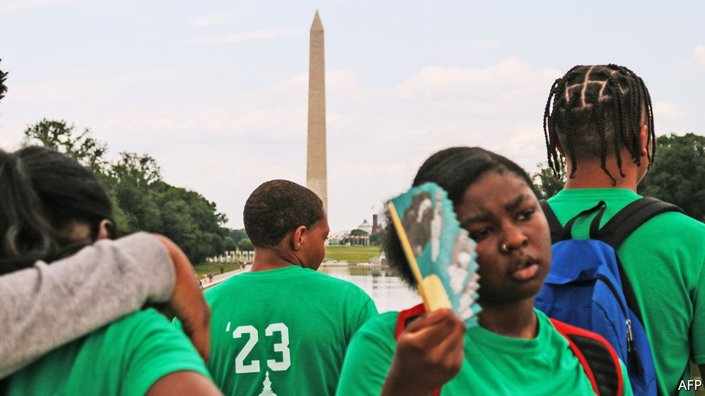

###### Patriotism and polarisation

# America’s history wars 

##### The fight over critical race theory in schools is part of a century-long battle over whose version of America is taught 

 

> Jul 10th 2021 

PARENTS ARE outraged by a new curriculum. Politicians worry that educators are indoctrinating pupils with un-American revisionist history. Progressives argue that this updated version of the curriculum reflects an American reality that should not be hidden from children. Both sides clash at school meetings, teachers are under fire. At issue could be the current controversy over critical race theory in classrooms. Or it could be one of the many skirmishes during the past century over history education, from whether it was pro-British to whether it was pro-Marxist.

Critical race theory (CRT), which has become the battleground this time, originated in the 1970s as a legal perspective that emphasised the role of systemic racism (as opposed to the individual sort) in replicating inequality. The Goldwater Institute, a conservative think-tank seeking to prevent the teaching of critical race theory in schools, describes the set of ideas thus: a “perspective…that believes all the events and ideas around us…must be explained in terms of racial identities”. Complicating the argument is the fact that some conservatives use the phrase to encompass everything from discussions about institutional racism to diversity training.


Twenty-six states have introduced measures that would limit critical race theory in public schools, according to EdWeek. Federal legislators are also piling into the debate. Seven Republican senators, including the minority leader, Mitch McConnell, reintroduced the “Saving American History Act” in June to limit federal funding to schools that use a curriculum derived from the 1619 Project, a set of Pulitzer-prize-winning essays published by the New York Times magazine that puts slavery at the centre of the nation’s founding and development (and received mixed reviews from professional historians). The federal bill, originally introduced in July 2020, is mostly symbolic: Congress has little control over state and local curriculums, and the bill is unlikely to pass when there are Democratic majorities in the House and Senate. But the politics is clear. Republicans are convinced that a war on critical race theory is good politics, even if attempts to ban it might prove unconstitutional.

Tennessee’s bill, signed by the governor in May, prohibits public schools from teaching concepts that promote “discomfort, guilt, anguish, or another form of psychological distress”. Texas’s law specifically bans the 1619 Project, prevents teachers from giving course credit for “social or public policy advocacy”, prohibits required training “that presents any form of race or sex stereotyping or blame on the basis of race or sex”, and restricts teaching that “slavery and racism are anything other than deviations from, betrayals of, or failures to live up to, the authentic founding principles of the United States.” Idaho’s legislation prevents any public institution, including colleges, from “compel[ling] students to personally affirm, adopt, or adhere” to the concepts that “individuals… are inherently responsible for actions committed in the past”. In May, Idaho’s Lieutenant Governor assembled a taskforce “to protect our young people from the scourge of critical race theory, socialism, communism, and Marxism”.

It is unclear how widely the theory, as described by either liberals or conservatives, is being taught in classrooms. According to the Heritage Foundation, another conservative think-tank, 43% of teachers are familiar with CRT, and only 30% of that group view it favourably (about one in ten overall). Even so, the National Education Association (NEA), America’s largest labour union, recently issued a statement embracing CRT.

This contest over how to tell the national story may seem new, but it is part of a century-old fight. The battle began once schooling became compulsory in all states in 1918. In the 1920s David Muzzey, a historian, was branded a traitor for his textbook “An American History”, which, according to critics, undermined the American spirit with pro-British distortions of the revolution and the war of 1812. According to Gary Nash, a historian, an opponent of Muzzey’s text claimed that American children would now sing “God Save the King” instead of “Yankee Doodle Dandy” after reading it. Attempts to ban the book were unsuccessful: it sold millions of copies.

Choose your own textbook

Other controversies followed. In the 1930s, Harold Rugg, an education professor, was accused of “Sovietising our children” by conservatives, who claimed that his textbook focused on American social ills and propagated Marxism. The McCarthy era spurred investigations into teachers labelled as Communist sympathisers. In the 1970s textbook wars led to violence in West Virginia, where protesters bombed schools and injured journalists over books with controversial multicultural content. Liberals have also attempted to censor materials. In the 1980s E.D. Hirsch, a literary critic and professor, published a list of common knowledge for American children that became a New York Times bestseller. Liberal critics accused Mr Hirsch of prioritising the achievements of white men and Western European perspectives.

Perhaps the most analogous fight, though, was in the 1990s over voluntary national history standards. The optional curriculum, originally conceived under the George H.W. Bush administration and continued under Bill Clinton, was lampooned by conservatives. Lynne Cheney, the wife of former Vice-President Dick Cheney, who was running for president, declared her opposition in an op-ed in the Wall Street Journal entitled “The End of History”. Mrs Cheney accused the standards of “political correctness” and lamented the lack of white male representation in the curriculum: Ulysses S. Grant had only one mention and Robert E. Lee had none, against Harriet Tubman’s six. The Senate passed a resolution to condemn the voluntary standards, killing the curriculum.

“These attacks are always connected to what’s going on in politics at that time,” says Mr Nash, who helped create the voluntary national standards. The Understanding America Study, a nationally representative survey by the University of Southern California, found that Americans are united on the importance of civics education for children. With little partisan disagreement, a majority of parents agree that it is important for children to learn how the government works (85%) and about voting requirements (79%).

But political differences emerge over who should appear prominently in history lessons. Parental opinion diverges on the importance of learning about women (87% of Democratic parents favour this versus 66% of Republican parents) and non-whites (83% versus 60%). The divide is greater on discussions of inequality. A majority of Democratic parents said it was important for pupils to learn about racism (88%) and income inequality (84%) compared with less than half of Republican parents (45% and 37% respectively).

Conservatives tend to argue that pupils should learn one unified, optimistic version of American history, and that learning about specific groups is divisive. “Critical race theory is destructive because it advocates for racial discrimination through affinity groupings, racial guilt based on your ethnicity not your behaviour, and rejects the fundamental ideas on which our freedom is based,” explains Matt Beienburg of the Goldwater Institute. Meanwhile, liberals are open to a more fragmented, less flattering version of the country’s past.

It is this view which seems to be gaining ground. Howard Zinn’s “A People’s History of the United States” (told from the perspective of women and racial minorities) is also grouped under the critical-race-theory debate by the Goldwater Institute: it has sold 2m copies since 1980. The 1619 Project is taught in many school districts including Chicago. According to the NEA, nine states and the District of Columbia have laws or policies establishing multicultural-history or ethnic-studies curriculums.

Greg Lukianoff, president of the Foundation for Individual Rights in Education, a non-profit organisation, urges liberal Americans to take conservative concerns seriously, or potentially face a “terrifying” boost of far-right nationalism. “It is going to get more intense as polarisation gets worse and as trust goes down,” he says. If each successive history war grows more intense, he adds, “Where do we end up in ten to 20 years?” ■

