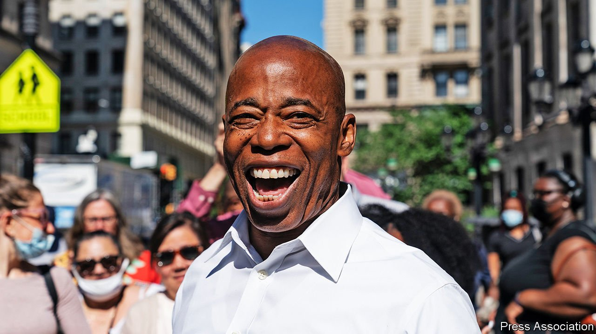

###### Adams’s Apple

# Eric Adams is poised to be New York’s next mayor 

##### His pragmatism may serve the city well 

 

> Jul 10th 2021 

“SOME PEOPLE talk about police brutality. I want to tell you how it is to live through it.” So begins the video that launched Eric Adams’s mayoral campaign. In the clip he stands outside the police station in Queens where, when he was 15, police beat him and his brother. Despite this experience, or maybe because of it, he later joined the police force, eventually becoming both a police captain and a prominent internal critic of racism and brutality at the NYPD. In his campaign he blended a call to reform the police with respect for the badge and a pledge to crack down on crime, and on July 6th, two weeks after the Democratic primary, he was named the projected winner. That almost certainly makes him the next mayor, since Democrats outnumber Republicans in New York’s electorate by seven to one.

In the city’s first election by ranked-choice voting, the two candidates that rose to the top of a crowded field were both relative centrists. Mr Adams, who also served as a state lawmaker and Brooklyn borough president, won by just 8,426 votes, or 1%, over Kathryn Garcia, a well-regarded bureaucrat. His emphasis on fighting crime clearly gave him an edge. While progressive candidates called for cutting police funding, Mr Adams argued that “the prerequisite for prosperity is public safety.” That message resonated as shootings last year nearly doubled from 2019 and violent crime escalated even in well-policed areas like Times Square. According to one poll New Yorkers listed crime among their three top concerns, with covid-19 and housing. On the day Mr Adams learnt he had won, Andrew Cuomo, New York’s governor, declared a “disaster emergency” statewide around gun violence.


It was a strange campaign. For months the many candidates met at forums via Zoom. Andrew Yang, a former Democratic presidential candidate, led at first, before a limited knowledge of city affairs caught up with him. As Mr Adams surged, his rivals tried to turn his anti-crime message against him. “Eric thinks the solution to every problem is a badge and gun,” said Maya Wiley, a progressive candidate who placed third. He had other liabilities, including having been a Republican for a time, and he committed his share of gaffes, such as telling gentrifiers to “Go back to Iowa”. His biggest donors are from the real estate industry, with which he built ties as borough president, a job that gave him influence over land use. Those relationships are likely to draw continued scrutiny. But in the primary even questions over whether he actually lived in New Jersey did not seem to hurt him.

For years the key to winning City Hall was to build a coalition outside Manhattan, particularly among white voters. That was how Ed Koch won in the 1970s and 1980s and how Rudy Giuliani won in 1993. Mr Adams also focused on the outer boroughs, but he built a multi-racial coalition of African-American, Dominican, Latino and Jewish New Yorkers. He also enlisted labour groups and pastors. He courted working-class voters with an unpretentious style, drawing a contrast with the current mayor, Bill de Blasio, who gets driven to the gym. Mr Adams intends to cycle, take the subway and even do laundry himself. Saying that “if we don’t educate, we will incarcerate,” he pledged to increase the number of charter schools, independently operated public schools which appeal to parents frustrated with the traditional system.

That’s a message that resonated as well on Wall Street, which, unlike some of his opponents and Mr de Blasio, Mr Adams did not demonise. After some politicians attacked a plan by Amazon to expand in Queens, causing the company to back out, Mr Adams later warned the message was “New York is no longer open for business.” As some firms and many workers decamped during the pandemic for business-friendly states like Florida and Texas, Mr Adams said, “We are in the business of recruiting human beings. That is the job of a city, and we have been a terrible recruiter over these last few years.” He plans a recruiting effort to attract workers and businesses from around the world.

Assuming he defeats Curtis Sliwa, the beret wearing, long-shot Republican candidate, Mr Adams will become the city’s second African-American mayor. He will also have a notoriously hard job, made harder by the pandemic. Federal recovery funds have propped the city up, but Bloomberg News reports the city expects property tax revenue to drop $1.6bn, or about 5%, this coming fiscal year. That would be the biggest drop in three decades. The value of office buildings has fallen citywide by 16%. Tourists, a critical input to New York’s economy, have yet to return in big numbers, and only 12% of office workers are back at their Manhattan desks.

Mr Adams has called for budget cuts of 3-5% at city agencies to rein in spending (New York City’s budget is nearly $100bn). He plans to work informally with Mr de Blasio in order to hit the ground running. “He is ideologically flexible,” says Robert Snyder, Manhattan borough historian, “and he’s very pragmatic.” After the rigidly progressive Mr de Blasio, New York could use both of these qualities.■

