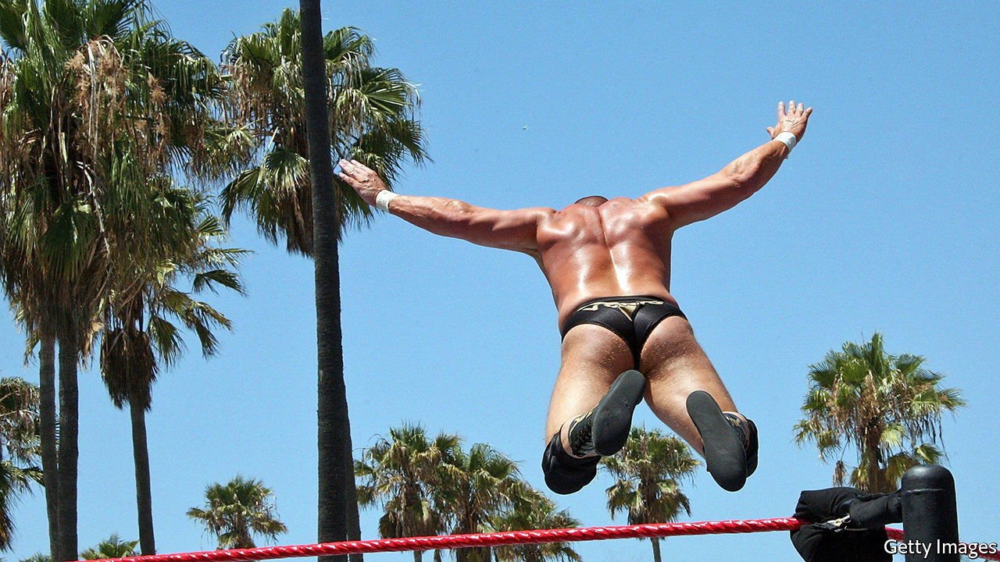

###### Wrestling with common sense

# How wrestling, conspiracy theories and politics overlap in America 

##### Mitt Romney compared the election conspiracy to pro wrestling. This was perhaps truer than he realised 

 

> Jul 10th 2021 

POLITICIANS EXAGGERATE, but understatement is a rarer quality. When in June Mitt Romney witheringly likened the conspiracy theory that last year’s presidential election was stolen to professional wrestling, the Republican senator from Utah might not have realised quite how apt the comparison is. Wrestling and conspiracy theories have much in common. Both tell improbable stories of cartoon villains and larger-than-life heroes. Convoluted but compelling plot lines are woven together to create a world of drama and intrigue more engaging than humdrum reality. They even share some of the same cast.

Big names from the past, such as Val Venis and Chris Jericho, have become enthusiastic conspiracy theorists. Given how many chairs to the head wrestlers take over a career, perhaps this is not surprising. And some have stepped into politics. Jesse “The Body” Ventura, a wrestler and former governor of Minnesota, once hosted a TV show investigating claims that the CIA had been turning citizens into assassins with hypnosis, and that oil companies caused the Deepwater Horizon oil spill in 2010 to profit from the clean-up. Alex Jones, the founder of Infowars, an internet purveyor of bogus conspiracy theories and useless supplements, was a frequent guest. The show’s co-host for a time was June Sarpong, later director of creative diversity at the BBC, Britain’s public broadcaster.


Occasionally wrestlers’ conspiratorial beliefs seep out into the real world. In 2013, immediately after the Boston Marathon bombing, Governor Deval Patrick of Massachusetts was asked at a press conference if the attack was a “false flag”, conspiracy-theorist lingo for an operation deliberately designed to implicate an innocent party. The questioner was “Bionic” Dan Bidondi, an Infowars “reporter” and semi-pro wrestler. In May World Wrestling Entertainment cut ties with Drake Wuertz, a referee. His conspiratorial beliefs had received some attention in the sport’s press, but become impossible to ignore when he berated a Florida school board over its mask mandate with a passion usually reserved for the ring, saying it “plays into the hands” of child sex-traffickers.

The two worlds also share an omertà-like code. Wrestlers’ commitment to “kayfabe”, the imperative never to break character in case it ruptures the suspension of disbelief, occasionally borders on ludicrous. The Wild Samoans, a tag-team duo, were travelling with fellow wrestler Terry “Hulk Hogan” Bollea when a state trooper discovered Mr Bollea’s unregistered firearm. According to wrestling lore the Wild Samoans said nothing—their characters did not speak English, so neither would they.

Mr Jones, whose show once hosted Donald Trump (himself a participant in Wrestlemania 23), seems to live by a similar code. In a hearing over the custody of his children, his lawyer suggested that his rants about the deep state and 9/11 should be discounted as evidence because he was really a “performance artist”. His lawyer might out him, but Mr Jones would never break kayfabe. His credibility and livelihood depend on it.

