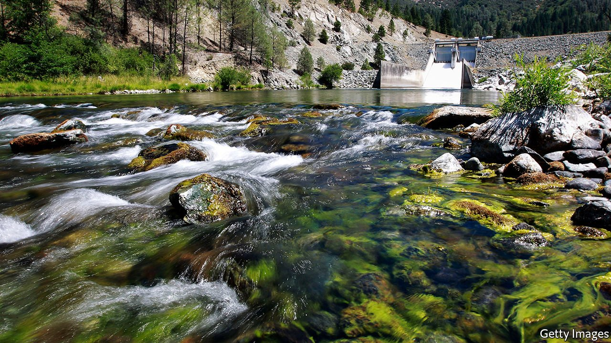

###### Dammed if you do

# In the Pacific north-west, hydroelectric dams are being removed 

##### This may be good news for salmon. It is less good for carbon-dioxide emissions 

 

> Jul 10th 2021 

HERE IS A dilemma for environmentalists: more salmon or a continued flow of hydroelectric power? This question has been at the heart of a battle over the scenic Klamath river, which flows from Oregon through a long stretch of northern California. On the river’s upper inland reaches, four hydroelectric dams produce enough power for 70,000 homes, and are capable of generating twice as much. But, detractors say, the dams prevent salmon and other migratory fish from reaching spawning grounds farther upstream. They argue that the dams must therefore be torn down.

Barring a surprise, that argument has prevailed. On June 17th the Federal Energy Regulatory Commission (FERC) granted a crucial approval needed for what will be the biggest dam-removal project in American history. Jared Huffman, a pro-removal Democratic congressman whose district includes the Klamath river’s undammed lower stretch, says the FERC’s decision means the opposition’s chances to derail the project are now an “extreme long shot”. The energy company, PacifiCorp, which is based in Portland, Oregon, plans to replace the hydropower by increasing electricity production elsewhere. Two-thirds of PacifiCorp’s generation is powered by fossil fuels, mostly coal.


Indigenous groups who fish salmon have led the charge for the dams’ removal. Barry McCovey, a scientist who is head of fisheries for the Yurok tribe, which lives along the Klamath’s lowest stretch near the Pacific Ocean, says the number of salmon that enter the river to spawn has tumbled since outsiders first arrived en masse in the 1850s. Salmon fishing, even for sport, is now sharply restricted.

The salmons’ decline has accelerated of late. Reduced rainfall is partly to blame. This has lowered and warmed the river, a predicament exacerbated by sunlight-absorbing artificial lakes behind the dams. As a result, fish parasites and blooms of toxic algae that devour oxygen have flourished. Sam Gensaw, a Yurok who guides tours in traditional canoes carved from redwood trunks, says living downstream from the dams “is like slowly being spoon-fed poison”. A municipal official in Arcata, a coastal city an hour south of the river’s mouth at the Yurok town of Klamath, sums up the local sentiment: remove the dams to “flush the ick out”.

Dambusting

The demolitions are set for 2023. How much this will boost salmon numbers, however, is debated. Some argue that lava flows now submerged by the dams have stopped many salmon migrating farther upriver since time immemorial. This is why salmon don’t appear in upriver ancestral stories of the Shasta Nation, an indigenous group in the area, says its chief, Roy Hall. He attributes the dwindling salmon more to global warming, and calls the removal of the dams “environmental madness”. Once the lakes are drained, he fears that Shasta burial sites now underwater will be desecrated by pottery hunters.

Of the four dams, only the one highest upriver has a fish ladder for migratory species. PacifiCorp describes it as “antiquated”. Proponents of saving the dams have pushed for the other three to be fitted with ladders or even “fish cannons”—tubes that shoot salmon over dams elsewhere. But proposals to install such aids have failed to gain traction. Cost is not the only reason. As Mr McCovey, the Yurok fisheries official, puts it, the goal is to restore nature, not build “more anthropogenic bullshit”.

Sentiments of the sort are echoed by other Yurok, a tribe that considers itself California’s largest. Amy Cordalis, a lawyer for the the Yurok, describes the dams as “a beacon of colonisation”. Frankie Myers, a senior elected Yurok official, calls the dams “monuments to genocide”. Mr Myers says that as a young man he would sneak into outsiders’ logging camps to “monkey-wrench” operations by, for example, spiriting away diesel. Taking down the dams, he says, is “a slap in the face” for what he deems the pursuit of material gain at the expense of indigenous ways of life.

Upriver, attitudes differ. Referendums in conservative logging, ranching and farming counties inland reveal overwhelming support for the riverine status quo. These areas are hotter and drier than coastal redwood forests, so wildfires are common. Firefighting aircraft can scoop up water from the reservoirs without landing, notes William Simpson, whose ranch near one, Copco Lake, was saved from a recent fire. He calls dam removal “reckless”.

The political battle has become a microcosm of polarisation in America. So says Craig Tucker of Suits and Signs, a small political consultancy hired by the Yurok to tilt public opinion and negotiate with government, corporations and other stakeholders. Mr Tucker, who is based in McKinleyville on the coast, describes some inland counties as “a hotbed” of “anti-government patriot groups”. In liberal beach towns like Arcata, where hipsters, some in pyjamas, visit a marijuana dispensary in the downtown shopping district, support for the dam removals is strong. Betsy Musick, proprietor of a diner-cum-gallery in Trinidad, a picturesque coastal village near Klamath, describes the conservative-liberal dichotomy as “lumber and pot”.

PacifiCorp, for its part, has played the controversy brilliantly, at least as far as its bean-counters are concerned. Though the dams are structurally sound, the FERC made it clear that licence renewals would be subject to “maximum conditions”, says Scott Bolton, PacifiCorp’s point man for the dams. Building fish ladders and jumping through other FERC hoops would cost perhaps as much as $650m, he reckons. It will therefore be cheaper to tear down the dams. PacifiCorp has managed to secure $250m of the project’s $450m cost from taxpayers. The remainder is being raised with higher electricity bills.■

