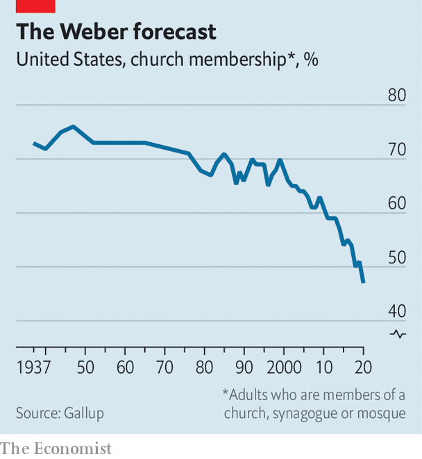

###### None of the above

# Nothing in particulars are America’s fastest-growing religious group 

##### They believe in God, do not go to church and are largely detached from politics 

 

> Jul 10th 2021 

IN APRIL 1966 Time magazine stirred outrage in America when it published a cover story asking “Is God Dead?”, more than 80 years after Nietzsche had declared Him to be so. Today American religion looks less exceptional. According to a recent survey by Gallup, a pollster, for the first time a majority of Americans do not belong to a church. “We are officially living in a pagan nation,” rued the editor of one Catholic magazine. Pollsters attribute the slump in church membership to the rise of the “nones” or religiously unaffiliated, who now represent a third of the population. Yet it is a subgroup of the nones, those who believe in “nothing in particular”, that is redrawing America’s religious landscape.

Though usually lumped in with atheists and agnostics under the religiously unaffiliated category, nothing-in-particulars are a distinct religious group. They are twice as numerous as atheists and agnostics—nearly one in four Americans are nothing-in-particulars—and are growing faster than any religious group. As the cryptic name suggests, their defining characteristic is an aversion to being defined.


“They do not want to be pinned down,” says Ryan Burge, a social scientist and author of “The Nones”. In some ways they are remarkably average: unlike atheists and agnostics, who are predominantly younger men, they are more likely to be middle-aged, and are just as likely to be women as men. The majority of nothing-in-particulars believe in God, and a third of them attend church sporadically. Yet they reject allegiance to any religious group and are sceptical of institutional authorities. Wariness towards the covid-19 vaccine is an example of this tendency.

 


Mr Burge says nothing-in-particulars are alienated from society in more ways than just religious affiliation. They have the lowest educational attainment of any big religious group—only one in five have a bachelor’s degree or higher qualification. Nearly 60% make less than $50,000 a year. When it comes to politics they lean neither right, like most white evangelicals, nor left, like atheists or black Protestants. (Only a third of them voted for Donald Trump according to Mr Burge’s analysis of the Cooperative Election Study.) They rarely take part in political activities, such as attending a protest, donating money to a campaign or even putting up a sign in the yard. “Apathy is the big word that comes to mind,” says Mr Burge.

Whereas Christianity has dwindled in America, nothing-in-particulars are growing at a breathtaking pace. Since 2008, when social scientists first began tracking them, their ranks have swelled by 60%. Mr Burge reckons there are two reasons for their rise. First, as America’s religious makeup changes, it is becoming more acceptable not to identify as a Christian. It could be that their emergence is less about people leaving organised religion than revealing they were never really part of it. Nothing-in-particulars are largely drawn from that segment of Americans who have become disaffected as they have seen their economic prospects sink with recessions and the loss of well-paid blue-collar jobs. “They are just left out of society, sort of drifting in space,” Mr Burge says.■

