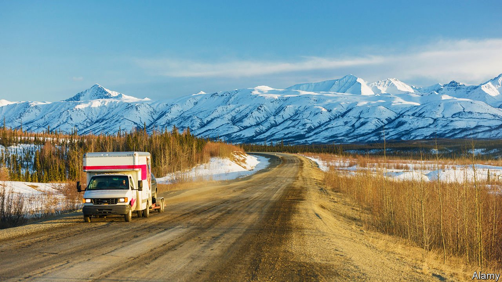

###### Baby, you can’t drive my car

# The pandemic has upended America’s rental-car market 

##### Some travellers are finding crafty alternatives 

 

> Jul 10th 2021 

HAWAIIANS COULD be forgiven for bewilderment when they saw U-Haul trucks and cargo vans parked on their pristine beaches. In April Kaleo Alau, president of U-Haul in Hawaii, told the local news station that the moving company had received calls from concerned citizens who thought the vehicles’ position looked suspicious. “We’re like, OK, let’s go and check it out, make sure it’s not stolen,” said Mr Alau. As it turns out, “it’s just somebody at the beach!” Hawaii is not the only state where Americans are resorting to unusual forms of transport to get around. The country is facing a national shortage of rental cars because of the recession and disruptions caused by the pandemic.

When lockdowns were imposed last spring, travel came to a standstill. The market for car-hire at airports disappeared almost overnight, says Greg Scott, a spokesman for the American Car Rental Association (ACRA), a trade group. ACRA members laid off or furloughed around 60,000 employees in 2020, about a third of the industry’s American workforce. Hertz, a car-hire behemoth, declared bankruptcy last May. Avis, another industry giant, saw its second-quarter revenues decline by 67% year-on-year. Companies sold off their fleets to try to stop the bleeding. They weren’t sure if or when demand would recover.


Fast forward, and the summer of 2021 seems to mark a renaissance for the great American road trip. Americans hankering for a getaway but unable to travel abroad have set their sights on Hawaii, Florida or the national parks. Demand for rental cars has rocketed. But because companies have sold off so many vehicles, there are few to be found. An Expedia search for a hire car in Honolulu next weekend showed cars costing at least $350 a day. Twitter is filled with the fulminations of aggrieved travellers who wait hours at an airport counter only to be given a minivan—or nothing at all.

For rental-car companies, rebuilding fleets will take time. An international shortage of semiconductors, which are used in cars’ electronic systems, has slowed manufacturing. A lack of new cars and, perhaps, a hesitancy to return to public transport have pushed up second-hand car sales by 30% in the past year. Things aren’t all bad, however. Barclays, a bank, suggests high prices are helping firms recoup their losses.

All this explains the curious case of the U-Haul on the beach. But the firm is not the only alternative to rental cars. Lyft launched its own car-hire service in 2019, though it too admits that the chip shortage has hurt growth. Some are turning to ride-hailing apps, but prices per ride have spiked because of a lack of drivers. Outdoorsy, an RV rental platform, has seen bookings for its smaller offerings—such as Jeeps and trucks—increase by 10% year-on-year. It seems that the rental car market would have to get even tighter for Americans to fall in love with public transport.

