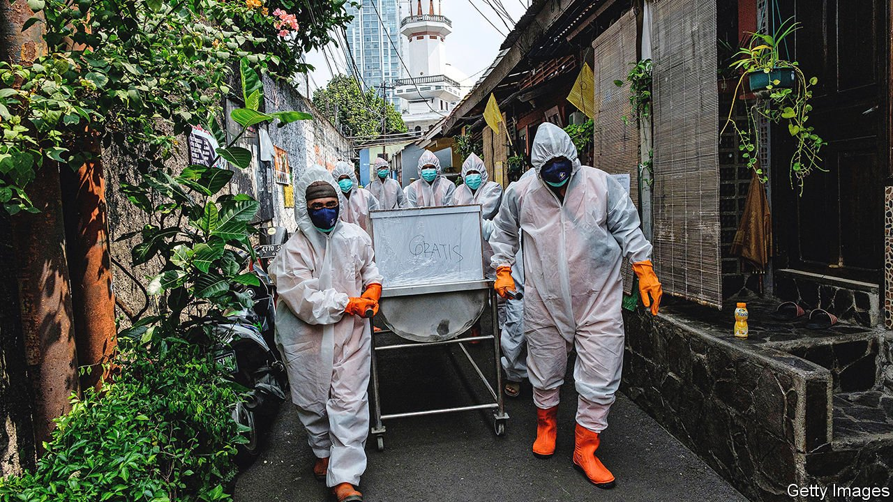
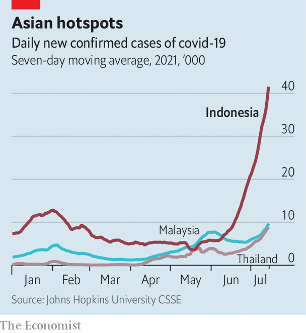

###### The next catastrophe

# A wave of covid-19 is engulfing Indonesia 

##### The government’s response is too little, too late 

 

> Jul 15th 2021 

TRI WAHYONO was trying to keep it together. It was rush hour on a weeknight in late June in Yogyakarta, a city on the Indonesian island of Java, but the streets were almost empty. It had been like that for a couple of weeks, since the number of covid-19 cases in the city had begun to spike. Mr Tri was speeding through the streets on his motorbike, searching for a hospital that would admit his 63-year-old mother, gasping for air in the makeshift ambulance behind him. The first one was full. The second one had run out of oxygen. As they pulled up in front of the emergency ward of yet another hospital, four medics in protective gear rushed out to meet them. Mr Tri hoped for a “miracle”, but by then it was too late. He chokes back tears remembering how his fear of catching the virus prevented him from holding his mother in her last moments.

South-East Asia is swimming in covid-19. For much of the past year, it had far fewer cases than Europe and North America. But low rates of vaccination, limited testing and the arrival of new, more transmissible variants mean the disease is surging through the region. Cambodia, Myanmar, Thailand and Vietnam are posting record numbers of new cases each day. Malaysia has the highest caseload in the region relative to population.


But in absolute terms, Indonesia has the . It surpassed other hotspots like India and, for a time, even Brazil. The daily number of new infections has grown by a factor of ten in the past month, exceeding 54,000 on July 14th. And because testing is patchy, the virus is likely to be much more widespread than these figures suggest. The proportion of tests that come back positive—a whopping 26%—suggests that the disease is running rampant.

 


Indonesia’s health-care system is drowning. Over the past five weeks, the number of hospital patients has more than trebled to around 81,000. Nearly three-quarters of hospital beds are now occupied, according to the Indonesian Hospital Association. On the island of Java, where most Indonesians live and most cases are found, only a few hospitals are still admitting patients. On July 5th the health minister said: “Hospitals are full.” Oxygen supplies are running dangerously low. Because of the shortage of medical supplies and equipment, doctors report being forced to choose which patients will live and which will die.

On July 5th the health minister urged those with mild symptoms to refrain from going to hospital. Many Indonesians are taking his advice. Some who stay at home are dying. LaporCovid-19, an NGO which collects data on the pandemic, has recorded 451 instances of infected people perishing while self-isolating or looking for a hospital. The true number is likely to be much higher. There has been a steep rise in deaths since June, says the UN’s World Health Organisation.

The rapid spike in cases and the “collapse” of the health-care system, as Pandu Riono, an epidemiologist at the University of Indonesia, puts it, have invited comparisons to India, another big country with a weak health system. But Indonesia is even more poorly equipped to deal with such a crisis. It has just four doctors for every 10,000 people—less than half India’s ratio. Deaths from covid-19 relative to population are higher now in Indonesia than they were in India at the height of the outbreak there, at least according to the official data.

Several factors have exacerbated the latest outbreak. The government never imposed a full lockdown, for fear of paralysing the economy and impoverishing the country’s millions of informal workers, who cannot toil from home. The restrictions that it did impose were poorly enforced. During Eid, a recent Muslim holiday, 1.5m people intent on celebrating in their home villages flouted a travel ban—an example of “herd stupidity”, as Dr Pandu puts it. The travellers brought the pernicious Delta variant with them from the cities to the countryside. It now accounts for some 90% of cases in the country.

Most Indonesians are not protected against the virus. Just 7% have been double-jabbed. The elderly are particularly vulnerable. The government, which at first prioritised vaccination for those of working age, did not begin jabbing the elderly for over a month after shots became available in mid-January. This was a mistake, says Dicky Budiman of Griffith University in Australia.

Making matters worse is the shortage of health workers. Although 97% of them have been fully vaccinated, the vast majority have received the shot from Sinovac, a Chinese firm, . The Indonesian Hospital Association surveyed big state-run hospitals across Java’s main cities and found that 10% of their staff had tested positive. LaporCovid-19 found that 131 vaccinated health-care workers had died since June, 50 of them in the first week of July.

The government has sprung into action. It is trying to accelerate vaccination. In early June it expanded eligibility for jabs to anyone over the age of 18. In July it announced new rules to slow the disease’s advance. Houses of worship, malls and restaurants on Java and Bali, another island, have closed their doors until July 20th. Non-essential workers on those islands must work from home. Big roads in some cities have been blocked off. On July 10th, in a sign of its growing concern, the government announced that these restrictions would also be imposed in 15 provincial capitals outside Java and Bali. It may extend the curbs by six weeks.

For Dr Pandu, the government’s efforts are too little, too late. He thinks measures to suppress the virus should be much stricter. The government says it will think about further restrictions. That will be little comfort to Mr Tri. ■

A version of this article was published online on July 11th 2021

Dig deeper

All our stories relating to the pandemic and the vaccines can be found on our . You can also find trackers showing ,  and the virus’s spread across  and .

