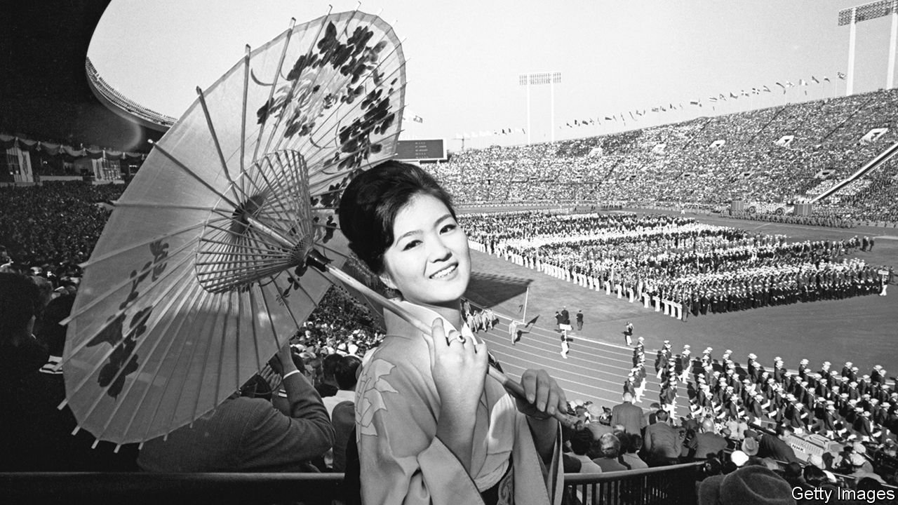

###### No fun and games

# Japan is struggling to keep covid-19 at bay at the Olympics 

##### It has banned spectators and fraternising among athletes, among other things 

 

> Jul 15th 2021 

WHEN THE world’s best athletes gather for the Olympics every four years, they do a lot more than run, jump and swim. In a memoir published after the previous Tokyo games, in 1964, Dawn Fraser, an Australian swimmer, pulled back the curtain on life inside the Olympic bubble. “Olympic morals are far more loose than any outsider would expect,” she wrote. The village’s reputation for debauchery has only grown since. Organisers began handing out condoms to athletes in 1988, ostensibly to raise awareness about HIV; at the last summer games in Rio de Janeiro in 2016, they handed out a record-breaking 450,000. As one former Olympic skier put it to ESPN  The Magazine, an American sports publication, the Olympic village is “just a magical, fairy-tale place, like ‘Alice in Wonderland’, where everything is possible. You could win a gold medal and you can sleep with a really hot guy.”

At this year’s Olympics, the atmosphere will be gloomier, duller, chaster. For the athletes, life in the village will be circumscribed, as laid out in a 70-page book of prohibitions. They have been asked to arrive in Japan as late as possible (no earlier than five days before the start of their events) and to leave as soon as possible (within two days after their event’s end). They must present negative results in two tests taken during the four days before they leave for Japan, and another negative test result on arrival. Though more than 80% of athletes are expected to be vaccinated, they will undergo daily tests, with a confirmed case leading to possible disqualification. Masks will be mandatory except when sleeping, eating and competing, meaning that athletes will be required to wear them even while working out in the Olympic village’s gyms and, if they make it that far, while standing on the podiums to receive their medals. They will not be allowed to go anywhere except to their accommodation and competition venues. All meals must be eaten quickly and without mingling at the village’s cafeteria. Alcohol will not be served in the village, and drinking in groups or in public areas will be forbidden.


The athletes will not be the only ones on lockdown. Japan’s government has declared a state of emergency in Tokyo and three surrounding prefectures to last until August 22nd, long after the Olympics finish. The government does not have the authority to limit the public’s movements, but other restrictions will put a damper on any celebrations: restaurants are being asked to close by 8pm and not to serve any alcohol; residents are implored to avoid “non-essential” outings.

There will be no viewing parties; a promenade near the Olympic Village which had been envisioned as a raucous fan zone will be closed. Tokyoites have been asked to enjoy the games on TV from their homes. Nearly all of the events will be held without fans, foreign or domestic. “It will feel very jarring,” says Sakaue Yasuhiro of Hitotsubashi University in Tokyo: “People are being told not to go out, not to meet up, not to have drinks; kids’ sports days are being cancelled—and yet a global sporting event is going forward.”

The contortions are the price for staging the games despite the pandemic, a state of affairs the government’s main medical adviser, Omi Shigeru, has called “abnormal”. Though Japan’s vaccination campaign has picked up pace after a slow start, only 21% of the population is fully inoculated. Rates are much higher among the elderly (some 75% of Tokyoites over the age of 65 have received at least one jab), leading to a decrease in deaths and seriously ill patients in the capital. Nonetheless, Tokyo recorded 1,149 new cases on July 14th, the highest tally since January. The spread of the more infectious Delta variant worries medical experts. Christian Tagsold of the University of Düsseldorf quips that the circumstances of these Olympics bring to mind “Akira”, a cult Japanese manga and anime from the 1980s that depicts a post-apocalyptic “Neo Tokyo” hosting the Olympic games in 2020.

Organisers admit that it will be impossible to control the virus completely. A handful of athletes and officials arriving early have already tested positive. The authorities hope instead to avoid an Olympian outbreak. That will require compliance not just from athletes, but from 53,000 officials, staff and press who are expected to attend. They will be bound by a “written pledge”, but face less drastic penalties for misbehaving than the athletes, who risk disqualification. Many worry they will be less rule-abiding than the Japan ese public, which has tended to heed the government’s requests.

Those fears were amplified this week when four foreigners working for a subcontractor at a venue were arrested on suspicion of cocaine use in a nightlife district far from the Olympic facilities. Pandemic or not, the Olympics will be a temptation for some to party. That may be one reason why the organisers backtracked on plans to hand out condoms in the village this year. Instead, the athletes will receive their prophylactics only when they leave Japan. ■

