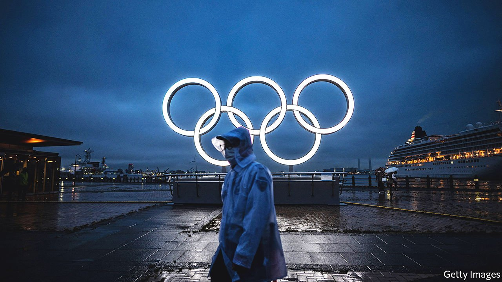

###### Rings on the ropes

# The 2020 Olympics will be memorable, but not in the way Japan hoped 

##### Even if disaster is averted, a sense of national renewal will remain elusive 

 

> Jul 15th 2021 

CLOUDS GATHERED over Komazawa stadium in Tokyo as the Olympic torch arrived on July 9th. Because of the pandemic, the traditional public relay was replaced by a small ceremony behind the stadium’s closed doors. Protesters outside held signs that read “Protect lives not the Olympics” and “Extinguish the Olympic torch”. As Kyogoku Noriko, a civil servant, put it, “Now is not the time for a festival.” More enthusiastic onlookers lined a nearby footbridge, hoping to catch a glimpse of the flame through the stadium’s rafters. For Honma Taka, an office worker, the torch offered “a bit of light within the darkness”.

Mr Honma longingly recalled a brighter day in the same park eight years earlier, when he joined thousands of others to celebrate as Tokyo won the right to host the games. Abe Shinzo, Japan’s prime minister at the time, said he was happier than he had been when he became prime minister. Mr Abe saw the Olympics as a chance to lend credence to his bullish catchphrase: “Japan is back”. He hoped the games would help the country snap out of its gloom after decades of economic stagnation, demographic decline and devastating natural disasters. The games, says Taniguchi Tomohiko, a special adviser to Mr Abe, were seen as a source of “a commodity that was in scarce supply: hope for the future”.


The grand designs had a powerful precedent in the previous Tokyo Olympics, in 1964. Just two decades after defeat in the second world war, those games came to encapsulate both Japan’s rise from the ashes and its re-entry into the global community. Tokyo, which had been reduced to cinders by American firebombing, was smartened up. New roads and rail lines, including the first shinkansen, or bullet train, were built. “There was a feeling in the 1960s that everyday life was becoming richer: today is better than yesterday, and tomorrow will be better than today—and the Olympics became a symbol of this,” says Togo Kazuhiko, a former ambassador who was a student at the time. The excitement left a lasting impression on a generation, including Mr Abe, who invoked his childhood memories of 1964 when Tokyo won the bid for this year’s games.

If not for the pandemic, excitement may well have materialised again. The current  has had its share of controversies, from an over-budget stadium to rank sexism from the (now departed) head of the organising committee. Nor would a sporting event alone be enough to resolve Japan’s problems. But the games were shaping up to be a source of pride. Tens of thousands of young Japanese had signed up to volunteer. Japan planned to welcome 40m foreigners in 2020, when the games were originally scheduled. Tourists would have found an impeccably clean, safe, well-run metropolis. Akita Hiroyuki, a commentator for Nikkei, a Japanese daily, reckons that the Olympics could have been a “white ship” that catalysed the country to “wake up and open up”. (The Americans who forced Japan to open to the world in the 19th century arrived in “Black Ships”.)

Instead, the games will be held without fans, foreign or domestic, in a city under a state of emergency. Ito Yuko, one of the fans gathered outside Komazawa stadium, lamented that the mood is “200% different” from 1964, when she first fell in love with the Olympics. Rather than coming together for the games, Japan has been riven by them. Recent polls show that as many as 80% of Japanese did not want them to go ahead this year.

The sense that national leaders are pulling an unwilling population into a disaster has led to comparisons not with the previous Tokyo Olympics, but with the war that preceded them. Even Emperor Naruhito, who almost never speaks about politically sensitive matters, has made his concerns about pressing on with the games known.

Opposition to the Olympics stems only in part from fears of covid-19. Japan has managed the pandemic well by global standards, with just 15,000 deaths; Tokyo has seen just eight covid-19 deaths so far this month. But many Japanese feel that the success has been thanks to ordinary people who behaved responsibly and made sacrifices in their personal lives, whereas the government is stubbornly persisting with a risky undertaking. “It’s not just the health crisis, but the democratic crisis—it’s the lack of accountability,” says Nakano Koichi of Sophia University.

Many fume that the interests of sponsors, TV networks and the International Olympic Committee (IOC) seem to be more important than those of the Japanese people. That the games have moved forward despite public opinion shows they are “not for the people”, but for “the people to whom the money flows”, says Miyakawa Taku, a software engineer who joined the protest outside Komazawa stadium.

Things could go badly wrong. A covid-19 outbreak in the Olympic Village could prevent events from being held and leave competitions with asterisks in the history books. A careless member of the press or an official delegation could sneak off and seed a larger outbreak among the Japanese public. Athletes from the developing world could bring a more infectious strain of the virus home, turning the games into a global superspreader event. Such a fiasco would reinforce a sense of Japan’s decline and leave the public more wary of engagement with the outside world.

Japan might also manage to keep the virus mostly under control and the sport on schedule. Executing the games in such difficult circumstances could instead serve as a reminder of Japan’s ability to overcome adversity. Either way, the legacy of these Olympics will be contested. “If this was a picture, we could say that the frame itself has become rotten,” says Sakaue Yasuhiro, a sports historian at Hitotsubashi University in Tokyo. “The picture might turn out to be beautiful, but it is still surrounded by this rotten frame.” ■

