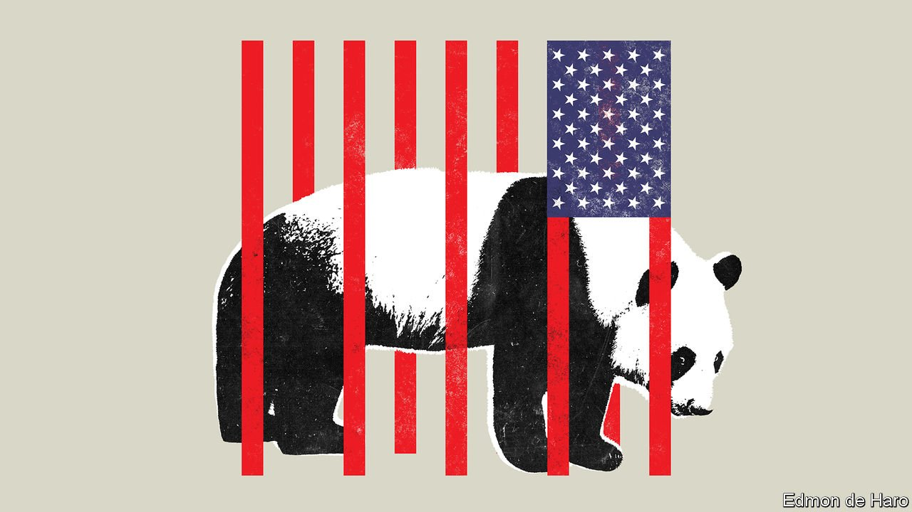
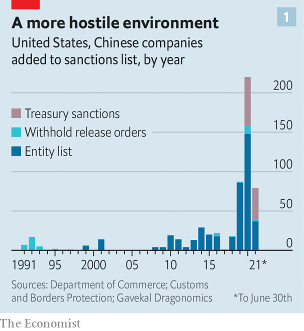
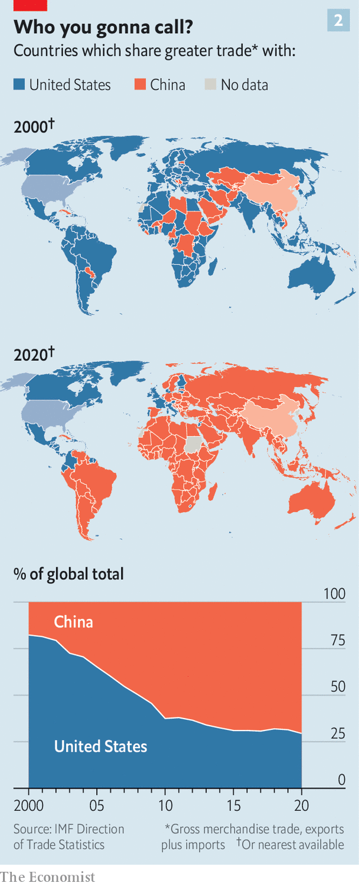

###### Pushing back

# Joe Biden is determined that China should not displace America 

##### His China policy is looking even tougher than Donald Trump’s 

 

> Jul 17th 2021 

AMERICA MUST focus on “blunting Chinese power and order and building the foundations for US power and order”. That, at least, is the message of a recent book by Rush Doshi, until recently a scholar at the Brookings Institution, a think-tank in Washington, DC. “The Long Game: China’s Grand Strategy to Displace American Order” argues that China has worked for years to undermine America’s geopolitical dominance and shape a more illiberal world order that better protects and serves China’s interests. It concludes that these efforts need to be repaid in kind.

This is a striking rebuke to decades of American foreign-policy thinking focused on “engagement” with China. The rebuke gains extra weight from the fact that Mr Doshi is now a China director on President Joe Biden’s National Security Council, where he works under Kurt Campbell, his mentor and a leading architect of the administration’s China strategy.


Engagement was already on its uppers. Donald Trump had replaced it with something more belligerent and capricious. Many hoped that Mr Biden would bring some order to the chaos and lay down rules for a return to some sort of engagement, albeit on less friendly terms than those practised by the Obama administration in which he served. But although Mr Biden’s administration is indeed forgoing the caprice and wilfulness of his predecessor, in other respects it is toughening policy, assiduously building a strategic framework for countering and checking China’s rise.

Unlike Mr Trump, Mr Biden seems sincerely worried about a world in which China’s authoritarian model wins. That makes him more serious about the policies implemented, often haphazardly, by the hawks who served in the previous administration. In its first six months Mr Biden’s administration has, to the surprise of many, officially affirmed the label of “genocide” applied by the last administration to atrocities in Xinjiang, and also worked with allies to impose further sanctions on the perpetrators. It has kept in place and refined Mr Trump’s prohibitions on doing business with Huawei and a long list of technology companies and military-affiliated businesses (see chart 1). It has made countering China a priority in talks with allies around the world, and shown no urgency to hold a summit with Xi Jinping, China’s president.

 


Mr Biden is positioning America as the West’s leader in a “contest with autocrats”, as he put it at the G7 summit in June. In an interview with The Economist a senior administration official said China sees the next 10 to 15 years as a window of opportunity in which to “assert its authority globally”: continuing its attempts to dominate critical technologies and rewrite the rules of the global order, and cowing its critics so as to make the world safe for autocracy. This is not a secret. Mr Xi has outlined China’s ambitions to exert influence on the global order, seizing a moment when the Communist Party views the West to be in decline. Even so, people in the West, the official said, are only beginning to recognise “that we’re dealing with a country that is perhaps less interested in coexistence, and more interested in dominance”. The time to take a stand, therefore, is now.

Build then blunt

Defining the relationship as one of two antagonists with antithetical values makes it sound like the cold war. But there are crucial differences, none more notable than China’s inextricable integration into the global economy. America cannot try to contain it as it did the Soviet Union; instead Mr Biden wants to counter China’s influence by increasing America’s own.

The emerging strategy, while still protean, sounds of a kind with Mr Doshi’s prescription for “blunting and building”. The building comes first. Mr Biden’s aides invariably start any discussion of China strategy with the need to restore American greatness after decades of decline. “Rarely has a great power like the United States gone on such a detour,” says the senior official. “It’s tragic.” America must recover from all that, and invest in itself, Mr Biden’s aides say, so that it can deal with China from a position of strength.

Hence the United States Innovation and Competition Act, which passed the Senate in early June packed with spending intended to improve . It would authorise $52bn to boost semiconductor research and manufacturing in America and $29bn for a new applied-sciences fund that would support projects in advanced materials, robotics, artificial intelligence and other technologies. It also contains extra money for going to the Moon.

Spending does not have to be aimed so precisely to be part of the policy. Mr Biden’s $1.9trn pandemic recovery package, which passed in March; his multi-trillion dollar proposals for “hard” and “soft” infrastructure; his provisos on buying American: all can be read as part of a rebuilding policy aimed at China while also looking to fulfil lavish campaign promises.

But ambitious as they look in Washington, these numbers cannot compare with Chinese spending on infrastructure and industrial policy. And they are shrinking. The  has been whittled down to $600bn in negotiations with Republicans whose distaste for handing victories to Mr Biden exceeds their animosity to China (though Democrats want to add back $3.5trn in another package). Republicans such as Ted Cruz, Marco Rubio and Josh Hawley, all self-professed China hawks, are unlikely to abandon their party’s opposition to Mr Biden’s domestic agenda when they have their eyes on his job.

Even if America were united in its efforts, though, building back at a rate that would seriously diminish China’s current prospects is not possible. Barring a serious setback, China’s economy will become the world’s largest within its 10-15 year “window of opportunity”. The country’s gigantic market will exert, as Communist Party lingo puts it, a “powerful gravitational field” far beyond its borders. It will be able to spend even more on its armed forces. The country’s investments in research and development will make its technological prowess increasingly formidable.

That is why an antagonistic policy requires what Mr Doshi calls “asymmetric blunting”: ways of undermining China’s attempts to rebuild the world order that do not cost too much. Militarily, that means adopting an approach of “deterrence by denial” in areas just beyond internationally recognised Chinese waters, investing in state-of-the-art weapons to stop China seizing control of waters or islands (like Taiwan) to which it considers itself entitled. Economic blunting tactics include enforcing export controls so that American companies do not fuel China’s rapid development of critical technologies—a tool that the Trump administration used to cripple Huawei and to impede China’s biggest chipmaker, Semiconductor Manufacturing International Corporation. Political blunting includes countering China’s influence in the United Nations and other multilateral institutions.

Sharpen up

Because such strategies require partners, their cultivation is a core tenet of Mr Biden’s strategy. He has been courting other governments and sorting out old grievances. He has agreed a suspension of tariffs in a 17-year-old dispute with the EU over subsidies to Airbus, an aerospace company. He has also waived sanctions on the company building the Russian-led Nord Stream 2 pipeline as a favour to Germany, which will be the recipient of most of its gas. In so doing he signalled that his administration views potential co-operation with allies on China as more important than confronting Russia. In March America agreed a new deal on funding for the main American military base in Seoul.

This cultivation has borne some fruit. In March Britain, Canada and the EU joined with America in imposing sanctions on Chinese officials and entities over Xinjiang—the first time any other governments had done so. In May South Korean President Moon Jae-in, on a visit to the White House, agreed to a mention of preserving the status of Taiwan in the subsequent joint statement. In June the G7 and, a couple of days later, a NATO summit both produced statements recognising the threat posed by China.

Serious blunting, though, requires more than co-ordinated statements and (largely symbolic) sanctions. Here there is less to report. Build Back Better World, or B3W, a response to China’s Belt and Road Initiative announced at the G7 summit, has no new institutional framework or funding. Mr Biden has worked with the G7 and the Quad, a military grouping with Australia, Japan and India, to counter China’s coercive, strings-attached vaccine diplomacy. But the commitments of vaccine doses are tiny compared with the need. He has not as yet put serious resources to his broader vision of providing middle-income countries with alternatives to taking money and business from China. Congress would not let him.

Where America does not lead, its allies seem unlikely to go of their own accord. In May the European Parliament responded to China’s bullying over the EU’s earlier Xinjiang sanctions by freezing ratification of an investment treaty. But many governments still want such deals and are not looking for trouble. On July 1st Rishi Sunak, Britain’s chancellor, called for a “mature and balanced relationship” with China, eyeing the City’s potential to sell financial services into the world’s second-largest national market. On July 7th Boris Johnson, the prime minister, said he did not want to scare away investment because of an “anti-China spirit”.

Emmanuel Macron, the French president, and Armin Laschet, who may succeed Angela Merkel as German chancellor, have shown a lack of enthusiasm for confronting China. Smaller countries feel similarly. Not coincidentally, the number of countries with which China shares more trade than America is far greater than the other way round (see chart 2).

 


There are also American voices opposed to a tougher line. Businesses and financial institutions are lobbying hard to maintain access to the China market and for the easing of export controls. On July 7th more than 40 progressive groups wrote to Mr Biden urging him to drop America’s “antagonistic posture” towards China and to co-operate on climate change. Such calls are music to Mr Xi’s ears. As Mr Doshi writes, Chinese officials routinely treat America’s wish for progress on major challenges—such as climate or nuclear non-proliferation—as opportunities for leverage. China’s determination to link issues America would like to keep separate makes America’s interest in cordoning off areas for co- operation some what moot. They are not decisions it can make on its own.

The climate looks likely to fall victim to this antagonism. Both countries will lower their emissions (though Mr Biden’s ambitions may be thwarted by opposition at home) but it will be hard for them to come together to set rules of the road for others. There are economic risks, too. There are almost no advocates for free and unfettered trade around Mr Biden, and that suits the architects of his China policy well.

During the 2020 presidential campaign Jake Sullivan, now Mr Biden’s national security adviser, co-authored an article calling on foreign-policy experts to stop deferring to economists and move past the assumption “that more trade is always the answer”. He is in no rush to get rid of Mr Trump’s tariffs and “phase one” trade deal, which required China to meet specific import quotas; they may not be to his taste, but they could supply leverage for future negotiations. This was despite the judgment of economists outside the administration—and some inside—that the tariffs hurt America more than they hurt China.

There are also areas where trade with China is seen as a risk in and of itself. China’s dominance over the markets for some key resources, while not yet a national-security problem, could become one. Mr Sullivan, Mr Campbell, Mr Doshi and others want America to reduce the degree to which it relies on its antagonist for some critical commodities. In June the administration completed a supply-chain review that identified areas that China dominates—including rare-earth metals, lithium and cobalt (vital for high-capacity batteries) and some drugs and drug ingredients—and called for America to work with other countries on how to wean themselves off the Chinese market.

Such concerns could lead to a bifurcation in global trade. But voices warning of the economic costs such a split would impose are exactly those to which Mr Sullivan wants policymakers to pay less heed. If his security-first view prevails Mr Biden may go further to decouple the two economies than did Mr Trump, parts of whose administration exploited his inattention in order to do less than he would have wished. The treasury secretary, Steven Mnuchin, delayed efforts to impose sanctions on Chinese institutions. Officials at the Bureau of Industry and Security (BIS) dragged their feet on drawing up a list of emerging technologies that could be subject to broad export controls. Customs and Border Protection issued most of its orders to block imports of goods made by forced labour in Xinjiang only in 2020, after Mr Trump had taken to blaming China for the pandemic.

 


Mr Biden’s administration is more responsive to his intentions. The machinery that can be used to blacklist more Chinese companies has been fine-tuned, in part to make it more resistant to legal challenges. It has maintained virtually all the existing sanctions, export controls and customs orders, and instituted a few more that were under way before Mr Trump left office. These included a ban in June on imports from a Xinjiang-based company which produces the type of silicon needed for solar cells, because of concerns about the forced labour of Uyghurs there. Some 45% of the world’s supply of this highly refined silicon comes from Xinjiang, and sanctions against more of its manufacturers are expected, if not from the administration, then through a bill pending in Congress.

How blunt, exactly?

In a speech on July 13th Mr Sullivan signalled concerns about companies evading export controls “in ways that harm national security”. What that posture means in terms of slowing China’s progress in technologies such as artificial intelligence and quantum computing is still a matter of concern for those watching proceedings. The tech industry has its worries about China (particularly over the long-term security of Taiwan Semiconductor Manufacturing Company, the main supplier of the highest-end chips). But it still wants to sell it more stuff. The most ardent foreign-policy hawks want the toughest actions, including things they are sure the Biden administration would not dare to do, such as banning dollar-denominated transactions with leading Chinese chipmakers.

Both sides have been keenly interested in who would serve as the new head of the BIS, seeing the position as a bellwether. But when, on July 13th, they learned it would be Alan Estevez, a former Obama-era Pentagon official with experience conducting national-security reviews of foreign investments, they seemed at first little the wiser. As a nominee to a sensitive post his chief attribute may be a lack of preconceptions as to how he will approach the job.

Beyond the question of how hard to push, though, lies the disconcerting realisation that China may well be an immovable object. If American businesses turn away from China, others will step in. Bonnie Glaser, a China expert at the German Marshall Fund, a think-tank, says the best hope of shaping China’s choices lies in forming an “anti-China coalition” (though not explicitly calling it that). Like those around Mr Biden, she believes that, even then, the odds of affecting change will not be good, but “we have to try”.

An us-v-them approach has problems. When Mr Biden presents it as a dichotomy of democracies versus autocracies, European officials wince—and the status of a country like Vietnam, which Mr Biden wants on-side, becomes problematic. Jude Blanchette of the Centre for Strategic and International Studies, another think-tank, argues that the Biden administration would be better-served if it stopped paying such close-up attention to China and instead zoomed out to take a broader view of the world. America reacts to everything Chinese leaders do, he says: they adopt an industrial policy, America adopts an industrial policy; they secure supply chains, so does America; they have a Belt and Road Initiative, so must America.

Mr Blanchette argues that America should take a different page out of Mr Xi’s playbook: talk less about its adversary and more about the world it wants to build. “Xi just does not talk about America a lot. When they articulate their vision it’s not an America strategy,” he says. “It’s ‘this is the role China wants to play in the world over the next 10, 20, 30, 40, 50 years’.” Like some members of the Biden administration, Mr Blanchette looks to the early days of the cold war for inspiration. Then America placed its attempts to contain the Soviet Union within a broader vision of the world. If today it could articulate such a vision again, it might become clearer how China fits in and open up a policy shaped by America’s continuing role, rather than purely by China’s rise. ■

For more coverage of Joe Biden’s presidency, visit our dedicated 

