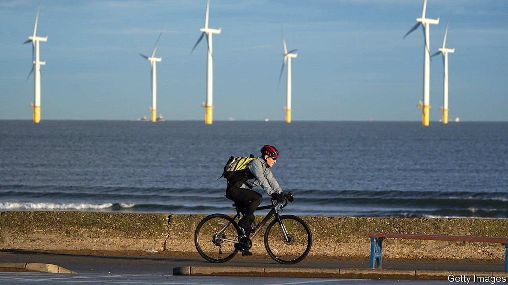
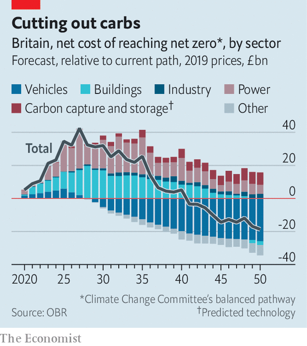

###### Pain now, gain later

# Achieving net-zero carbon emissions will be eye-wateringly expensive 

##### The politics will be tricky 

 

> Jul 17th 2021 

IN NOVEMBER BRITAIN will host the 26th UN climate-change conference, known as COP26, in Glasgow. For Boris Johnson, the prime minister, it will be a chance to play global statesman. Mr Johnson is fond of grand projects, and few are as grand as decarbonisation. Britain is one of 131 countries that have committed to reducing net carbon emissions to zero, or are discussing such a target—but one of just six to have enshrined that commitment in law.

This autumn the Treasury is expected to set out the policies required and, crucially, how they will be paid for. On July 6th the Office for Budget Responsibility (OBR), gave a preview. Achieving net zero by the target date of 2050 will be costly, it said, but unmitigated climate change would be even more so.


A paper in 2019 by the International Monetary Fund had already suggested that unmitigated climate change could lower global per-person GDP by 7% by 2100. The OBR focused instead on the impact on government debt under several scenarios. The most severe, in which the Earth’s average temperature rises by 4°C, would see the debt-to-GDP ratio rise from 100% now to closer to 300% by the end of the century. That would be a bigger fiscal burden than bequeathed by either of the 20th century’s world wars.

 


Reaching the net-zero target by travelling along the trajectory laid out by the government’s climate-change committee would, the report estimated, cost £321bn, around 15% of annual pre-pandemic GDP. That is made up of spending of £1.3trn over the next three decades, partially offset by savings of £991bn.

Coming up with such a figure requires heroic assumptions. But amid the uncertainty, one thing is clear: the spending comes long before the benefits. Insulating a building, for example, involves an upfront cost, only later recouped in lower heating bills. Most of the OBR’s predicted costs fall in this decade and next, with savings kicking in during the 2040s. The year with the highest net cost is 2027, when investment in low-carbon power generation is set to peak.

So far public opinion has been strongly in favour of the net-zero target. Indeed, several polls have found support for aiming to achieve it sooner than 2050. Research by BritainThinks, a polling firm, for the Green Alliance, a group of think-tanks, finds the public is even keen on green taxation, with around six in ten supporting a levy on carbon.

More ominously for a prime minister keen to trumpet green credentials, they are less keen once the specifics are made clear. Just 37% support new road taxes, which will be needed to replace fuel duty as more cars go electric. Treasury insiders fear that, along the path to net zero, public enthusiasm will evaporate.

For more coverage of climate change, register for The Climate Issue, our fortnightly , or visit our 

