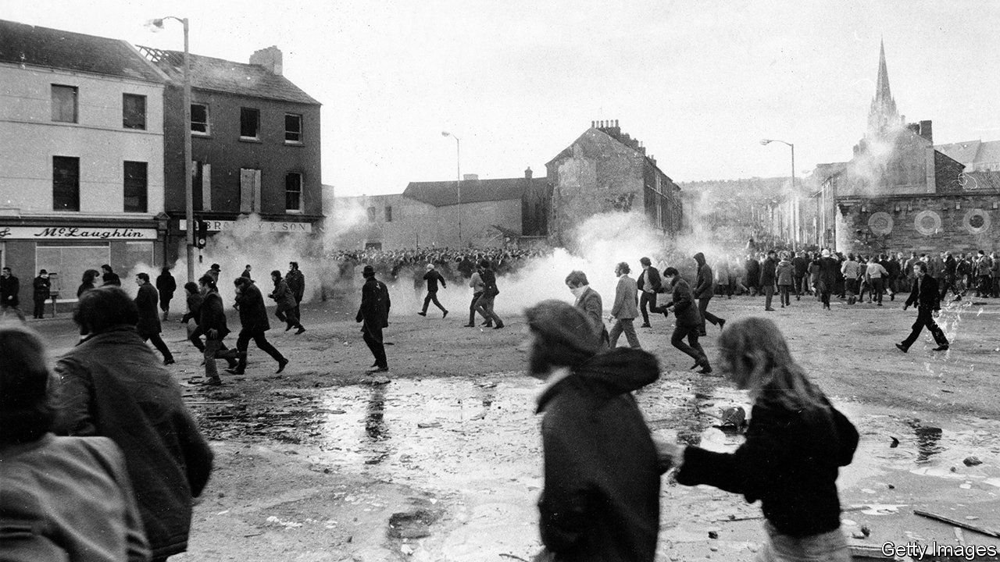

###### Closure denied

# An amnesty for Northern Irish killers is supposed to draw a line under the Troubles 

##### But victims’ families say that reconciliation relies on a continued search for truth 

 

> Jul 15th 2021 

THE THREE decades of sectarian conflict in Northern Ireland known as the Troubles saw 3,500 killings, many never punished. Since the Good Friday Agreement (GFA) of 1998 brought that dark period to an end, those who had evaded justice have had little reason to fear it would catch up with them. Soon they will have none. On July 14th the British government announced a bar on new prosecutions, even if new evidence should emerge.

Under the GFA, some terrorist prisoners were released early and jail terms for any future convictions were limited to two years. The peace deal was followed by further concessions to the erstwhile men and women of violence—royal pardons, “letters of comfort” to Republican terrorists on the run, a prohibition on forensic testing of decommissioned paramilitary weapons and limited immunity for anyone who provided information about the location of hidden remains.


Now the British government is to introduce a “statute of limitations, to apply equally to all Troubles-related incidents”. This de facto amnesty would also block belated inquests into killings not adequately investigated at the time, and civil-court actions against perpetrators. There are more than 1,000 civil actions against government agencies, some thought to be against alleged perpetrators, others seeking information or claiming negligence.

Far from healing old wounds, the government argues, litigation reopens them, and moreover ties up the criminal-justice system to little end. Only a handful of cases in recent years have led to convictions. The amnesty would enable Northern Ireland to “draw a line under the Troubles”, said the prime minister, Boris Johnson.

On the government backbenches and front pages of Tory-supporting newspapers, there was jubilation. Both have vociferously opposed a growing number of prosecutions of now-elderly former soldiers. Earlier this month the trial of one collapsed. He had been charged with murdering two people on Bloody Sunday in 1972, when the Parachute Regiment shot dead 13 unarmed civilians.

But among politicians and victims’ groups in Northern Ireland, there was near-unanimous outrage. Even people who have called for some version of an amnesty object to this one. Jude Whyte, who has publicly forgiven the loyalists who murdered his mother in 1984, supports an end to prosecutions. But he says that including killers who remain silent in the amnesty means they will never have any incentive to come forward, and the bereaved will continue to be denied closure.

Ann Travers lost her sister in 1984, when she was shot by IRA gunmen as she left Mass. Her father survived. She had accepted she would probably never see justice done: “I would find myself apologising to my sister and my dad in my head.” But she opposes the bar on future prosecutions: “It’s extinguishing the very faint hope left.” The IRA targeted her family because her father was a Catholic magistrate who upheld British law, she says. “For the prime minister to say that changing the law will ‘draw a line’ is grossly insulting.” ■

