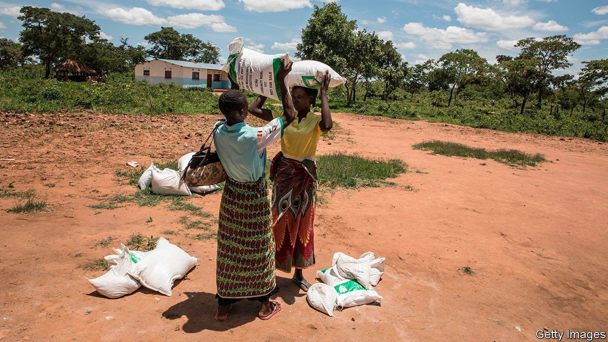

###### Foreign aid

# Britain is no longer a leader in international giving 

##### A cut from 0.7% to 0.5% of gross national income is only one sign of that 

 

> Jul 17th 2021 

THANKS TO SOCIAL distancing and the wartime atmosphere created by the covid-19 pandemic, the House of Commons has not been a terribly dramatic place for the past year. The vote on foreign aid on July 13th was an exception. MPs lambasted the Conservative government’s decision to cut aid, accusing it of abandoning the world’s indigent at the worst possible time. Even Theresa May, the previous prime minister, rebelled—the first time she has voted against a Conservative three-line whip since becoming an MP 24 years ago.

The rebels failed anyway, mustering 298 votes (24 from Tories) against 333 in favour. As a result, foreign-aid spending will be cut from 0.7% of gross national income (GNI) to 0.5%. The chancellor of the exchequer, Rishi Sunak, promised to return to 0.7% when the government is no longer borrowing for day-to-day spending and when public-sector net debt is falling. Those conditions are highly unlikely to prevail in the next few years.


This will go down well in Britain. According to YouGov, a pollster, 54% of people believe that the state spends too much on foreign aid. That is down from 63% last September, before the government announced that the budget would be cut. But it is still more than twice as high as the proportion of people who believe too much money goes on defence—the second-most-unpopular kind of spending.

Two common criticisms of foreign aid are that it does not work, and that money is wasted. Unfortunately, the British government’s lurch has made both more likely. Charities complain that their budgets have been cut with little warning, wrecking existing projects. One charity, Women for Women International, ended up with local offices in Afghanistan that were running no projects. Expect a different kind of waste if the aid budget suddenly jumps back to 0.7% of GNI, as officials fling money at half-baked schemes.

Even after the cut Britain will remain a large donor by international standards, spending more on aid as a proportion of GNI than either America (0.17%) or Japan (0.31%). But the significance of Britain’s foreign aid was never defined by its largesse—by what Boris Johnson, the prime minister and no fan of foreign aid, once called the “giant cashpoint in the sky”. Britain used to be a global leader in aid policy. It has gradually squandered that lead.

From 1997, when the Department for International Development (DfID) was created, Britain was in the vanguard of a more technocratic approach. It insisted that foreign aid should be for helping needy people, rather than for propping up friendly regimes or boosting British exports. It assessed aid projects rigorously, measuring outputs rather than inputs—fewer people going hungry, not more tonnes of wheat distributed. It chivvied others to follow, with some success. In the two decades to 2019 the proportion of aid that is not “tied” to suppliers in the donor countries rose from 47% to 87%, according to the OECD, a club mostly of rich countries.

Over time, that high-minded approach has been displaced by a more pragmatic, self-interested agenda. By 2016 Britain was trying to use aid to prevent migration to its shores. Announcing a merger between DfID and the foreign office last year, Mr Johnson complained that Britain was giving as much aid to Zambia, which is not vital to European security, as to Ukraine, which is. The foreign secretary, Dominic Raab, speaks of using aid to nurture “long-term, win-win partnerships”. Even before it cut spending on foreign aid, Britain was trimming its ideals. ■

