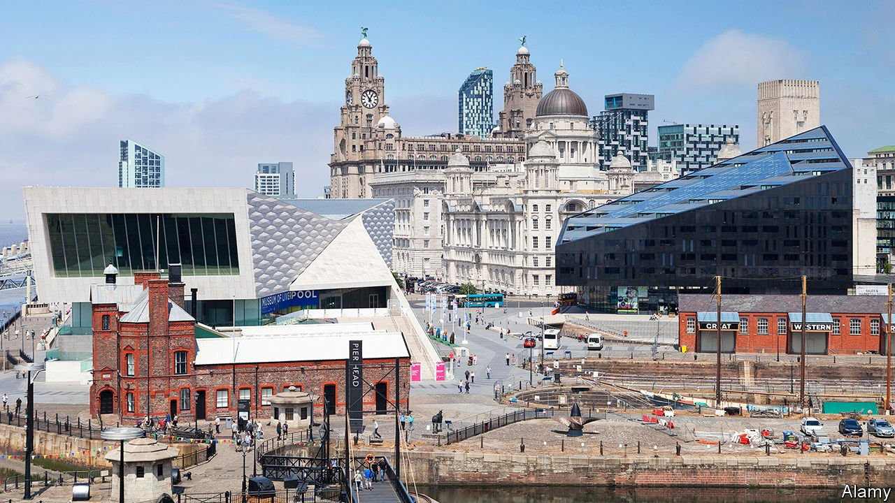

###### Red in tooth and claw

# Liverpool’s changing skyline defies UNESCO 

##### But its appetite for growth is distinctly Victorian 

 

> Jul 17th 2021 

“THERE’S NO accountability in UNESCO,” says Derek Hatton over lunch on the Toxteth Riviera, as locals call what was once Liverpool’s red-light district and is now its swankiest neighbourhood. “This guy arrives, who finds the city with a satnav, and decides whether we can have it five storeys, six storeys, 12 storeys. It’s not their fucking job! We elect the mayor.”

Liverpool was once the British empire’s second city, fattened on the trade in slaves, wool and machines. By the 1980s the docks and manufacturing had collapsed, and the resulting unemployment fuelled riots. The prime minister of the day, Margaret Thatcher, was urged by her chancellor to put the city into “managed decline”. Mr Hatton, whose Trotskyite faction, Militant, ran the council, defied her budget cuts and pushed it close to bankruptcy.


These days, “it is a sea of cranes,” says Michael Heseltine, a former minister who persuaded Mrs Thatcher the city could be saved. Militant was ousted from the Labour Party, and under a more moderate council, money poured in. Shopping centres, flats and museums sprouted. The monumental “palaces of trade” of the port’s apogee were fixed up. In 2008 the city hosted the European Capital of Culture. The population, which had fallen by nearly half since the 1930s, started growing again.

Mr Hatton now dabbles in property, and has a new foe: the UN’s cultural agency. At a meeting later this month, its world-heritage committee will vote on whether to strike the Mersey waterfront from its register of 1,121 sites of outstanding beauty or importance. Its listing in 2004 cited “the supreme example of a commercial port”, its role in emigration to America—and, naturally, the Beatles.

But the city’s ambitions soon displeased those seeking to preserve former glories. In 2012, alarmed by plans for flats and offices that it said would destroy the skyline, UNESCO put Liverpool on its register of sites “in danger”. Those plans were scaled back, but still UNESCO wants a moratorium on new buildings in the area. Trickiest of all is a planned dockside stadium for Everton Football Club, which UNESCO calls part of the “serious deterioration” of the city’s qualities. Diggers will trundle in this month. City leaders have suggested that UNESCO officials should visit before the vote (their most recent mission was in 2015), but a reprieve seems unlikely.

Liverpool is unmoved. “The bureaucrats of UNESCO have a very puritanical view of the world,” says Tony Reeves, the council’s chief executive. Frank McKenna of Downtown in Business, a lobby group, says the listing attracted no tourists (the Beatles and football take care of that) and actually deters investors. Gary Bond, a PR man to the property sector, complains that Liverpool “looks nothing like Shanghai”, its twin. Merseyside’s Civic Society, the sort of body that in any other city might resist almost any building proposal, supports the stadium.

Memories of unemployment in the 1980s explain the appetite for growth, says Joanne Anderson, the mayor, who hopes to nurture a life-sciences sector. Liverpool Walton, near the docks, is England’s most deprived parliamentary constituency, according to government figures. Although more Scousers gain degree-level qualifications than used to, and fewer leave school with nothing, the region is still below the British average on both measures. High-grade office space is still in short supply.

But the boom was not always well-governed. Joe Anderson, the mayor from 2012 to 2020 (no relation to the incumbent, Joanne), was slow to respond to UNESCO’s warnings. And though many developers drawn to the boom were sound, others were disreputable. In March Max Caller, a government inspector, found that the council’s regeneration department was in disarray. Some buildings went up without the required permissions, and the council had sold off land without proper valuation.

Ticket to ride high

“It was Las Vegas-like,” says Richard Kemp, the opposition leader on the city council, who says Mr Anderson “was looking for quantity, not quality”. Police investigating the local construction trade arrested Mr Anderson and Mr Hatton, and others, last December. Both deny wrongdoing, and no charges have been brought. Robert Jenrick, the local-government minister, declared the city’s politics “rotten”, and sent in four commissioners to oversee reforms, which Ms Anderson has promised to deliver. Mr Reeves says these moves are rebuilding trust among investors.

Some city grandees fear that the twin blows of UNESCO’s decision and Mr Caller’s report will revive the impression created during the 1980s, of a philistine city unable to run itself. That would be unfair. Liverpool’s troubles are reminiscent less of Mr Hatton’s era, and more of its earlier rise. It was in reaction to post-war concrete that Britain’s urban-preservation movement took off in the 1970s; Liverpool’s taste for height, growth and municipal swagger, by contrast, is distinctly Victorian. “The leaders who were around in those times would be laughing at us for listening to any concerns,” insists Mr Anderson. Far from forgetting their history, says Gavin Davenport, the civic-society chairman, Liverpudlians “wear that heritage on their sleeves”.

Mr Caller’s report reads like an account of an earlier era of frenetic city-building, in which town halls could run on gut feeling and patronage—and become bywords for corruption. Rightly, that is no longer tolerable. The city’s new leaders must reconcile their Victorian appetites with the due process demanded by commercial investors and central government. Keeping UNESCO happy, however, is optional. ■

