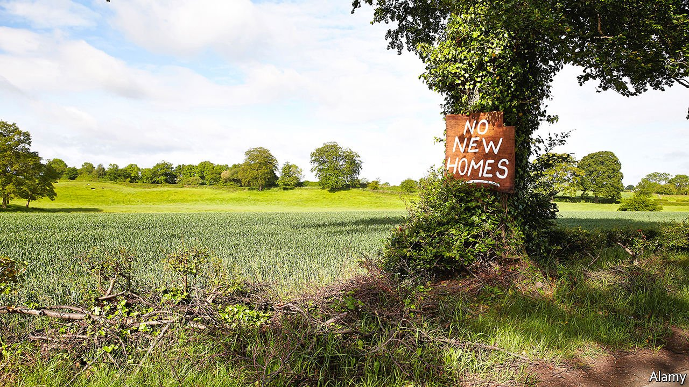

###### The new NIMBYs

# Opponents of housebuilding claim to care more about the environment than prices 

##### That may help explain the rise of the Greens 

 

> Jul 17th 2021 

IN JULY 1998 the Reading Evening Post, a now-defunct paper, ran a story about opposition to housebuilding. Rhodri Hughes, a councillor, was concerned that new flats would overshadow residents’ gardens and that “the loss of trees would change the look of the area”. Last month another local, the Reading Chronicle, ran a similar story about housing in nearby Wokingham. Clive Jones, a Liberal Democrat councillor, is exercised about the ecological crisis, railing that developers are destroying the wildlife and habitats of “muntjac deer, badgers, birds, rabbits”.

The sharp increase in housebuilding in recent years has given a fillip to NIMBYs, people who don’t mind development as long as it is Not In My Back Yard. This month YouGov, a pollster, found that 47% of Britons would oppose new housing in their area, up from 40% since mid-2019. Some 43% would support it, a drop of seven percentage points. But as hinted at by this tale of two councillors, today’s NIMBYs are citing new concerns: not just “my environment” but “the environment”.


NIMBYs have always worried about wildlife, noise, pollution and the like, says Philip Hubbard, a geographer at King’s College London. And their concerns are not merely mercenary: a recent survey by Tom O’Grady of University College London found that Britons who expressed opposition to local housebuilding were largely motivated by a desire to preserve the beauty and amenity of their area, rather than the value of their home.

Such attitudes can be characterised as environmentalism, albeit of an intensely local, personal sort. But a growing number of NIMBYs now claim a broader green agenda. Some cite biodiversity, saying they support new housing as long as it does not spoil land teeming with wildlife. Andrew Stringer, who leads the Green, Liberal Democrat and Independent Group on Suffolk County Council (and who has built four houses himself), says he has teamed up with residents to get developers to change their plans. He claims to have stopped trees being felled and barn owls being made homeless.

Green-tinged NIMBYs in Essex want land slated for housing to be “rewilded”—helped return to a natural state. Elsewhere, they are seeking to block development by citing its impact on carbon emissions. Some groups are aligned with Extinction Rebellion, an international climate campaign. In Newbury a plan to build 1,000 homes is being opposed because of the “climate crisis”. Campaigners in Chesham claim its carbon footprint would rise by a fifth if planned building goes ahead.

An environment bill making its way through Parliament aims to protect nature despite high volumes of house-building. Developers are supposed to ensure that biodiversity on the plots they develop increases overall. One large housebuilder says it has researched green housing in Japan, and found that wildflower meadows can be created cheaply. But some green NIMBYs dismiss such mitigation measures as shabby and ineffective. One mocks a trend for developers to fix bird-boxes on houses—likely to be unpopular with owners because of ”bird poo on doorsteps”.

The Green Party’s gains in May’s local elections could be a sign that the new eco- NIMBYs are sincere about their motives. Jonathan Bartley, a co-leader of the party, says that erstwhile Tory voters in the south-east saw in the Greens a party “that gets wildlife, that gets the ecological emergency, that gets the countryside”. But others wonder if the conversion to greenery is merely strategic. Locals may not share her environmentalism, says Wendy Turner, a Green councillor in Suffolk, but they see supporting her party as the best route to stopping new development. Since 2019, at least 230 councils have declared a climate emergency; some campaigners may simply be seizing on a new weapon in the same old fight to protect their back yards. ■

