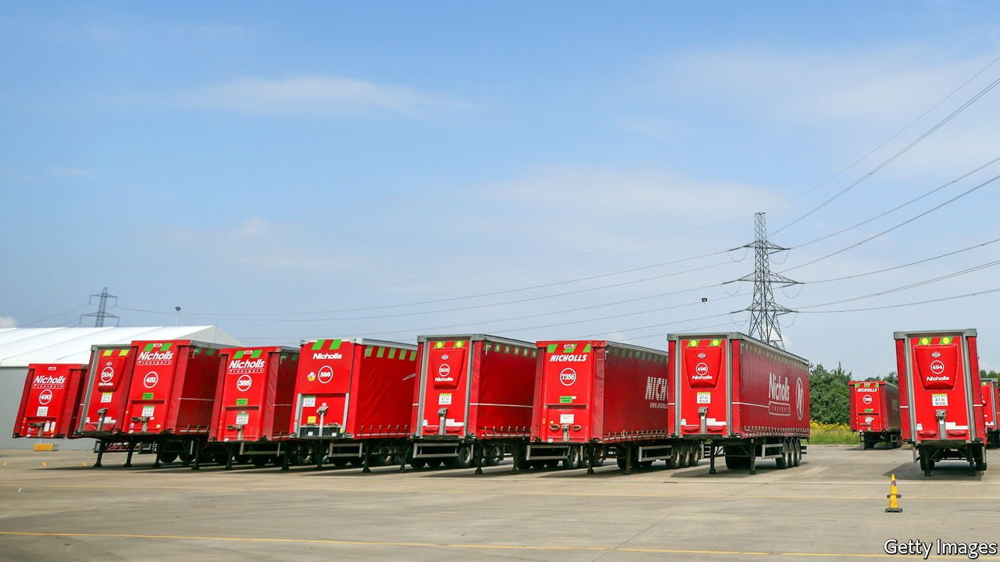

###### Driving: a hard bargain

# The shortage of HGV drivers in Britain is getting worse 

##### Even more money isn’t hauling them in 

 

> Jul 15th 2021 

BIG DAVIE MALCOLM stands six foot four in his socks. But when he climbs into a lorry cab, he moves carefully, spreading a large rag before placing his feet on it, delicate as a dancer. He doesn’t like, he says, “to dirty a man’s carpets”.

Today, he is driving coffee from Tamworth to Holyhead. The company he works for, Virginia International Logistics, carries everything from the nuts and bolts of the trucking industry (they take nuts and bolts from Birmingham to Ireland) to food, car parts, clothes and, naturally, the kitchen sink (kitchens go to Dublin).


The past year has been hard. Mr Malcolm cannot get drivers for love nor money. In his yard four lorries, blunt-nosed and naked without their trailers, stand stationary. Today, like every day, he lacks drivers to put in them. Britain has been suffering from a shortage of heavy-goods vehicle (HGV) drivers for years; Brexit and covid-19 have made things worse. The Road Haulage Association (RHA), an industry body, estimates that to keep Britain running smoothly requires well over 600,000 drivers. It is short by around 100,000.

Some accuse the industry of scaremongering; those in it are adamant. “This is the worst crisis in my career,” says Thomas van Mourik, the boss of Culina Group, a large logistics company. Mr van Mourik employs about 6,000 drivers. “We could employ today at least another 500 or 600.” He can’t get them. Competition is intense: wages have increased by 20% in a year. The government has held crisis talks and an hour has been added to drivers’ days, a temporary solution that the industry derides: they want visas to allow in more drivers.

Drivers are needed. Almost anything can be bought with a click in this internet age but things are not brought so easily. Every organic avocado, artisanal cheese or hand-tied bouquet of bluebells will probably spend some time in a very un-artisanal HGV. But the industry is rarely considered; even more rarely praised. “We always get remembered for the bad things,”says Richard Burnett, head of the RHA: for crashes and for “big, horrible, smelly trucks”.

This lack of interest in an era’s defining transport network is a historical anomaly. Historians rhapsodise over the efficiency of Roman roads and the romance of the Silk Roads; poets and painters immortalised the ages of steam and sail. Few wax lyrical about HGVs. In America, truckers claim a rugged charm and the attention of songwriters. But in Britain, says Mr van Mourik, haulage is not a “sexy industry”.

Or a widely respected one. Throughout the pandemic truckers kept on trucking, filling the shelves with the pasta that Britons, cowering at home, panic-bought. But few clapped for truckers. Ballet dancers appear on a government list of skilled “shortage occupations” who can obtain visas; lorry drivers do not. Since shortages cannot be solved by foreign workers, young people are needed. But few want to join a neglected industry: the average age of drivers is 55.

On the road, Big Davie rates other lorries, tutting at dirty cabs and applauding good driving (“Courteous”). The job used to be one people aspired to, he says: “I can show you pictures of trucks with proud men.” Presumably, wages will eventually rise enough to attract new drivers; so far, higher pay seems merely to be prompting the same ones to job-hop for more money. But it may at least help with the industry’s other shortage: that of self-esteem. ■

