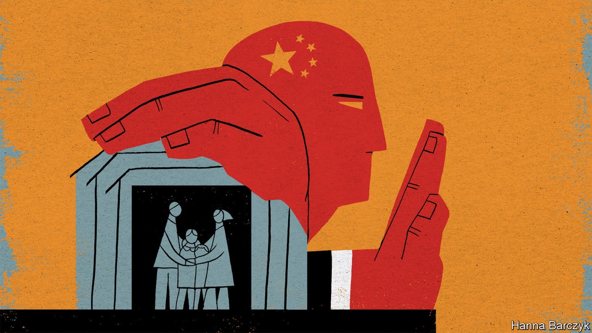

###### Chaguan

# China is keeping its borders closed, and turning inward 

##### Zero tolerance for the virus, combined with rising nationalism, breed isolationism 

 

> Jul 17th 2021 

IT IS BECOMING clear that China will not, or perhaps cannot, re-open its borders soon. The reasons are many. Chinese leaders have declared that zero tolerance of covid-19 is a mark of good government. Officials are fired if cases are found on their patch, so they lock down whole cities to crush even tiny outbreaks. Ordinary Chinese associate the virus with fear and stigma, knowing that a single infected person may force thousands of neighbours, colleagues or classmates into quarantine.

The outside world stands for chaos. Propaganda outlets stress that new cases involve arrivals from abroad. State media describe foreigners, notably Americans, as too selfish, science-scorning and obsessed with individual rights to control the virus. Images of mask-less Westerners on crowded beaches or rampaging at anti-lockdown protests are a staple of Chinese news coverage. Lots of Chinese are cross about a lack of overseas praise for their country’s strict approach. Their resentment is both sincere and stoked by propaganda that accuses American leaders of slandering China to cover up their cruel incompetence and 600,000 pandemic deaths.


Finally, though open discussion of this question is taboo, the authorities are being oddly secretive about how well Chinese-made vaccines work. Locally made jabs have been given to two-fifths of the population, with assurances that they are highly effective. But few data have been released about how Chinese vaccines cope with variants, or how long they work. This opacity is a problem. Many developing countries have relied heavily on Chinese shots. Indonesia and Thailand are among those now planning booster jabs with Western vaccines, at least for medical workers.

Chinese officials grumble that America and the European Union have yet to approve a vaccine from China. But in May, EU regulators trying to inspect a vaccine production site near Beijing were stymied by Chinese officials who insisted that those busy scientists would have to spend three weeks in quarantine. The government rejected an offer for them to fly in by charter plane for a brief inspection visit in protective suits.

Meanwhile, mainland China has yet to approve any foreign vaccines, including the most effective ones that use mRNA gene technology. Perhaps China wants to protect domestic drugmakers from competition, suggest foreign diplomats. Equally, China may want to buy time for a locally made mRNA vaccine that is known to be in development. Given all these factors, it is not obvious how China will start to re-open, especially before some big events have safely passed. These include the Winter Olympics that Beijing will host next February and a Communist Party congress in late 2022, at which Xi Jinping is set to seek a fresh term as supreme leader.

For their part, foreigners who live in mainland China appreciate being in a country that has the virus under control: in spring 2020 hundreds of millions of Chinese spent weeks at home to break the chain of transmission, often without pay. But quite a few have also had enough. Surveys by the American and European chambers of commerce suggested the number of foreign residents in China had fallen by 30% in 18 months. International schools are braced for a fresh exodus this summer, it is said, including of teachers who have not seen families outside China for more than a year. This spring several embassies debated whether China should become a hardship posting reserved for diplomats without dependents. Their concerns include rules obliging all international arrivals, including children, to quarantine in a hotel for three weeks, and to enter an isolation clinic if they test positive. (Ambassadors may quarantine at home for 21 days, but only if their residence is a detached house and they are driven there with a police escort.)

In June Spain’s consulate-general in Shanghai protested after a newly arrived Spanish citizen was made to sign documents that she could not read and undergo days of tests and MRI scans in a clinic. The Spaniard had apparently tested positive for antibodies, either as a result of having been vaccinated or after recovering from a bout of covid-19. Chinese officials declined to explain.

Foreign companies in favoured sectors can secure visas for executives, or for engineers who are needed to build advanced manufacturing sites that China wants. But even the largest such businesses struggle to obtain visas for the families of their expatriate staff. As many as half a million foreign students at Chinese institutions are stuck outside the country: their visas were cancelled in March 2020. Let them study online, Chinese officials tell diplomats who mention their plight. International tourism, both inbound and outbound, has ground to a halt.

China now issues a few visas for temporary business and family visits. But any further opening provokes nervousness. The southern province of Guangdong, hit by a recent virus outbreak, is building a quarantine clinic for international arrivals with 5,000 beds. Those foreign airlines allowed to operate limited flights into China are often running at 10% of pre-pandemic capacity. Visits by political leaders from abroad have largely ceased. Some foreign ministers have been admitted to China to meet their counterpart, Wang Yi, but only in provincial cities. Beijing, where top leaders live, is off limits. Mr Xi attends overseas summits by video-link.

China wants foreign know-how and respect, not foreigners

Chinese history has seen many cycles of opening and turning inward. Anecdote by anecdote, evidence is mounting that foreigners, whether suspected of bearing dangerous germs or ideas, are becoming less welcome. On a recent domestic flight, Chaguan’s neighbour pointedly asked to move seats. It is growing more common to face demands from members of the public to agree that China is strong and the West failing. Nationalism and impatience with foreign criticism were on the rise before covid-19. The pandemic has sped up those trends—as it has inspired at times nasty anti-Chinese racism abroad. Mutual distrust will be hard to overcome until China re-opens. That may take a while.■

Dig deeper

All our stories relating to the pandemic and the vaccines can be found on our . You can also find trackers showing ,  and the virus’s spread across  and .

