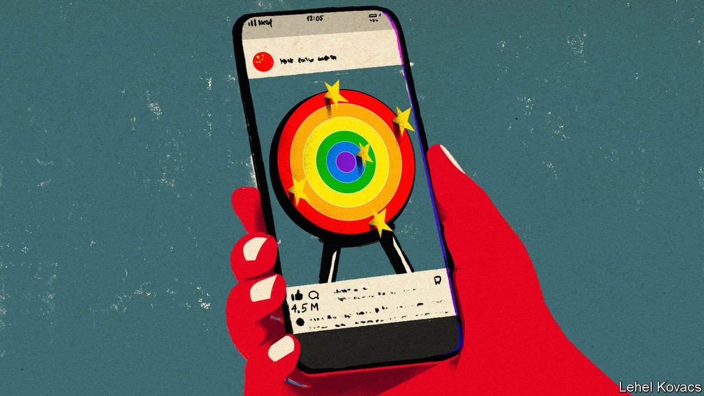

###### Patriotism and prejudice

# How nationalism is making life harder for gay people in China 

##### They are increasingly viewed as agents of foreign influence 

 

> Jul 15th 2021 

TO FREE-THINKING users of WeChat, a social-media platform, it was a depressingly familiar event. Late on July 6th, those who tried to browse accounts run by LGBT societies at several universities in China were greeted with messages saying the forums, which had been used to publicise events such as webinars and film nights, had been closed for violating unspecified rules. The accounts had probably offended the government, which has little regard for the rights of sexual minorities and even less for freedom of speech.

In the past, such clampdowns have met resistance. In 2018 Weibo, a Twitter-like service, announced a three-month campaign to eradicate pornographic, gay and violent content from its services. In 2019 the platform shut down a discussion group called Les, aimed at homosexual women. It had 140,000 members. In both cases, online anger prompted Weibo to rethink. The service conducted the clean-up, but decided not to suppress content simply for being gay-themed. It allowed the lesbian group to reopen.


This time the online reaction has been more mixed. Many social-media users hailed the closure of the LGBT accounts as a victory for patriots. “External forces are trying to weaken China’s competitiveness by spreading propaganda about LGBT to reduce China’s fertility rate,” wrote one blogger, gathering more than 66,000 views. Some accused LGBT groups of trying to promote a “colour revolution” in China, a reference to uprisings against other autocratic regimes. Hongwei Bao of Nottingham University says popular nationalism in China sometimes adopts the language of the far right in the West. That includes anti-Semitic drivel: one Weibo user with nearly 150,000 followers described LGBT activism as “a culture war initiated by the Jewish elite and the white left”. The term “white left” was coined in China a few years ago to describe Western liberals obsessed with identity politics. Now it is also used to insult Chinese who are deemed to sound like woke Westerners.

Homosexuality has long been vilified as foreign in China. But in the 2000s, as China grappled with rising rates of HIV/AIDS, the government dialled back the bigotry. In 2001 it removed homosexuality from an official list of mental disorders. Since then, at the UN and other international forums, it has gone further by endorsing the rights of LGBT people. At least in big cities, gay people have reported growing acceptance of their sexuality among fellow citizens. “The government doesn’t really care,” says Eric Wang (not his real name), who works for an LGBT-rights organisation in mainland China. “They’ve got more important things to do than oppress us.”

But rising anti-Western sentiment is hampering this progress. Nationalists, egged on by the Communist Party, have become even more vocal during the covid-19 pandemic. They have trumpeted China’s success in controlling the virus while heaping scorn on the West’s fumbling response. Mr Wang says a growing number of Chinese, even those who know gay and transgender people, have started “believing in conspiracy theories”. One is that all LGBT groups are funded by Westerners.

Seker Ma, a graphic designer in the eastern city of Suzhou who was involved with LGBT groups during his recent time at university, says the atmosphere for gay people in China has worsened in the past few months. “A lot of the current wave of patriotism takes this view: ‘Whatever the West supports, we must oppose,’” says Mr Ma.

A worker at an LGBT-rights group in Beijing says that even some gay people think that Western countries use LGBT issues to attack China. Very few such organisations are officially recognised as NGOs—the government views them with deep suspicion. Most are able to operate only by registering as youth centres or charities related to HIV/AIDS. In the build-up to celebrations of the party’s 100th birthday on July 1st, officials warned leaders of such groups to lie low. “We are very vulnerable,” says the LGBT activist. Now nationalism may be posing an even greater threat to their work than the interference of security-obsessed bureaucrats. ■

