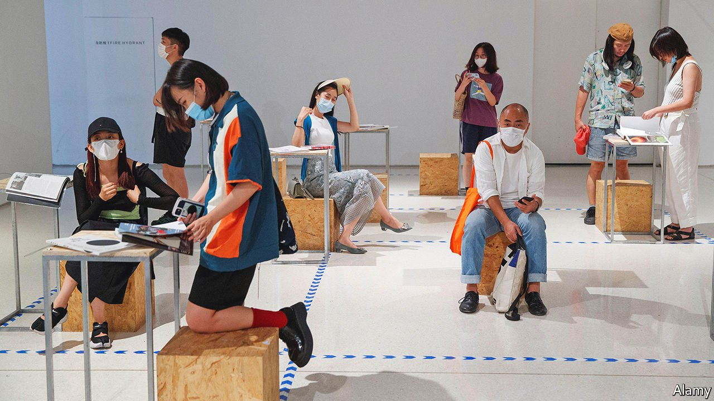

###### The small print

# In China’s publishing business, you have to duck and dive 

##### Independent publishers find ways around a thicket of regulations 

 

> Jul 15th 2021 

THE BEIJING International Book Fair, which takes place in August, gives the better-known view of China’s publishing industry: state-controlled and gargantuan. The organiser, China Publishing Group, owns 40 of the 580 government-run firms that dominate the country’s $15bn book-publishing market—second in size only to America’s. But another book jamboree, held one month earlier in the capital, shows a less familiar aspect. The abC Art Book Fair, which this year ran for three days from July 9th, is all that the other is not: independent, eclectic and lean. Readers piled in to buy and browse the works of 140 independent publishers (last year’s event is pictured). It reflects a small but lively indie-publishing scene.

The government tightly controls printed matter. Publication codes, such as ISBNs, that must be used by all books and periodicals sold in China are allocated only to state-run publishers (half of them based in Beijing). Censors pore over works before they go to print. The government gives another 200 privately owned publishers special permits to operate.


There are other small unofficial publishers scattered across China. They may be legally registered as businesses, but lack publishing licenses. At the latest abC fair, an event dating back to 2015, the majority of exhibitors were illustrators, comic-strip authors, photobook makers and publishers of what the industry calls zines (small pamphlet-like magazines). Some were papermakers, or studios offering high-quality printing by letterpress, silk screen or, more affordably, by Risograph.

For decades until “reform and opening” began in the late 1970s, only one retailer was allowed to sell books to the public: Xinhua Bookstore, a state-run firm. But under Deng Xiaoping private publishers and bookshops were allowed to operate again, under close watch. Some bypass restrictions on circulation by designating their magazines as neibu, or for “internal” reading. That allows distribution among a limited group: neibu materials may not be sold to the public. Non-government producers of periodicals have to rent the required codes from state entities that no longer need them because the journals using them are defunct. Independent book publishers have to buy ISBNs from state counterparts, an arduous procedure. Small publishers sometimes purchase them in Hong Kong, where doing so is cheaper and far simpler. Such an ISBN does not give automatic access to China’s market.

But independent publishers who keep their content free of anything the Communist Party might seriously dislike, and who limit their print-runs to just a few hundred, can still manage to thrive. “No one is doing this to resist” authority, says a magazine-maker in Shanghai. Another, in the southern city of Guangzhou, says she devoted one issue to technology, but avoided mention of debate about facial recognition. “I can’t risk the magazine for one sentence,” she says. “I want to survive.”

Some publications are more daring. One is Missionary,a thoughtful magazine about gay life in China. (.) A recent issue was on sale at abC. It included discussion of the stigma surrounding pornography. Photography books sometimes push boundaries. Buried in the pages of one at the fair were a few scenes from the Cultural Revolution, showing people being persecuted by a crowd. The book’s editor checked them with a friend at a state-run publisher, who did not think they would cause trouble (a few independent publishers scoff at the ability of censors to spot subtle censure). Some print in a mixture of Chinese and English, in part because they hope this will deflect criticism. State publishers have little interest in illustrated books for adults. So in 2018 Aki Jiang set up AKIPRESS to give herself and fellow artists an outlet. “Publishing through formal channels is so hard in China,” says Ms Jiang. “I wanted to draw freely.”

Officials appear fine with that, within limits. State publishers attend indie book fairs to scout for talent. One such event, called UNFOLD, which was first held in Shanghai in 2018, even receives subsidies from the local district-level government. Officials there are eager to jazz up the derelict industrial zone where the fair takes place. Such co-operation involves added scrutiny by censors. Missionary does not participate in UNFOLD.

Most authors and illustrators feel that Shanghai offers a more relaxed environment than the strait-laced capital. Indie publishers there, lacking the requisite codes for selling their work in conventional bookstores, instead put them in the city’s cafés and boutiques. Officials overlook this transgression.

Independent book fairs have also sprung up in bigger inland cities where demand is growing among young, well-educated inhabitants. Bookshops are booming: 4,000 opened in China last year, despite the pandemic. Sisyphe, a big private chain, has spread to hundreds of malls. Chengdu in the south-west, home to more bookshops and libraries than any other Chinese city, subsidises new bookshops.

But the public can be a problem. Some readers use city-government hotlines to report on books they deem unsuitable for circulation. One customer at Bananafish, a bookshop in Shanghai, complained that it was selling a magazine from Taiwan, the government of which China loathes. In fact, the publication had been cleared for sale in China. Another called the hotline about an 11-page book, printed locally, called “The Old Man and the Pigeon”. It is unclear how the work had offended. Perhaps the reader had seen sexual innuendo in an illustration of two birds, above a line that read: “mating pigeons”. Local censors visited the shop. But they chuckled at the story. They took one copy away with them, and left the others. ■

