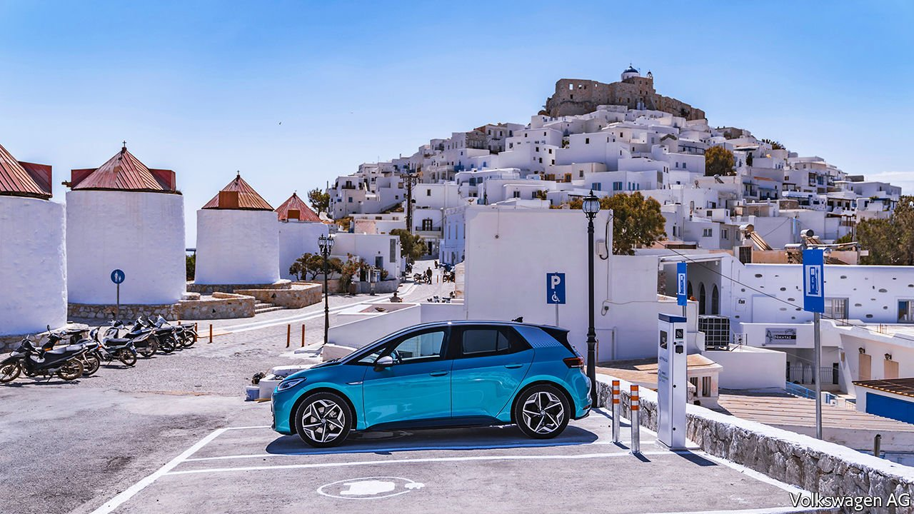

###### Sun, sand and scooters

# A Greek island is to host an experiment in low-carbon living 

##### Not everyone is convinced 

 

> Jul 17th 2021 

A  BUTTERFLY-SHAPED island in the central Aegean hopes to become Greece’s first carbon-free tourist destination. Under a deal with the government, Volkswagen, a carmaker, has donated several new electric vehicles for use by Astypalea’s public services; it will sell others at cost price to its 1,200 year-round residents. In return, the government has bumped up subsidies for islanders to buy electric cars and will build a hybrid solar and wind-fuelled power plant to replace a cluster of polluting diesel-fired generators.

Unlike other nearby islands, Astypalea is not connected to Greece’s electricity grid. With only 3,000 rooms for visitors in small hotels or flats, tourism is still low-key. Many residents make a living the old-fashioned way: raising goats, keeping bees and fishing. The island was selected for Volkswagen’s e-mobility experiment after Nikos Komineas, the go-ahead mayor, contacted the transport ministry for help in finding an electric bus to try out on its rugged roads.


Most islanders sound keen on the project. Mr Komineas expects the number of private cars on Astypalea to fall by a third over the next five years. Its residents, he says, will get around on e-scooters and electric minibuses, which will be free, linked to a mobile-phone app and available round the clock.

Some observers detect a whiff of greenwashing. A tender for a solar park that would generate half the island’s electricity within three years will not get under way before the tourist season ends. A single wind turbine will be installed only in 2026, assuming the licensing process goes smoothly. That is not normally the case in the Aegean, where islanders worry that tourists will go elsewhere if the view is spoiled by a turbine 200 metres high. And even then, the hybrid power unit is planned to cover only about 80% of summer demand. But it is a start.

