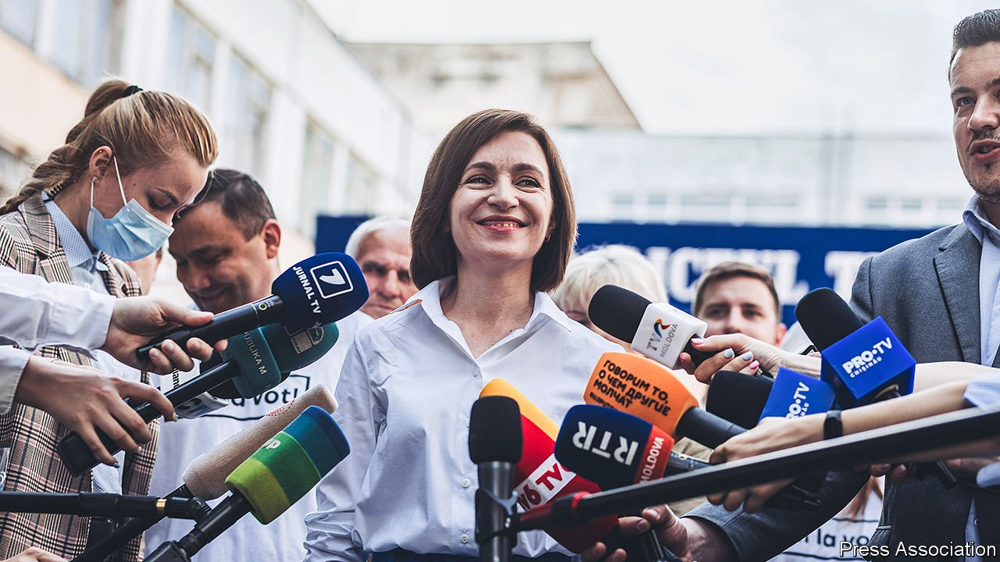

###### Bowled over

# An anti-corruption party triumphs in Moldova 

##### After decades of graft, a reformer now holds all the levers of power 

 

> Jul 15th 2021 

SHE IS SLIGHT, polite and gets what she wants. On July 11th the party founded by Maia Sandu, Moldova’s president, won parliamentary elections by a landslide. Over the past two years Ms Sandu (pictured), briefly prime minister in 2019, has seen off a local oligarch and has now dispatched the men from Moscow, too.

Moldova is one of Europe’s poorest countries. Weak institutions have made it even poorer. From 2012 to 2014 almost $1bn, or 12% of the country’s GDP, was stolen from the country through its banking system. Most of those believed to be responsible are still at large. From 2013 to 2019 Moldova was controlled by an oligarch, Vlad Plahotniuc, prompting the Council of Europe, which promotes human rights and democracy, to label it a “captive state”. Mr Plahotniuc used to claim he was pro-Western and that Moldovans should vote for him to stop their country falling into the hands of pro-Russian parties.


Ms Sandu founded a reformist party in 2016. Though harassed and bullied, it grew. In 2019 she struck a deal with Igor Dodon, the president at the time, and became prime minister, prompting Mr Plahotniuc to flee the country. But Mr Dodon, close to Vladimir Putin, Russia’s president, later turned on Ms Sandu and engineered her removal as prime minister. Undeterred, she beat him in presidential elections last year. Now her victory is complete.

Unlike Moldova’s pro-European politicians in the past, she appealed not only to Romanian-speakers (the majority) but also to Russian-speakers, who often get their news from Moscow’s propagandists. Corruption hurts everyone, she says, except the bribe-takers. A recent UN study estimates that illicit financial flows, from tax evasion to organised crime, cost Moldova $1bn a year. If a tenth of that could be recovered, it would pay the salaries of 20,000 teachers. Such brazen looting has hastened an exodus of Moldovans that has been swift even by eastern European standards. In 1989 Moldova had 4.3m people; now it has fewer than 3m.

With her hands on all the levers of power, Ms Sandu now has a unique opportunity. Her government must now clean up the judiciary, she says. Vadim Pistrinciuc, a reformist former MP, agrees but adds that if the government moves too slowly, a historic chance to break the link between the judges, the oligarchs and the media they control will be lost. They will regroup fast, he says. “Unless their power is smashed within six months, they will never leave.”

To the south, Bulgarians also voted on July 11th, with less happy results. They had already done so in April but neither the then incumbent prime minister, Boyko Borisov, nor the opposition was able to form a government. It is unclear if the situation is much different now. A stream of allegations of corruption and gangsterism, always denied, has eroded support for Mr Borisov. But there is no love lost between his many enemies.

Mr Borisov’s party was pushed into second place by that of Slavi Trifonov, a former TV showman. Then Mr Trifonov shocked the other anti-Borisov parties by declaring “coalition” to be a “dirty word”. He presented a take-it-or-leave-it proposal that he should lead a minority government. The other parties seem to have left it. ■

