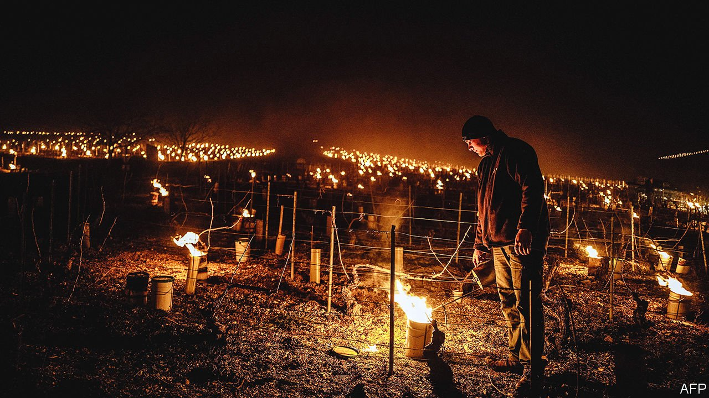

###### The grapes are off

# Climate change is affecting wine flavours 

##### British bubbly is getting easier to make; French grapes are threatened 

 

> Jul 17th 2021 

IN THE FOOTHILLS of Chianti Classico in central Italy, Elena Lapini and her husband make their way down neat rows of grapevines and inspect their fruit. The grapes are ripening too fast under the blistering sun. Too much bronzing on the vine and they will wither into raisins, turning the wine into a syrupy, unpleasant blend. Getting the harvest date right is crucial for this reason, Mrs Lapini says. But climate change is making it increasingly hard.

An analysis of harvest dates going back to 1354 from Burgundy in France found that air temperatures have increased so much that grapes are now harvested two weeks earlier than in medieval times. Higher peak temperatures have become the norm, with the biggest jump over the past 30 years. Elizabeth Wolkovich, a biologist at the University of British Columbia researching the impact of climate change on vineyards, says rising temperatures are also changing the taste of wine itself.


For some cooler regions, warming conditions have allowed winemakers to grow more flavourful berries and enjoy longer growing seasons. Germany, best known for its Riesling white wines, has become more favourable to the heat-loving grapes used to make reds like pinot noir. Parts of rain-sodden Britain now have the perfect climate to make sparkling wines, giving British bubbly from Kent and Sussex a fair fight against French champagne. But warmer places like France, Italy and Spain have had a rotten deal. Ripening grapes at a higher temperature means more sugar and less acid in the berry, making high-alcohol, honey-like wines.

Climate change is threatening the world’s wine supply, not just the wines’ flavour. In April producers in Italy and France found themselves lighting thousands of bucket-sized candles to warm the air and ward off a killer frost that threatened to destroy buds emerging with the first warm spells of spring. It wasn’t enough. In some regions the frost wiped out 90% of the crop, resulting in an estimated €2bn loss. French officials described it as “probably the greatest agricultural catastrophe of the beginning of the 21st century”.

Scientists concluded that the plants were coaxed to bud early by record-breaking temperatures in March. This made the chilly nights of early April particularly damaging. Climate change may make such events more common.

Some regions are better dressed for the weather; 51% of Europe’s shrublands are vulnerable, compared with just 7% in North America. Part of the problem is that European species are not well-adjusted to a warming world. They bud early, quickly reacting to warming air temperatures only to die once they suddenly drop. North America, by contrast, harbours cautious species with adaptive strategies. They do not bud until they have experienced a sufficiently long winter, regardless of short warm spells in spring.

Geographical differences help explain why. With no east-west mountain ranges in North America, warm air from the Gulf of Mexico and cold air from Arctic regions move freely across the continent, creating large fluctuations in temperature over short time periods. Constantin Zohner, a biologist at ETH Zürich, jokes that plants don’t want to take any risks in such an unpredictable climate. European winemakers, he reckons, need to take note and plant more resilient and diverse varieties of vine. There is no time to lose. ■

For more coverage of climate change, register for The Climate Issue, our fortnightly , or visit our 

