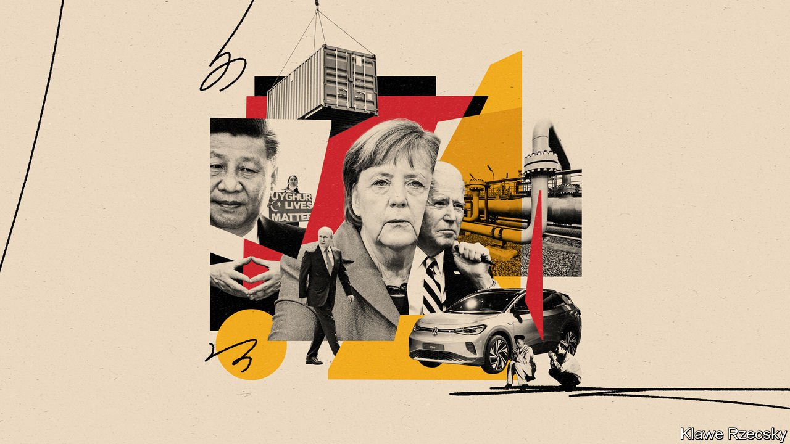
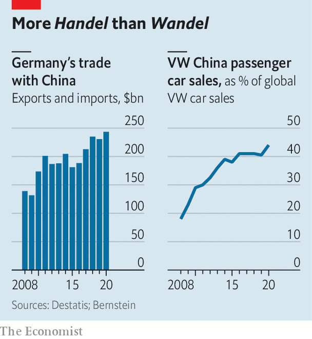

###### Auf Wiedersehen

# Germany’s export-driven foreign policy is being challenged 

##### But that does not mean it will change much 

 

> Jul 17th 2021 

ANGELA MERKEL and Joe Biden will dine together on July 15th in Washington during what is almost certain to be her final trip to America as Germany’s chancellor. The date is a reminder of the unique closeness of the two allies. It is the 75th anniversary of the arrival in Bremerhaven of the first CARE packages (Co-operative for American Remittances to Europe), parcels of food and supplies that prevented starvation for many in war-ravaged Germany.

There will be a great show of warmth between the lame-duck chancellor and the American president. Mr Biden is trying to mend relations with America’s closest allies after Donald Trump treated them with scorn. But the love-in will have its limits: on Russia and China, Germany and America are not aligned. “Russia is work in progress between the two allies, but there is a wide gap in what is the right strategy for China,” says Charles Kupchan of the Council on Foreign Relations, a think-tank.


Despite rumblings of discontent at home, even within her own party, Mrs Merkel continues to stick to her course in many of her dealings with Moscow and most of her relationship with Beijing. This has become an acute problem with Nord Stream 2, a €9.5bn ($11.2bn) undersea pipeline, fiercely opposed by America’s Congress, that will bring natural gas from Russia’s Yamal peninsula to the German coast, circumventing Ukrainian and Polish transit routes. The project is expected to be completed in August.

“Nord Stream 2 is a heavy millstone around our necks that is harming our credibility,” says Wolfgang Ischinger, a former German ambassador to America. The pipeline has largely nullified the credit Mrs Merkel won for press-ganging other Europeans into imposing sanctions against Russia after its annexation of Crimea in 2014. In May Mr Biden attempted to defuse the row by waiving sanctions on the company building the pipeline and on Matthias Warnig, a former East German intelligence officer who is its chief executive. But he needs something in return, as Congress looks likely to demand fresh sanctions next month.

Mrs Merkel is expected to achieve a compromise so that Mr Biden can placate congressmen. Germany could promise that it would turn off the gas coming through Nord Stream 2 if ever the Russians stopped the transit of gas through Ukraine, which fears the loss of transit fees. It could bolster Ukraine by helping it develop new sources of revenue and energy infrastructure. Lastly, it could help to pay for the American-fostered Three Seas Initiative, an effort to modernise infrastructure, including ports and pipes, between 12 eastern members of the European Union that is needed to switch to liquefied natural gas from America or other suppliers.

Like her predecessors Mrs Merkel has tried to balance loyalty to Germany’s allies with attempts to engage with adversaries economically. Yet whereas Willy Brandt’s Ostpolitik (eastern policy) was one of the most successful doctrines of the post-war years, Wandel durch Handel (change through trade), the mantra of the past two decades, is a distortion of Ostpolitik, argues Hans Kundnani of Chatham House, a British think-tank. Ostpolitik at least had reunification as a strategic objective: the idea of political change through trade is often little more than an excuse for closer commercial ties with autocratic regimes. It is one of the reasons that other EU leaders recently scuppered Mrs Merkel’s push for the first EU summit with Vladimir Putin since the Russian president annexed Crimea.

 


Until a couple of years ago Germany’s China policy was guided mainly by Wandel durch Handel, promoted in particular by the big carmakers that are Germany’s most important industry. Over the past ten years China has become Germany’s biggest trading partner, with goods exchanges growing to $243bn last year. And Volkswagen, Europe’s biggest carmaker, now sells more than 40% of its passenger cars in China (see charts).

But German enthusiasm for doing business with China has abated. At the start of 2019 the BDI, the main German industry association, published a paper calling China a “systemic competitor” and outlining its concerns about high barriers to entry, state subsidies to local firms and other distortions in the Chinese market. Siegfried Russwurm, the BDI’s boss, recently said that Germany needs “an honest discussion about how we deal with autocratic trading partners”. Human rights are not an internal affair, insisted Mr Russwurm, describing as “unacceptable” China’s treatment of the Uyghurs, a Muslim minority.

Policies are changing too. A new law requires German firms with more than 3,000 employees to prove by 2023 that their supply chains are free of human-rights abuses (from 2024 it will apply to those with more than 1,000). Penalties for infractions can be 2% of a company’s annual revenue.

Even so, Mrs Merkel is sticking to her policy of treating China with kid gloves. She was loth to ban Huawei, a Chinese firm, from bidding for contracts to build Germany’s fifth-generation telecoms networks, as America wanted. In the last days of Germany’s rotating presidency of the EU last December, she pushed through a treaty that is meant to grant European firms better access to the Chinese market. This irritated the incoming Biden administration, and has been blocked by the EU parliament. And in June Mrs Merkel made fellow G7 leaders water down their summit’s final communiqué to avoid upsetting China.

Will Mrs Merkel’s successor chart a different course? Of the three people vying to replace her after an election in September, two give the impression they are not aware of the extent of the challenge posed by Russian and Chinese aggression, says Constanze Stelzenmüller of the Brookings Institution, a think-tank. Armin Laschet, the Christian Democratic (CDU) candidate, and Olaf Scholz of the Social Democrats make feeble arguments about America wanting a “new cold war” and trying to force Europeans to “decouple” from China.

In contrast Annalena Baerbock, the Greens’ candidate, wants to stand up to Russia and China. But her chances are receding, with the latest polls giving the Greens less than 20% of the vote while the CDU and its allies hover around 30%. As a potential junior partner she would carry some weight on China and Russia policy, but it is hard to say how much; her priority would be climate change. That is why Mr Biden will listen to Mrs Merkel, even though she is on her way out. Her successor is likely to follow her faithfully. ■

