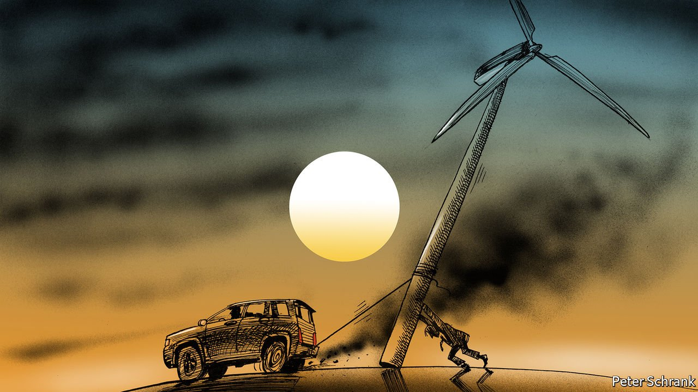

###### Charlemagne

# Why the European Union is a less-than-jolly green giant 

##### The EU is better placed than national governments to set green standards. This will hurt 

 

> Jul 15th 2021 

A SIMPLE RULE applies when analysing an EU scheme: the sillier something’s name, the more important it is. When the EU launched €750bn of common debt, it came under the seemingly Star Trek-inspired title of Next Generation EU. The European Semester, which makes little sense in any of the club’s 24 languages, dictates whether a government’s budget fits with EU spending rules. Schengen, the radical experiment in passport-free travel across an entire continent, is named after a nondescript village in Luxembourg. Nomenclature of Territorial Units for Statistics is a vital tool for dishing out EU funds, turning Europe’s map from a land of wiggly rivers and mountains into a patchwork gerrymandered by cynical officials aiming to scrape up cash. It is better known by a satisfying French acronym: NUTS.

“Fit for 55” is the apogee of this rule. What sounds like a gentle aerobics class for the middle-aged is in fact a series of sweeping environmental reforms that will set the direction of climate policy for the next decade. In a glut of legislation, the European Commission put forward 13 proposals with the aim of slashing emissions to 55% below their 1990 level by 2030. Carbon-intensive imports, such as industrial materials, face a levy at the EU’s border for the first time—which is already causing . Sectors once exempt from emissions-trading schemes, such as transport and domestic heating, will have to pay for the carbon they spit out. Those already covered will have to pay more. Cars with internal combustion engines will disappear from European forecourts by 2035.


Speak to the more enthusiastic officials and they claim this is nothing less than a revolution, changing the way Europeans live, determining the EU’s place in the world and providing the bloc with a purpose for a generation. It is, in their mind, a legislative “big bang” on a par with the creation of the single market or even the euro. Speak to others and all they can see is an almighty political fight brewing.

Climate should be a perfect topic for the EU. At heart, the club is a bet that nation states are a 19th-century invention no longer fit for the 21st century. Climate policy is an area where this argument is strongest. Solo national efforts are absurd. There is little point in Austria going green if petrol-guzzling Audis spew out emissions on German autobahns, or in the North Sea filling up with Danish wind turbines if Poland still relies on coal.

Environmental policy is also a fine canvas for the EU’s geopolitical ambitions. The EU fancies itself as a standard-setter: if the EU goes green, other countries will follow, runs the logic. What the EU lacks in hard power, it makes up for with regulatory clout. The “Brussels effect” allows EU regulations to ripple out from Belgium to Borneo. A combination of the EU’s economic size and its (usually) exacting standards means that other governments tend to adopt its rules too to save their businesses from having to abide by multiple codes.

Climate policy is the first big area where the “Brussels effect” will be properly tested. On issues such as online privacy, where the EU’s norms have become global ones, countries and companies fall in line because it is not especially expensive to follow suit. Likewise, timber producers in Indonesia have to abide by EU rules otherwise they will not be able to sell into its market. In short, the Brussels effect works when following EU rules is an easy or obvious compromise to make. Expecting other countries to mimic an expensive carbon-trading system is a much bigger ask—particularly when all it guarantees is access to a market that will only shrink as a proportion of the global economy. “Fit for 55” will demonstrate how much soft power the EU can actually wield.

With this potential comes peril. Environmental policy has long been an EU-level matter, but it is one that has traditionally been dealt with away from voters’ eyes, as businesses have been forced to deal with the consequences and quietly pass the bill on to consumers. Now voters will be asked to give up petrol cars, take fewer flights or pay far more for heating. They may rebel, as the gilets jaunes did in France in 2018 when fuel prices went up. Now this tortuous debate will be played out primarily on a European stage, rather than a national one. Frans Timmermans, the Dutch commissioner overseeing the package and the main remaining exponent of British English within the EU’s institutions, declared that reaching the target would be “bloody hard”.

Good cop, green cop

Climate policy is, after all, meant to hurt. Some behaviour is supposed to become more awkward and expensive. This rubs against the EU’s previous interactions with most citizens, which were to make things easier and cheaper: as in cut-price flights or the abolition of mobile-phone roaming fees. When it comes to environmental policy, European institutions will find themselves in the role they reluctantly played a decade ago during bail-out programmes in southern Europe: the face of unpopular reforms. Rather than representing the ability to fly from Amsterdam to Athens for the price of a round of drinks, the EU will come to be associated with the steep tab for going green.

Slashing emissions is a rotten problem for the officials, politicians and diplomats who must solve it. The costs come now and the benefits are reaped only in a generation, points out Elisabetta Cornago of the Centre for European Reform, a think-tank. Industry lobbyists are happy to accept targets for climate neutrality by 2050, when they will have retired but—funnily enough—not by 2030 when they will mostly still be in their jobs. Voters, too, are keen on going green, yet do not expect any aspect of their lives to change significantly. National politicians have a choice: share the political burden with Brussels, or shift the blame. Brussels provides a convenient scapegoat. For the EU, the process of going green will be painful, whatever silly name Eurocrats give it. ■

For more coverage of climate change, register for The Climate Issue, our fortnightly , or visit our 

A version of this article was published online on July 14th 2021

