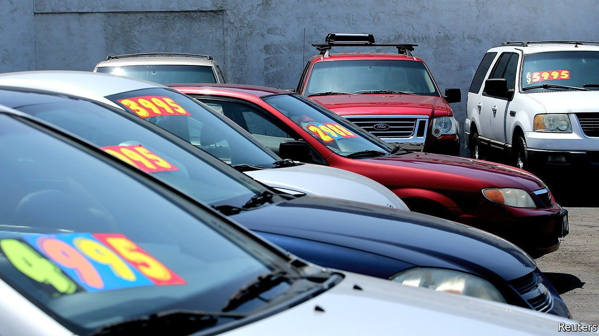
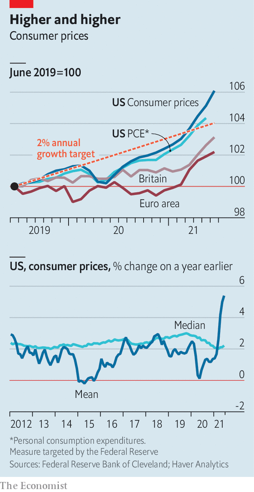

###### Sticker shock

# Inflation in America and Britain rises by much more than expected 

##### A small number of huge price rises are dragging up the headline rate 

 

> Jul 17th 2021 

 


CONSUMER PRICES rose by 5.4% in the year to June in America, and by 2.5% in Britain—both well above economists’ expectations. Speaking to Congress on July 14th Jerome Powell, chairman of the Federal Reserve, argued that America’s inflation surge is temporary. A small number of huge price rises, such as those for used cars, are dragging up the headline average rate. By contrast, the median price change is far lower.

