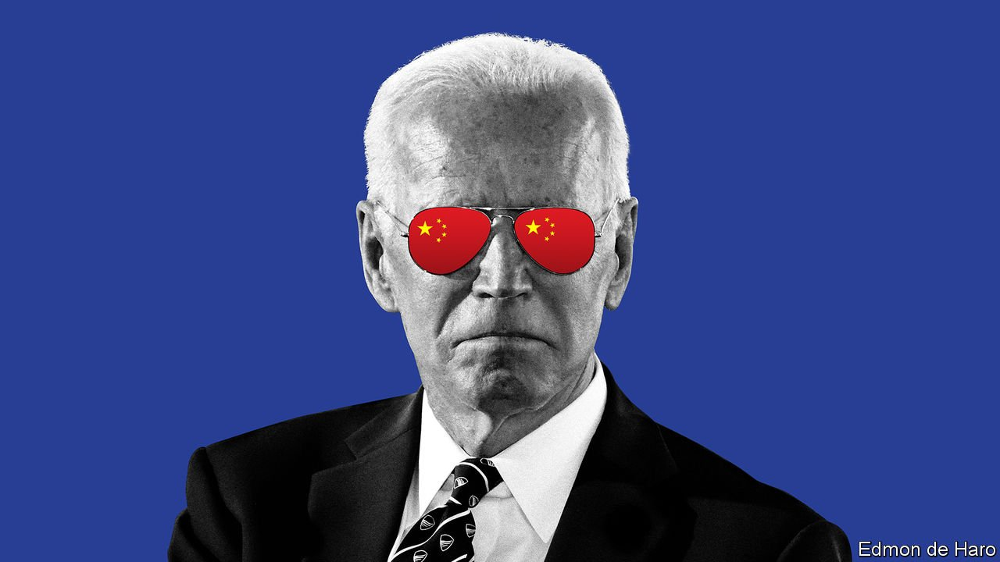

###### America and China

# Biden’s new China doctrine 

##### Its protectionism and its us-or-them rhetoric will hurt America and put off allies 

 

> Jul 17th 2021 

OPTIMISTS LONG hoped that welcoming China into the global economy would make it a “responsible stakeholder”, and bring about political reform. As president, Donald Trump blasted that as weak. Now Joe Biden is converting Trumpian bombast into a doctrine that pits America against China, a struggle between rival political systems which, he says, can have only one winner. Between them, Mr Trump and Mr Biden have engineered the most dramatic break in American foreign policy in the five decades since Richard Nixon went to China.

Mr Biden and his team base their doctrine on the belief that China is “less interested in coexistence and more interested in dominance”. The task of  is to blunt Chinese ambitions. America will work with China in areas of common interest, like climate change, but counter its ambitions elsewhere. That means building up the strength at home and working abroad with allies that can supplement its economic, technological, diplomatic, military and moral heft.


Much about Mr Biden’s new doctrine makes sense. The optimistic case for engagement has crumbled under the realities of Chinese power. Led by President Xi Jinping, China has garrisoned the South China Sea, imposed party rule on Hong Kong, threatened Taiwan, skirmished with India and has tried to subvert Western values in international bodies. Many countries are alarmed by China’s “wolf warrior” diplomacy.

But the details of the Biden doctrine contain much to worry about—not least that it is unlikely to work. One problem is how Mr Biden defines the threat. Because politics in Washington is broken, he seems to feel that he needs the spirit of Pearl Harbour to help rekindle a sense of national purpose. That is a miscalculation.

It is true that Republicans jump on anything they can portray as soft on China (even though every time they say that the presidential election was stolen, they do the work of Chinese propagandists). However, Republicans are unlikely to start backing Mr Biden’s domestic agenda just because it has the word “China” stamped on the cover.

Worse, the more Mr Biden uses strident rhetoric to galvanise Americans, the harder he makes his task of galvanising allies and big emerging powers like India and Indonesia. By framing the relationship as a zero-sum contest, he is presenting them with a Manichean struggle between democracy and autocracy, rather than the search for co-existence. Alas, in this he is overestimating America’s influence and underestimating how much potential allies have to lose by turning their back on China.

By many economic measures , whatever America does. It will have the world’s biggest economy and it is already the largest trading goods partner of almost twice as many countries as America. , aims to sustain commercial links with China even as political links buckle. In South-East Asia many countries look to America for their security and China for their prosperity. If forced to choose between the superpowers, some may pick China.

Rather than imposing a decision on other countries today, Mr Biden needs to win them around. And his best chance of that is for America to demonstrate that it can thrive at home and be the leader of a successful and open world economy.

Here, too, the details of Mr Biden’s scheme are troubling. Rather than build on America’s strengths as the champion of global rules, the administration is using the threat of China to further its domestic agenda. Its doctrine is full of industrial policy, government intervention, planning and controls. It is uncomfortably like the decoupling being pursued by China itself.

For a glimpse of what this could entail, look at the administration’s report on four crucial supply chains—for semiconductors, batteries, rare earths and vital pharmaceutical ingredients—published last month. The report does not just make the national-security case for government intervention in these industries. It also embraces union representation, social justice and pretty much everything else. More such reports will come later. If this one is a guide, Mr Biden will propose to use subsidies and regulation to ensure that jobs and production remain within America’s borders.

Inevitably, Mr Biden’s plans have trade-offs. Central to his attack on China is its abuse of human rights, especially of the Uyghurs, subject to internment and forced labour in Xinjiang. Central to his policy on climate change is to shift to renewables. Yet the two are entangled, at least in the short term, because Xinjiang is the origin of 45% of the silicon used in generating solar power.

A more fundamental problem is the China doctrine’s soft protectionism. This favours incumbents over competitors and is likely to weigh down the economy rather than supercharge it. The country’s new Moon programme is popular largely as a way to show that America has an edge over China. Yet it is vibrant precisely to the degree that it allows the sort of competition in which private firms such as SpaceX and  can shine.

A third problem is that Mr Biden’s doctrine will make America’s allies even more wary. If the purpose of cutting ties with China is to create good union jobs in America, allies will ask themselves what is in it for them.

Mr Biden’s plan is a missed opportunity. If America wants to stop China from rebuilding the global order in its image, it should defend the sort of globalisation that always served it well. At the centre of such an approach would be trade and the multilateral system, embodying the faith that openness and the free flow of ideas will create an edge in innovation.

If America really wanted to counter China in Asia, it would join the pan-Asian trade deal it walked away from in 2016. That is highly unlikely now, but it could seek fresh agreements on the environment and digital trade. It should also put money and clout behind new ideas that reinforce the Western order, such as a vaccine programme for future pandemics, digital payment systems, cyber-security and an infrastructure scheme to compete with China’s Belt and Road Initiative. Rather than copying China’s techno-nationalism, a more confident America should affirm what made the West strong. ■

For more coverage of Joe Biden’s presidency, visit our dedicated 

