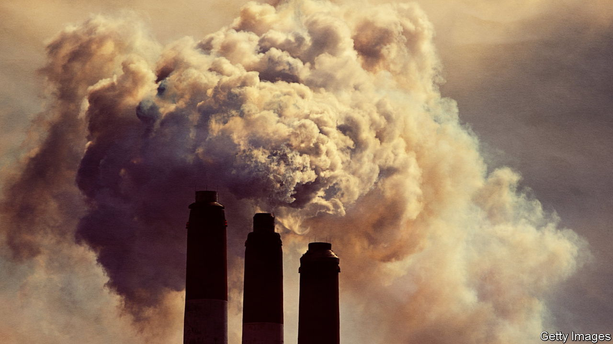
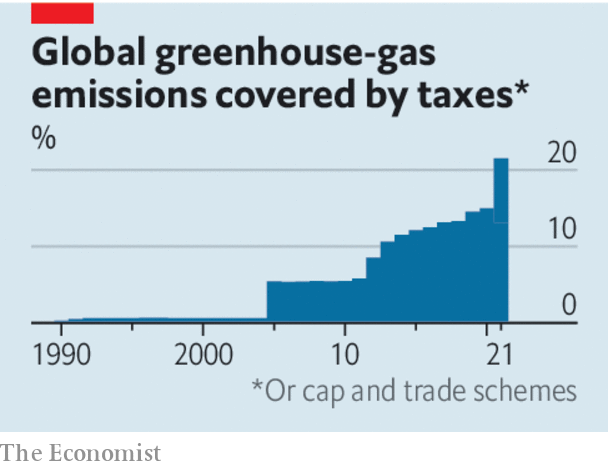

###### Climate change

# Carbon border taxes are defensible but bring great risks 

##### The EU’s proposal may set off another trade war 

 

> Jul 15th 2021 

CARBON PRICES are the most cost-effective way to fight climate change—but for them to work properly, emissions must be priced everywhere. On July 14th the European Commission unveiled its plan to levy what would, in effect, be a tariff on some carbon-intensive imports which, by virtue of having been produced outside the EU, are not subject to its cap-and-trade carbon-pricing scheme. The idea is to stop European firms from responding to the carbon price by moving production to parts of the world where they can pollute without penalty, to shield them from being undercut by rivals from such places and to encourage foreign firms who want to sell to Europe to go green.

There are sound reasons for applying carbon prices to imports. But working out how to go about it without causing a cycle of damaging protectionism is a conundrum.


Were carbon prices global, the costs of fulfilling the Paris agreement on climate change could fall by 79%, according to the Environmental Defence Fund, a think-tank. Market forces would find the cheapest ways to cut emissions. Yet a worldwide carbon market is a pipe dream. (China is due to launch the world’s largest emissions-trading system on July 16th, after we go to press, but permits will be far too cheap.) Carbon tariffs are a fallback measure.

 


Free traders like The Economist typically reject tariffs on principle. Cheap imports bring lower prices, more choice, higher productivity and incentives to innovate. Firms and workers constantly plead for protection from foreign competitors, alleging that jobs and profits must be shielded from unfair foreign competition. Liberals respond that the harm done to incumbents by the free operation of markets—what economists call “pecuniary externalities”—do not, unlike other types of harm, justify government intervention. “Society admits no right, legal or moral, in the disappointed competitors, to immunity from this kind of suffering,” wrote John Stuart Mill in 1859, 16 years after The Economist was founded to oppose the Corn Laws, which kept cheap food out of Britain to the benefit of its incumbent landowners.

, however, would not be inherently protectionist. They are an attempt to expand the reach of market forces rather than to limit them. The opportunity to pollute the atmosphere without penalty is itself a kind of distorting subsidy; more so if it exists unevenly across borders. Preventing climate change is a global public good, meaning every country’s citizens have a direct interest in reducing emissions wherever they happen. Pricing carbon at the border should therefore be viewed as a special case, and not as a precedent for using tariffs as a bludgeon with which to impose local regulations or standards abroad.

The problems with carbon tariffs are thus not moral or economic but practical and political. Implementing the policy fairly would mean ascertaining how much carbon has been emitted in the production of a given import, and to what extent foreign governments had already taxed those emissions. In 2018 the European Commission said that would be “clearly unmanageable”. Not much has changed since.

The EU’s new plan applies only to select industries which at present are protected using subsidies. The products involved, such as cement and fertiliser, are commonplace. Even so, the plan relies on arbitrary rules. Where the carbon intensity of a foreign producer’s processes cannot be estimated they will be assumed to be as dirty as the worst 10% of European companies.

Incumbents are rubbing their hands at the prospect of outsiders drowning in paperwork. Some members of the European Parliament are trying to amend the plan to favour local firms. John Kerry, America’s climate envoy, has said that the United States is also looking at carbon border taxes. That is indefensible unless America implements a proper carbon price at home.

The IMF has an alternative idea to tariffs: a globally negotiated minimum carbon tax which varies according to GDP. But it is not clear that it is achievable. William Nordhaus, a Nobel-prizewinning environmental economist, thinks willing countries should form a climate club within which carbon is priced and then simply levy flat punitive tariffs on those countries which refuse to join.

It is just about possible to imagine a successful path to a global carbon price that involves tariffs. But any such plan is fraught with the risk of capture and protectionism. Governments must tread with care—while also recognising that failing to price carbon adequately may be the greatest danger of all. ■

For more coverage of climate change, register for The Climate Issue, our fortnightly , or visit our 

