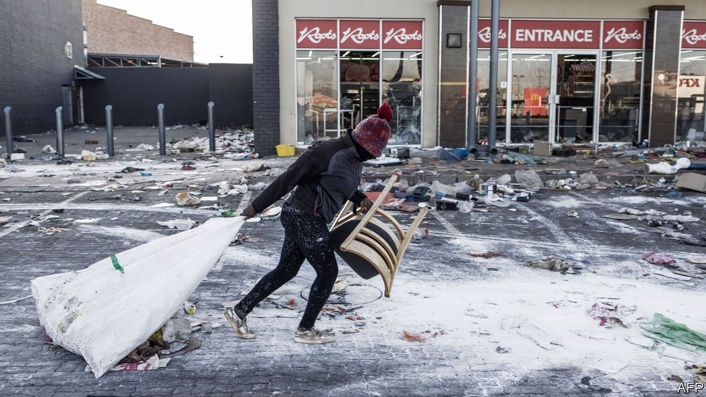

###### Jacob Zuma’s legacy

# South Africa’s war for the rule of law 

##### Order must be restored quickly in Africa’s most industrialised country 

 

> Jul 15th 2021 

SOUTH AFRICA offers dry kindling for political conflagration. Unemployment and inequality are preposterously high. Many people lack food, power and running water, while members of the ruling African National Congress (ANC) gorge on graft. In the two years before covid-19 there were more protests than probably at any time in the democratic era. The pandemic, Africa’s worst if official statistics are to be trusted, has killed at least 65,000 people and plunged many more into destitution.

Yet the violence that has engulfed the country in the past week is not a spontaneous protest against such ills. It was incited, and in some cases perhaps instigated, by people close to the former president, Jacob Zuma. Their narrow aim is to have him released after his imprisonment on July 7th for contempt of court for refusing to appear before a judge-led inquiry into his corrupt reign of 2009-18. Their broader goal is to make the country ungovernable so as to undermine his successor, Cyril Ramaphosa. For South Africa’s sake, they must not succeed.


Mr Zuma represents the ugly side of the ANC. His supporters either tolerate corruption, or avidly indulge in it. Mr Ramaphosa was elected to clean up the mess his predecessor left behind: a system of “state capture” that cost South Africa more than 500bn rand ($34.5bn), or about 10% of a year’s GDP. Mr Zuma’s cronies had looted budgets and subverted the bodies designed to check such abuses, including the police and prosecutors. Mr Ramaphosa has put clean, capable people back in charge of the tax and prosecution services. And judges are mostly honest and independent. For optimists, Mr Zuma’s sentencing symbolised South Africa’s renewed commitment to the rule of law.

That is why the bigwigs who profit from lawlessness are so desperate to thwart it. Many within the ANC still see Mr Zuma as their leader and his faction as their best chance for enrichment. Some police and spooks preferred the old, corrupt, ways, too. The weakness of the state is most acute in Mr Zuma’s stronghold of KwaZulu-Natal (KZN), a province with a history of violence by Zulu nationalists, scores of recent political assassinations, and local mafias. Many Zulus believe Mr Zuma when he claims, speciously, to be the victim of a political witch hunt.


In the past week at least 72 people have been killed and 1,234 arrested. In Gauteng, the economic heartland containing Johannesburg, shops have been ransacked. In KZN there have also been attacks on vital infrastructure: telecommunications towers, industrial warehouses and lorries along a crucial highway to the port of Durban. Hundreds of businesses have been destroyed. The country’s biggest refinery has shut. Petrol, food and medicines are in short supply in KZN. Local citizens, some nervously clutching guns, others holding no more than their neighbours’ hands, are protecting their houses and shops.

Mr Ramaphosa’s response has been too slow. He must get a grip. The priorities are to restore order in Gauteng and KZN, and to stop violence from spreading to the other seven provinces. On July 14th the defence minister said 25,000 troops would be deployed, the largest mobilisation since the end of apartheid. Authorities must be given everything they need to go after ringleaders. The finance ministry needs a plan to rebuild the economy and ease the pain of the pandemic. The police minister and commissioner should be fired. Calls to release Mr Zuma to stop the violence must be rejected with the disdain such ransom notes deserve.

Some South Africans wonder if their state is up to the task. But the security forces have enforced covid-related restrictions, so they should be able to restore peace. The inspiring response by non-state institutions—business groups, grassroots charities, local reporters—is a reminder of the best of South Africa. The rioters and their sponsors want to destroy the rule of law. Mr Ramaphosa, and all patriotic South Africans, must uphold it. ■

A version of this article was published online on July 14th 2021

