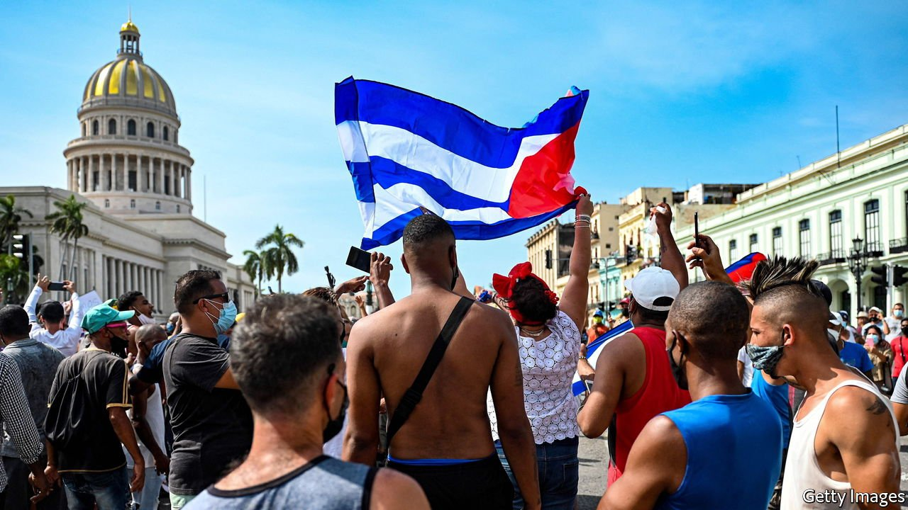

###### The mask slips

# The causes of Cuba’s uprising lie at home 

##### Joe Biden should scrap Donald Trump’s policies and lift the embargo 

 

> Jul 15th 2021 

THOUSANDS OF PROTESTERS thronged the streets on July 11th. Some stoned the police and looted posh shops. Such outbursts are unprecedented in Cuba since the communists secured their hold on power in the 1960s. “Freedom!” and “Down with the dictatorship!” they chanted, and “Patria y Vida!” (Fatherland and Life), quoting an underground reggaeton song that mocks Fidel Castro’s tired slogan of “Fatherland or Death”.

All this poses an extraordinary challenge to the dull bureaucrats who rule Cuba, after the death of Fidel and the retirement of his younger brother, Raúl, earlier this year. . “Revolutionaries, to the streets,” urged Miguel Díaz-Canel, the president who this year took the helm of the Communist Party, unleashing troops, police and loyalist mobs wielding baseball bats. At least one person was killed. Scores have been detained and the government has sporadically cut access to the internet.


Repression may work in Cuba, as it has elsewhere. But something there has snapped. The tacit contract that kept social peace for six decades is broken. Many Cubans used to put up with a police state because it guaranteed their basic needs, and those with initiative found a way to leave. Now Cubans are fed up. When Mr Díaz-Canel blames the protests on “American imperialism”, all he shows is how out of touch he is. The protesters are young, mainly black and dismiss the Castros’ revolution of 1959 against an American-backed tyrant as ancient history.

They have plenty to complain about. The pandemic has shut off foreign tourism, aggravating the economy’s lack of hard currency. Raúl Castro launched economic reforms, but they were timid and slow, permitting only minuscule private businesses. It was left to Mr Díaz-Canel to take the most momentous step, by ordering a big devaluation in January. Without measures to allow more private investment and growth, that has merely triggered inflation. As its sanctions-hit oil industry collapses, Venezuela, Cuba’s chief foreign patron over the past 15 years, has curbed its cut-price oil shipments, prompting power cuts during the heat of summer. Chronic shortages of food and medicine have become acute. Despite Cuba’s prowess at public health and its development of its own vaccine, the government has failed to contain the pandemic. The sick are dying, abandoned at home or on hospital floors.

Two other factors explain the outburst. One is the change of leadership. The Castros commanded respect even among the many Cubans who abhorred them. Mr Díaz-Canel, without a shred of charisma, does not. And the internet and social media, allowed only in the past few years, have broken the regime’s monopoly of information, connecting younger Cubans to each other and the world. They have empowered a cultural protest movement of artists and musicians. Its message, in the unanswerable lyrics of “Patria y Vida”, is “Your time’s up, the silence is broken…we’re not scared, the deception is over.”

Mr Díaz-Canel faces a choice: to turn Cuba into Belarus with sunshine, or to assuage discontent by allowing more private enterprise and greater cultural freedom. That could weaken the army and the Communist Party, but it would eventually salvage some of the revolution’s original social gains.

Curiously, many Republicans in the United States echo Mr Díaz-Canel’s description of America’s role in the protests. President Donald Trump tightened the economic embargo against Cuba, barring American tourists, curbing remittances and slapping sanctions on state firms, largely reversing Barack Obama’s opening to the island. Like Cuba’s president, Republicans argue that the unrest proves the embargo is working at last.

Not so. True, the embargo has made life harder for the Cuban government. But its restrictions mainly hurt Americans. The regime can still buy American food and medicine and trade with the world. The causes of Cuba’s social explosion lie at home.

Open the windows

Joe Biden should draw the obvious conclusion. So far he has left Mr Trump’s Cuba policy intact, so as not to annoy hawkish Cuban-Americans. Instead he should return to Mr Obama’s approach. The big threat to a closed regime is engagement with the world, especially the United States. Mr Biden should lift the embargo and deprive the regime of an excuse for its own failures. ■

