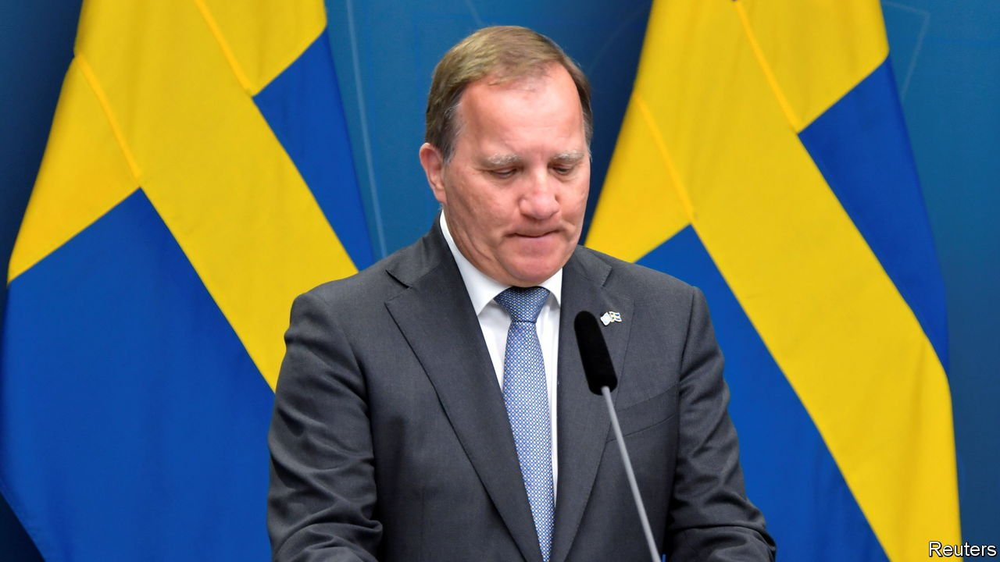
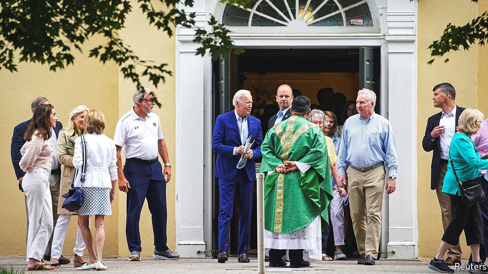
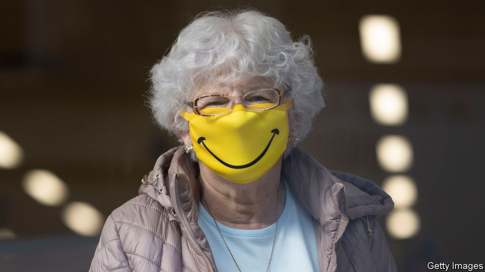

###### On Sweden, abortion, gun rights, state pensions, Belgium

# Letters to the editor 

##### A selection of correspondence 

 

> Jul 17th 2021 


Politics in Sweden

I noticed an important misconception in your article about the political situation in Sweden (“”, June 26th). You stated that the January accord that allowed the formation of the Social Democratic-Green government was negotiated not only with my own liberal Centre Party but also with the former communist Left Party. It emphatically was not. The point of the accord was to exclude both right- and left-wing extreme parties, while initiating major structural reforms, notably of the labour market. I was one of the politicians who negotiated this agreement with the prime minister, including the clause explicitly excluding influence for the Left Party.


What we did not anticipate was that the extremes would later unite, the Left Party voting for the populist and xenophobic Sweden Democrats’ motion of no confidence in Stefan Lofven, hurling Sweden into a political crisis. The Centre Party is now the sole remaining political force on the liberal centre-right opposing the direct influence of the Sweden Democrats over our government.

MARTIN ADAHL

Centre Party MP and negotiator of the January accord

Stockholm

 


Church and state

Given the manner in which Joe Biden’s Catholic faith has been worn in public, why is it so surprising that many bishops feel compelled to show their disapproval of his support for abortion, a practice that the church regards to be especially heinous (“”, June 26th)?

Catholicism allows certain space for a well-formed conscience. But your conscience can’t tell you, let alone suggest publicly to the whole world, that something the church’s authority explicitly forbids is in fact okay. If some prominent Democrat trumpeted something flagrantly out of line with a core Democratic plank, would we be shocked were Mr Biden and other party leaders publicly to correct the record, potentially sanctioning that individual?

DANIEL BRENDEL

Alexandria, Virginia

 


Guns and the constitution

Your review of Carol Anderson’s book on the Second Amendment was too kind in discussing her strange theory that it was designed to help the South enforce slavery (“”, June 12th). Such a view blatantly overlooks the important role that our militia played in the French and Indian war and the American revolution, both of which predated the drafting of the constitution.

It also ignores the views of African-American leaders like Frederick Douglass, who wrote the following words to encourage black men to enlist in the Union army:

In your hands that musket means liberty, and should your constitutional rights at the close of this war be denied… your brethren are safe while you have a constitution which proclaims your right to keep and bear arms.

Not much doubt about where Douglass stood on the issue.

JOHN DIRLAM

Wellesley, Massachusetts

 


Customised state pensions

It is true that state pensions in Britain might rise by an unusually large percentage next year, thanks to statistical quirks (“”, June 26th). Some might say that needs to happen, especially given Britain’s low level of public pension compared with other countries, but affordability is an issue. As you pointed out, the programme to push back the state-pension age, which could reach 69 by 2050, does reduce the cost. But this approach also has a disproportionate impact on those with lower life expectancies, who are more affected by missing out on earlier payments.

Instead of a one-size-fits-all delay, we should introduce a state-pension window, a new system that would retain the option for people to access some level of state pension from 65, with incentives for others to take it later.

RAJ MODY

Head of pensions

PwC

London

 


There’ll always be a Belgium

Forty years ago The Economist predicted that Belgium would not last long (Survey of Belgium, “”, January 19th 1980). Now it claims that Belgium is a failed state and “in some ways, secession has already happened” (, June 26th). You could have noted that most of the decisions and legislation are taken at the federal level and not in the regions, and that the judicial system is unified nationally (more so than the British one). A glance over the Belgian constitution would have been instructive.

According to recent polls, a clear majority of citizens in the three main parts of the country reject the idea of secession. Granted, the structure of government is expensive and complicated, but a shrewd citizen, as most Belgians are, is able to understand the working of the institutions. Moreover, the checks and balances in government have been very attractive to refugees. They did not come for the 199 rainy days a year (Ireland has 225 by the way), the beer, the chocolate or the fries, or even for the undeniable prosperity of the country, but to find a safe haven in a tolerant and trusted democratic state. So many have found a home in Belgium during their exile.

IVAN VEROUGSTRAETE

Former judge on the Belgian supreme court

Brussels

True “Belgian zen” is not about grey indifference, it’s about actively choosing not to have an opinion. Those are two different things. Imagine a country where you ought to have an opinion about everything if you don’t want to look odd. Abracadabra: Brexit.

VINCENT BATSAntwerp

Charlemagne presented Belgium as a grey, absurd and highly bureaucratic country. As a Belgian citizen living in Britain I can confirm that a “Belgitude” also helps to cope with the grey weather, absurd politics and bureaucracy on this side of the channel.

DAMIEN VAN PUYVELDE

Glasgow

As an anti-nationalist Syrian refugee in Belgium Charlemagne has made me realise that I am wholeheartedly enthusiastic about becoming a citizen of such a successful failed state. It is telling that the harshest critics of Belgian culture are the Belgians themselves. It is bizarre to witness the excitement of Belgians to work with French or Dutch people rather than their own.

However, the Flemish and the Walloons were never so united as when France lost to Switzerland in the recent Euro football tournament (not even when Belgium beat Portugal). They taunted the French in both Dutch and French.

ALEXANDRE AL JAEGER

Ghent

Belgium is also the only country where a politician can erroneously sing the wrong national anthem in front of the television cameras and become prime minister regardless shortly after. This happened to Yves Leterme, on-and-off prime minister from 2008 to 2011, who was prompted by a reporter on Belgium’s national day in 2007 to prove he knew the anthem. He sang the French La Marseillaise.

MARKUS HAEFLIGER

Bern, Switzerland

