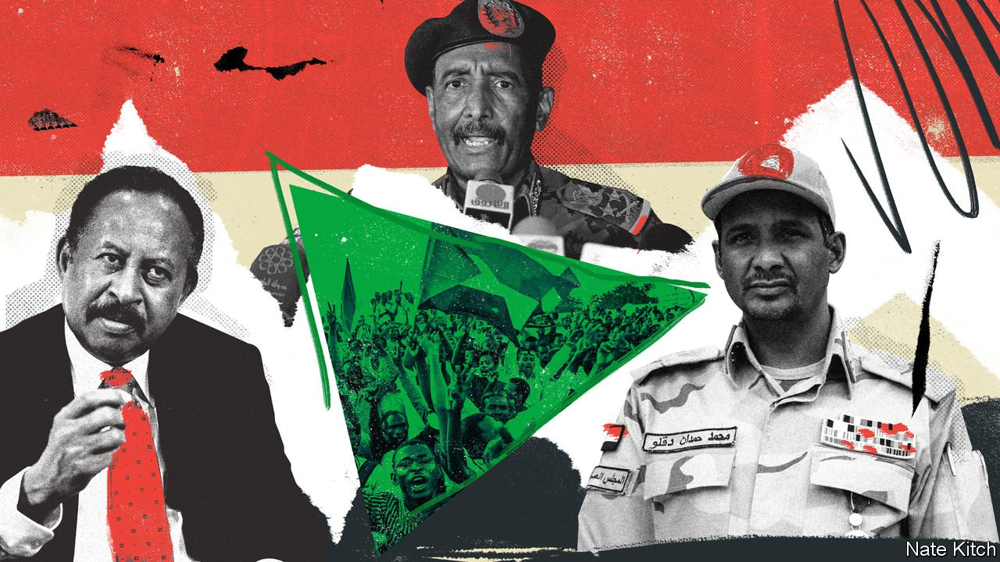

###### Unlikely bedfellows

# A general, a warlord and an economist vie to run Sudan 

##### Interviews with the three most powerful men in a would-be democracy 

 

> Jul 15th 2021 

A STALWART OF the previous regime, now in charge of dismantling it. A camel-rustler turned warlord, now ensconced in a palatial home. And an avuncular economist, who once was a communist.

These are unlikely bedfellows. Yet they are entrusted with the task of building democracy in Sudan. Barely two years after a ruthless Islamist despot, Omar al-Bashir, was deposed, they are supposed to be shepherding the country towards elections in 2024. “We call it the Sudan model,” smiles Abdalla Hamdok, the economist (below left). He is the prime minister appointed by protest leaders in 2019. “A model of partnership between civilians and the military, paradoxically, to bring democracy.”


That model emerged from a power-sharing pact struck in 2019 between leaders of the protesters, who had first taken to the streets eight months earlier, and the generals who had tossed out Mr Bashir when it became clear he would fall. At the top is Abdel-Fattah al-Burhan (centre), Sudan’s de facto president and chairman of the sovereign council, a military and civilian body that oversees Mr Hamdok’s mostly civilian cabinet. Burhan is a general who rose to prominence under Mr Bashir.

Beneath him is a desert warlord, Muhammad Hamdan Dagalo (known as Hemedti). He heads the Rapid Support Forces (RSF), a paramilitary unit that grew out of the Janjaweed, militias notorious for rape and butchery of civilians in the Darfur region. Mr Dagalo (pictured right), now deputy chairman, rose to power through ruthlessness towards rebellious Sudanese. Today he is jostling for primacy in a struggle that may determine whether Sudan’s third attempt at democracy since independence from Britain in 1956 also ends in failure.

Each tells The Economist that the spirit of unity is undimmed. “All components of the transition work together in harmony,” says General Burhan. As evidence he points to successes: a peace deal signed with armed rebels, and the repeal of repressive laws, such as one that banned women from wearing immodest clothing.

General Burhan also highlights the restoration of full ties with America and Israel, which prompted America to remove Sudan from its list of state sponsors of terrorism. This has paved the way for Sudan to win relief on more than $56bn of its debt. “Our international isolation of more than 30 years is now over,” says the general.

But behind the façade of camaraderie tension runs deep. Speaking more candidly than his colleagues, Mr Hamdok warns of a “political crisis” stemming from three challenges that could derail the transition. The first is division among civilian leaders. “This was probably the broadest coalition the country has seen for decades,” Mr Hamdok explains. “It managed to topple the dictatorship. But immediately afterwards we started seeing cracks and divisions.” Several of its members have withdrawn from the coalition and returned to the streets. Those that remain squabble over jobs and government portfolios. Critics blame Mr Hamdok’s aloof and timid governing style for failing to maintain unity.

 


The fragmentation makes it harder for the civilians to handle the prime minister’s second challenge: to rein in the army. Mr Hamdok says he had “very frank discussions” with the generals early on about the army’s excessive power over the economy. General Burhan says this has ended, but that stretches credulity. Several firms which used to belong to Mr Bashir’s family, for instance, now belong to the army.

General Burhan, meanwhile, has emerged as the most powerful and effective of the three. He has muscled in on foreign policy, which is Mr Hamdok’s job. He has strengthened Sudan’s relationship with Egypt and overridden civilian objections to the deal with Israel last year. He has also burnished the army’s nationalist credentials by taking back control of . “Burhan is a shrewd general,” says Yasir Arman, a former rebel who is now advising Mr Hamdok. “He bought time to shore up the army’s position. And now it is stronger than ever.”

But General Burhan’s assertiveness may have exacerbated the third problem Mr Hamdok identifies: fragmentation within the armed forces, and competition between the army and the paramilitary RSF. Created by Mr Bashir as a counterweight to the army and the intelligence service, the RSF has its own command structure and funding. As part of the power-sharing deal, Mr Dagalo is supposed to integrate his forces into the army, which would mean giving up some of his power. The general says this will happen “in the right time”. Mr Dagalo insists it has already happened.

But this superficial harmony could quickly evaporate. In June the RSF and the army began barricading their respective headquarters in Khartoum with sandbags. “It had reached a point where they could have been killing each other on the streets,” says Shaddad Hamid Mauwid, an academic at Khartoum University. Talks between General Burhan and Mr Dagalo have since calmed nerves. Some reckon the general may have agreed to postpone integration indefinitely. Yet that would put him at odds with Mr Hamdok, who feels Sudan should “have one national army”.

Big questions remain about Mr Dagalo. Few doubt he has presidential ambitions. (Over a sumptuous breakfast at his home he tells The Economist he has been taking English and French lessons.) But his footing looks a bit shaky. Saudi Arabia and the United Arab Emirates, which used to pay for thousands of his soldiers to fight in Yemen, no longer have much use for him. And the death of Chad’s dictator, Idriss Déby, has deprived him of another regional ally. Recent visits to both Qatar and Turkey suggest he is seeking new friends.

Perhaps in a sign of anxiety, Mr Dagalo warns of a “coup” by people tied to the old regime. Though this is unlikely, Islamists from Mr Bashir’s former party may conceivably ally with factions in the army to force Mr Dagalo out, notes Jean-Baptiste Gallopin, a French researcher. This could set off fighting across Sudan. Yet other observers believe Mr Dagalo himself would pose a bigger threat to the transition, should he fear for his economic interests—or his freedom. An investigation into a massacre of over 100 protesters in 2019 may point the finger at his gunmen.

Mr Hamdok has been sounding the alarm. In June he warned of civil war if the armed factions are not unified in a single army. He has set a deadline for forming a legislature with civilians in charge and called for a constitutional convention to clarify the place of the army in politics. “For all the years since independence to today, we have been dominated by the military,” he says. The civilians have a chance to reverse this. But only a fleeting one. ■

