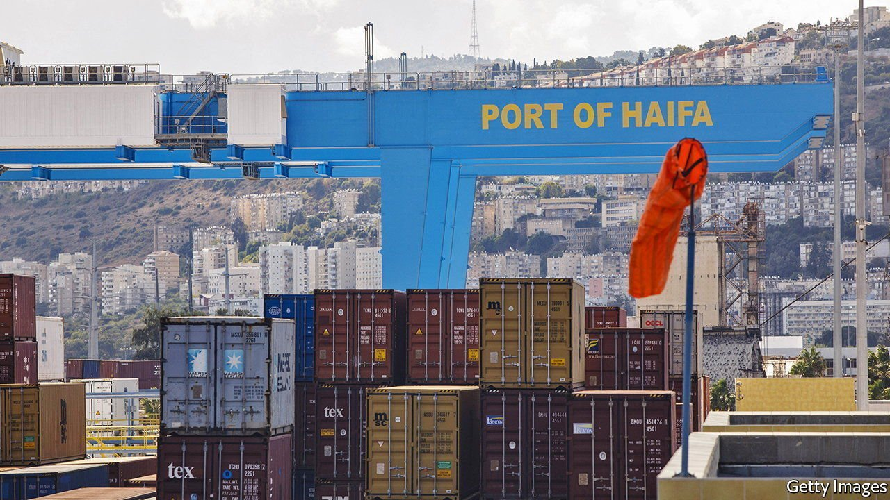

###### The enemy of my friend

# Israel is being forced to choose between America and China 

##### One is its strongest ally, the other offers investment and trade 

 

> Jul 15th 2021 

THE ADVISORY Committee to Inspect National Security Aspects of Foreign Investments is the dull title for one of the more secret and sensitive bodies in the Israeli government. Its membership is unknown and meetings are held under a blanket of opacity. It is essentially a committee to assess deals with China. It was set up in 2020 after pressure from America, which was concerned that China could be getting Israeli weapons technology. The committee’s chilling effect on trade and ties with China is already being felt.

Although there is no official policy or written directive banning Chinese investments in key areas of the economy, there has been a marked slowdown in new deals. “The Americans made it clear to us that they would not accept any Chinese involvement in critical infrastructure and Israel belatedly got the message,” says a former Israeli minister in the government that left office on June 13th.


In May 2020, for instance, Israel rejected a bid by Hutchison Water, a Chinese firm, to build a desalination plant. Chinese firms are still involved in previously signed infrastructure projects, including the new Tel Aviv light-rail network. But Israel, under American pressure, is discreetly trying to replace the Shanghai International Port Group, which is set to manage a new container terminal in Haifa Port, with an Emirati company.

“In the past we got a lot less guidance from the government on how to do business with China,” says one Israeli executive who has spent over a decade working on Chinese investment. “Now things are a lot clearer. They can invest in fields like foodtech and fintech, but not in anything cyber- or security-related and not in infrastructure.” Chinese investment in Israeli tech companies has fallen from 72 deals in 2018 to 45 in 2020. This can be explained partly by the pandemic and new regulations within China on foreign-currency transfers, but also by what one Israeli diplomat calls the “recalibration of relations”.

“Under Netanyahu, Israel felt that it could have its cake and eat it—do business with the Chinese without the Americans being angry with us,” says Doron Ella, an expert on Israel-China relations at the Institute for National Security Studies, a think-tank in Tel Aviv. “It took Israel time to realise the extent to which the US now sees China as its chief rival.” ■

