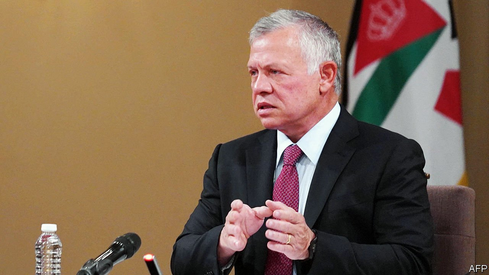

###### Courting trouble

# Jordan’s jailing of a courtier exposes fissures in the kingdom 

##### Some Bedouin tribes may be changing allegiance 

 

> Jul 15th 2021 

FOR KING ABDULLAH it is like old times. On July 19th he will be back in the White House, the first Arab leader to meet the new president. Gone are the cast of old antagonists, Donald Trump and his chum, Binyamin Netanyahu. President Joe Biden has ditched Mr Trump’s “deal-of-the-century” for Arab-Israeli peace, which had sidelined Jordan and its king. Naftali Bennett made Amman, Jordan’s capital, his first foreign destination as Israel’s new prime minister. Without Mr Trump’s support, Saudi Arabia has backed off from trying to supplant Jordan as the custodian of Jerusalem’s holy sites. Confident of this geopolitical realignment in Jordan’s favour, Abdullah and his queen, Rania, have taken a three-week jaunt around America.

Back home, though, Jordan is seething. Bedouin tribes, historically the regime’s bedrock, openly challenge the king, who has reigned for 22 years. “I’ve never seen such dissent,” says a former official. “It’s seeping into the heart of the system itself.”


On July 12th Jordan’s State Security Court sentenced two of the king’s former confidants, Bassem Awadallah and Sharif Hassan bin Zeid, to 15 years in prison for plotting against the monarch. The trial was quick, closed and devoid of key witnesses. No army officers were charged, casting doubt on the prosecution’s claim that a coup was being planned. Lawyers for the accused could not call as a witness the alleged chief protagonist, Prince Hamzah, the king’s half-brother, because he is under house arrest.

Instead of uniting Jordan behind the king, the case has inflamed tensions. Several Bedouin tribes, a minority who fear losing their dominance to the descendants of Palestinians, have pledged their allegiance to the prince. One of their parliamentarians led protests waving a sword. (He was subsequently jailed for threatening to shoot the king.) Protesters praise Hamzah’s fluent Arabic, deep tribal connections and facial resemblance to their beloved former king, Hussein, and deride Abdullah’s Western upbringing and ties by marriage to Jordan’s Palestinian majority. They call him an American lackey and chant in English—“so he’ll understand”.

In the past the king (pictured below) has bought off the tribes by offering them jobs in the security forces. But the country’s economic woes are stoking anger. Covid-19 has hit the mainstays of tourism and remittances. Oil-rich Gulf states have been cutting aid and investment. Debt is set to reach 118% of GDP this year. Almost two-thirds of young Jordanians are jobless.

With no vision for recovery, the king rarely addresses his nation. America already gives $1.5bn annually (making the country America’s second-largest recipient of aid). Israel has direct flights to the Gulf and no longer needs Jordan as a stepping stone to the Arab world and beyond. For appearances ahead of his visit to America, the king has appointed a commission stacked with toadies to consider political reform. But he prefers to stifle dissent than listen to it. He closes trade unions and curbs civil liberties. This year Freedom House, a think-tank in Washington, downgraded Jordan’s ranking from “Partly Free” to “Not Free”. The king’s meeting with Mr Biden may offer him a photo opportunity. It will not cure his country’s ills. ■

