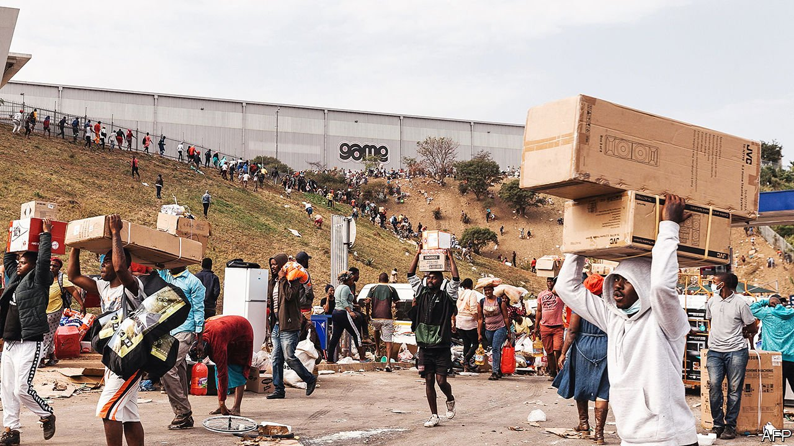
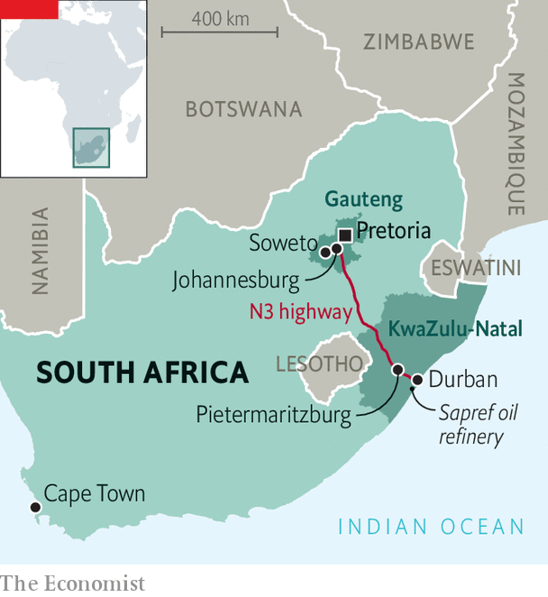

###### Jacob’s looters

# South Africa reels from the worst violence since apartheid 

##### A jailed ex-president won’t go quietly 

 

> Jul 15th 2021 

SHOPPING CENTRES should be a symbol of South Africa’s progress. Their core customers, as well as their staff, are the black middle class that has grown since apartheid ended. In the past week, however, looters have destroyed malls in cities such as Pretoria, Durban and Johannesburg. Thousands of criminals have ransacked shops, departing unchallenged with their booty.

The mayhem does not end there. Arsonists have burnt lorries along the country’s major motorway, forcing its closure. Vandals have attacked infrastructure, including industrial warehouses and more than 100 telecommunications towers. The country’s largest oil refinery is shut. Rioters have blocked roads used by nurses and doctors to reach hospitals dealing with a massive third wave of covid-19. Ambulances have been attacked. Vaccination sites have shuttered. Thousands of businesses have been wrecked; many will never reopen. Food, petrol and medicines are in short supply in the province of KwaZulu-Natal (KZN) and parts of Gauteng, which contains Johannesburg. At least 72 people have been killed and more than 1,234 arrested. The worst violence since the dawn of democracy in 1994 not only threatens the presidency of Cyril Ramaphosa but shows how his enemies can exploit the weakness of the post-apartheid state.


In South Africa there are plenty of sources of discontent. The official unemployment rate is the highest in the world, according to the World Bank. Gaping inequality means a minority enjoys a rich-world standard of living while most people struggle to get by. Parts of the country regularly go without power and water. The police are a blend of incompetence and cruelty. The pandemic has made life harder in every way. And when corruption is rampant, some ask, what is raiding a supermarket compared with looting a state airline or the national energy company?

But the riots are not random. They have been urged on by supporters of Jacob Zuma, the former president whose faction of the ruling African National Congress (ANC) wants to topple Mr Ramaphosa. On June 29th the Constitutional Court sentenced Mr Zuma to 15 months behind bars for refusing to appear before a judge-led inquiry into corruption during his time in office from 2009-18. Just before midnight on July 7th, as the highest court’s deadline for the police to arrest him approached, Mr Zuma was taken into custody. His allies, including family members, then spread misinformation about the basis for his arrest and encouraged unrest. His foundation called it the “righteous anger of the people...which others have characterised as violence”, in response to the “violent provocation” of his sentencing.

 


Some Zuma supporters may have done more than applaud the destruction. In a veiled reference to the Zulu nationalists who make up Mr Zuma’s base, Mr Ramaphosa said on July 12th that “there may have been some people who sought to agitate for violence and disorder along ethnic lines.” The next day, Ayanda Dlodlo, the State Security Minister, said the government was investigating whether former agents of the domestic spy agency and senior ANC members aligned with Mr Zuma had actively organised some of the violence. On July 14th News24, a South African outlet, reported that the government was looking into allegations that Thulani Dlomo, a Zuma-era spy boss and former ambassador, was one of the instigators.

Some 25,000 troops will soon be deployed, said the defence minister on July 14th. They are needed. In KZN, Mr Zuma’s stronghold, the violence was still unabated as The Economist went to press. Police were conspicuous by their absence at the sites of some of the worst criminality. The first state of emergency since the apartheid era is being considered, according to government ministers. Several business groups are pleading for it.

As is often the case, South Africans let down by the state are taking matters into their own hands. In parts of KZN, armed neighbourhood groups are controlling entry to and exit from their areas. The country’s many private-security firms, which between them have more than three times as many guards as there are police officers, are patrolling suburbs and defending businesses. In Johannesburg townships, such as Alexandra and Soweto, community groups are banding together to protect malls and sweep up the broken glass.

Recovery will take years. Some South African business owners, teetering after years of slow growth, will give up or go overseas. Some foreign investors will look at the chaos, see every bad stereotype about South Africa confirmed, and put their money elsewhere. Already strained public finances will be hit by the cost of rebuilding infrastructure and of payouts from a state insurer used by firms to cover against riots. Even after trashed, burned buildings have been repaired, the damage to the social fabric may prove enduring.

Mr Ramaphosa has defined his presidency as the opposite of Mr Zuma’s. In his speech on July 12th he told the country: “This is not who we are as South Africans. This is not us.” He pledged to “restore calm and order”. But if his government does not do so soon, it will cement the malign legacy of his predecessor and emphasise his own weakness. Mr Zuma may no longer be in charge. But is anyone? ■

A version of this article was published online on July 12th 2021

