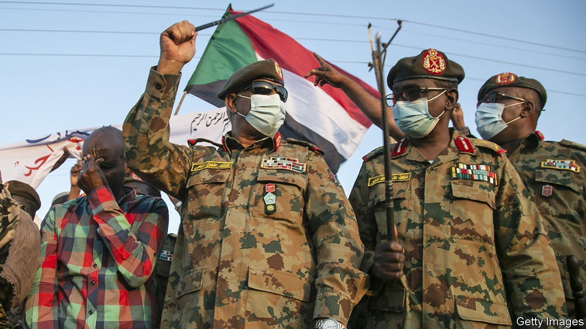
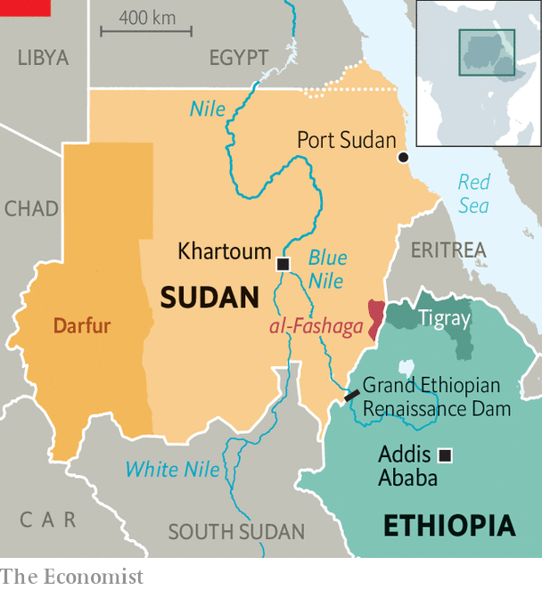

###### The most dangerous place in the Horn

# Why nerves are jangling on the border between Ethiopia and Sudan 

##### Conflict over farmland in al-Fashaga threatens to spark a war 

 

> Jul 15th 2021 

AT FIRST SIGHT it looks an unremarkable place. Open savannah scattered with thatched-roof homesteads. Bumpy and unpaved roads. Upturned soil that appears rocky and blackened.

But then come Sudanese soldiers. One is on a tractor. Another walks through a field, cigarette in one hand, rifle in the other. Tanks face east towards Ethiopia.


For eight months this slice of fertile farmland known as al-Fashaga has been on a war footing. Army camps have sprung up across fields of sesame and sorghum. There are thought to be tens of thousands of soldiers on the Sudanese side. Nobody knows how many have been deployed by the Ethiopians. But after months of skirmishes and some small battles, many fret that just one spark could trigger a full-blown war.

The conflict dates back to the early 20th century, when the British who then ruled in Khartoum signed border treaties with Ethiopia placing al-Fashaga inside Sudan. Ethiopia has long disputed them. But an uneasy compromise established between Sudan’s former dictator, Omar al-Bashir, and Ethiopia's late prime minister, Meles Zenawi, allowed Ethiopians to till the land, provided they recognised Sudanese ownership of the area.

 


That bargain ended in November when war erupted in Tigray, a northern Ethiopian region which borders al-Fashaga. Abiy Ahmed, the Ethiopian prime minister, asked the Sudanese to seal the border to stop the Tigrayans from smuggling in supplies. Sudanese troops moved in and expelled thousands of Ethiopian farmers. Ethiopian officials called it an invasion and sent in reinforcements backed by units from neighbouring Eritrea.

Some reckon that Sudanese generals, including the de facto president, are using the threat of war to strengthen their hand within . Also, several army officers are known to own land in al-Fashaga. But the civilians sound as incensed as the generals. “We are actually very surprised by the [Ethiopians’] rhetoric,” says Abdalla Hamdok, Sudan’s civilian prime minister. “You can’t invade your own land!”

Aggravating matters is the Grand Ethiopian Renaissance Dam (GERD) being built by the Ethiopians on the Nile near the border. Abiy’s government suspects dirty tricks by downstream Egypt, which it believes wants to scupper the dam. “If you search for the cause of every problem, you find the GERD behind each of them,” said Abiy in March.

In June rebels in Tigray seized control of most of their region. Some of Abiy’s defeated troops are now being sent to reinforce those on the border with Sudan. His government has also indicated that it will blockade Tigray in order to weaken its leaders. If so, the rebels are likely to fight for access to the Sudanese border—making al-Fashaga the civil war’s next front line.

