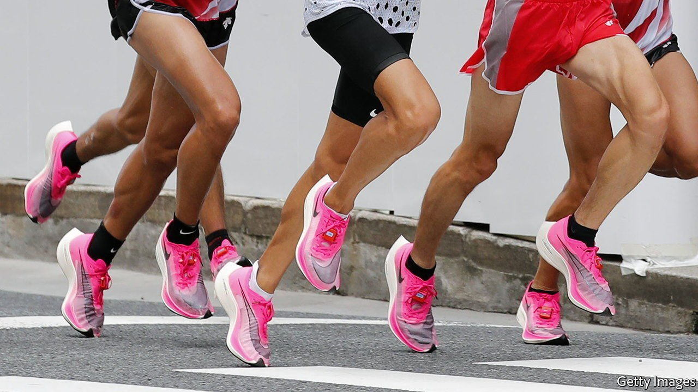

###### Sports equipment

# New running shoes are smashing records 

##### Is that fair? 

 

> Jul 14th 2021 

PLATFORM SHOES are back in fashion, at least in athletics. Many of the long-distance runners at the Tokyo Olympics, which begin on July 23rd, will arrive at the starting line sporting footwear with a distinctive chunky-looking heel. It will be more than just a fashion statement. The new shoes offer such a big performance advantage that critics have described them as “technological doping”.

Running-shoe makers have long tried to boost athletic performance, observes Geoff Burns, a biomechanics expert at the University of Michigan. In olden days, a 1% improvement in “running economy”—the energy taken to travel a given distance—would have impressed. But in 2016 Nike released the first version of its “Vaporfly” model, which improved running economy by 4%.


If that percentage were to translate directly into performance, it would knock about five minutes off an elite male’s marathon time. In practice, as Dr Burns observes, it wouldn’t quite do that. A marathon improvement of around 90 seconds would be a more realistic expectation. But Vaporfly and its successors have helped athletes smash a string of records. On June 6th Sifan Hassan, a Dutch runner, completed a women’s 10,000 metres race in 29 minutes and 6.82 seconds, beating a record set in 2016. Two days later she was overtaken by Letesenbet Gidey, an Ethiopian, who clocked 29 minutes and 1.03 seconds. In 2019 Eliod Kipchoge, a Kenyan, became the first to run, albeit in an unofficial event, a marathon’s distance of 42.195km in under two hours. The same weekend Brigid Kosgei, another Kenyan, broke a women’s marathon record that had stood for 16 years.

Scientists are still puzzling over exactly how the shoes work. The soles are made of a new type of foam that offers an unprecedented mix of resilience and squidginess, according to Dr Burns. This returns around 80% of the energy from each strike of a runner’s foot. The carbon-fibre plate may help by stiffening the midsole, and possibly by altering a runner’s gait. By cushioning a runner’s bones, muscles and ligaments from repetitive impacts, the shoes may even help athletes train harder than they otherwise could.

All that is great news for Nike, which sells the Vaporfly and its successors for around $250 each. (Rival manufacturers now offer similar shoes of their own.) Whether it is good for the sport is another question. Different sports have different tolerances for technological assistance. Running tends towards the conservative end of the spectrum.

In January 2020 World Athletics, the governing body of international athletics, passed new rules limiting the thickness of a road shoe’s sole to 40mm. Meanwhile, Nike appears to have shelved plans to deploy high tech shoes designed for sprinters at the Tokyo games, possibly because they did not comply with regulations either. But if they, or a rival manufacturer, have worked out a way around that problem, there could be fireworks in the sprints, too.

A version of this article was published online on July 14th 2021

