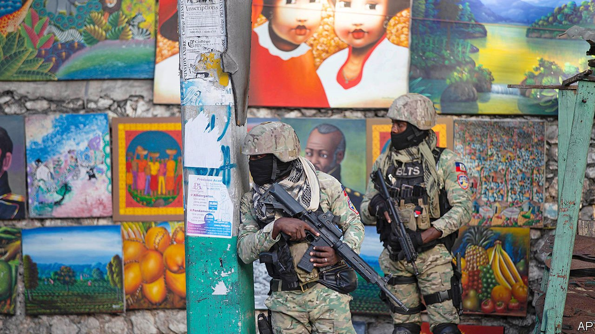

###### Après Moïse, le déluge?

# It is still unclear who murdered Haiti’s president 

##### Or what to do about it 

 

> Jul 15th 2021 

THE LAST time a president was murdered in Haiti, in 1915, troops from the United States occupied the Caribbean country for 19 years. They introduced racial-segregation laws, built infrastructure with forced labour and left a bloody legacy by stamping down on cacos, the insurgents who defied the occupation. Writing in the New Yorker in 2015, Edwidge Danticat, a Haitian-American novelist, described how her uncle recalled seeing marines kicking a man’s decapitated head around like a football, to scare the rebels in their area.

A week on from the murder, on July 7th, of Jovenel Moïse, Haiti’s increasingly autocratic president, much remains unclear. No one knows who ordered the hit, or why. And no one knows how the United States will react if its poor and chaotic neighbour once again slides into mayhem.


The Haitian authorities’ version of events is murky. They allege that a team of 28 mercenaries, mainly Colombians but also two Haitian-Americans, stormed the president’s house, riddling his body with 12 bullets. Colombian investigators say that some of their compatriots, who were paid around $3,000 a month each, did not know they were part of an assassination plot. It is unclear how the killers got past the president’s bodyguards, or why Mr Moïse’s head of security at the residence seems to have recently visited Colombia.

Conspiracy theories are rife. Léon Charles, Haiti’s chief of police, declared that Christian Emmanuel Sanon, a Haitian doctor who lives in Florida, was behind the attack. A report in the New York Times suggests that Mr Sanon had aspirations to become the head of a transitional government, but that plans for a coup or murder were never discussed.

Mr Moïse’s death has left a power vacuum. Haiti has no sitting parliament; the president had ruled by decree since January 2020. Three men are now jostling for control: Claude Joseph, the interim prime minister at the time of Mr Moïse’s death, who has declared he is in charge of the country and instituted martial law; Ariel Henry, who was prime minister-designate and due to be sworn in on July 7th; and Joseph Lambert, one of the ten remaining elected officials in the country.

In previous moments of crisis, foreign powers have swiftly intervened in Haiti. The United States got involved in 1994 to reinstate Jean-Bertrand Aristide, Haiti’s first democratically elected leader, who was ousted in a coup in 1991. (Mr Aristide claims that American troops were also involved in another coup to oust him in 2004.) Many Haitians accuse the United States of interfering in elections, including those in 2010-11 that brought to power Michel Martelly, a singer who anointed Mr Moïse, a former banana-plantation manager, as his successor.

Such meddling has tended to be unpopular. “All my life, foreign interventions have brought a lot of misery to Haiti,” says Sabine Lamour, a Haitian activist. So it surprised some when, soon after claiming the top job, Mr Joseph called for America to intervene to protect Haiti’s “infrastructure”. This may be a cynical move to consolidate his power. The United States and the UN initially recognised that he was in charge; the presence of American troops would reinforce that idea. But for now Joe Biden’s administration has declined to send any. On July 11th FBI agents were dispatched to help the Haitian police force work out who was behind the assassination. (One news report suggested that the FBI was investigating whether Mr Joseph was involved.)

It is impossible to know whether Haiti would be in a better position, now, had the United States always left it alone. Amy Wilentz, the author of two books on Haiti, says Americans have mostly involved themselves with “institution imitation”. “They may have built a palace of justice and put in place judges, but not a real justice system,” she argues.

After an earthquake in 2010 that killed perhaps 200,000 people, foreign governments and NGOs donated $10bn, about 150% of GDP at the time. About $1.2bn of that came from America. Since 2010 the United States has spent $312m on training and equipping the Haitian police, who are weaker than the many gangs that control parts of the country. It is trying to help them deal with kidnappings, which by one estimate rose by 50% in the first three months of this year.

The legacy of UN interventions in Haiti is mixed. In the 1990s the UN sent four missions to the country, all of which by its own admission failed to achieve their goals. Between 2004 and 2017 it returned, providing some stability after the ousting of Mr Aristide. But when the blue helmets withdrew, they were lambasted for having inadvertently introduced cholera, starting an outbreak that killed 10,000 Haitians. Other NGO workers were accused of sexually assaulting children and women.

Aid has undoubtedly given Haiti a boost in some areas. NGOS have helped build schools, hospitals and sewers. But their proliferation and vast budgets have reduced incentives for Haiti to develop its own institutions. The sheer volume of charitable cash has tempted corrupt bigwigs. Indeed, one source of anger against Mr Moïse was his alleged pilfering of money from PetroCaribe, a cheap Venezuelan oil scheme.

Many Haitians would welcome some foreign help to restore a semblance of security. More support could be given to counter gangs. On July 11th a delegation of American officials, including from the National Security Council, met the three men who claim to be in charge. But activists and intellectuals are adamant they do not want outside powers to back the same old, discredited political faces or to push Haiti into elections planned for September, for which the country is unlikely to be ready. Fritz Jean, a former prime minister, speaks for many when he says, “It is time to listen to the voices of Haitian people.” ■

