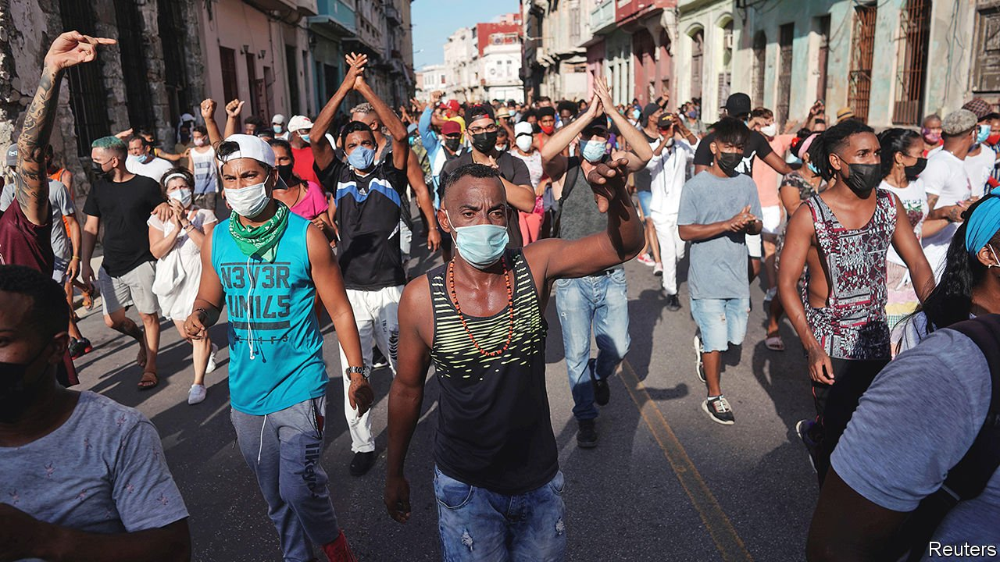

###### A revolt against the revolution

# The Cuban government cracks down on protesters 

##### The communist island has not seen such big displays of discontent for decades 

 

> Jul 15th 2021 

ON JULY 11TH thousands of protesters took to the streets spontaneously in more than 50 Cuban towns and cities. They had a long litany of grievances: recurring electricity shortages, empty grocery shops, a failing economy, a repressive government and an increasingly desperate situation regarding covid-19. In a display of discontent not seen on the communist island for perhaps six decades, people of all ages chanted and marched, some of them to the tune of clanging spoons and frying pans. They shouted “Patria y Vida!” (Fatherland and Life)—a riff on the revolutionary slogan “Patria o Muerte” (Fatherland or Death), and the name of a rap song which criticises the government—along with “Libertad!” (Freedom) and “Abajo la dictadura!” (Down with the dictatorship).

Although protests continue, by the next day cities were quieter as the police went from house to house, rounding up the demonstration leaders. Riot police spread out across cities, plainclothes officers took to the streets and pro-government mobs brandishing images of Fidel Castro were called in to chant revolutionary slogans and wave Cuban flags. Miguel Díaz-Canel, the , appeared on television to declare: “Cuba belongs to its revolutionaries.” Around 150 people have gone missing, and one protester has been killed. There are rumours that young men are being forcibly conscripted into the army.


The big question is how much staying power the protests will have. The coming weeks will show whether the regime's stock response of swatting down any signs of dissent will work again. The government has little leeway to buy social peace. Cuba has been badly hit by covid-19 and by a precipitous drop in tourism, on which it heavily depends. A lack of foreign currency with which to buy imports has led to  and blackouts. Under the administration of Donald Trump, the United States tightened sanctions on Cuba. These have added a little to the island’s longstanding economic troubles.

Cuba’s reluctance to buy foreign vaccines, born of a mix of autarky and a shortage of cash, means that only 16% of the population is fully inoculated.  are being developed, but have not yet been fully rolled out; meanwhile, pharmacies are short even of basics like aspirin. Whereas tourism has resumed in nearby places where covid-19 has receded, such as Jamaica and the Dominican Republic, Cuba is suffering from rising infections. Even the official data show the number of new cases doubling every seven days. In a video posted to Facebook, Lisveilys Echenique, who lives in the city of Ciego de Ávila, described how her brother spent 11 days battling covid-19 without treatment because he could get neither medicine nor a hospital bed. After he died, his corpse remained in her home for seven hours before an ambulance arrived.

The Cuban economy came close to collapse in the early 1990s, after the fall of the Soviet Union brought foreign aid to an abrupt halt. There were public protests then, too, which were quickly dispersed. But Cubans now have access to the internet and are adept at using it to mobilise. Videos of police violence and arbitrary arrests have been circulating rapidly in recent days. At one point in the afternoon of July 11th, as the protests reached their height, the authorities appeared to block all internet access. Some social-messaging sites have also been suspended.

But much as the government may wish to turn the internet off, it cannot afford to: the exorbitant access fees charged by the state telecoms monopoly are an important source of foreign exchange. The internet is also a vital conduit for remittances from Cubans abroad. Mobile data and Wi-Fi charges bring in perhaps $80m a month for the government, estimates Emilio Morales of Havana Consulting Group in Miami.

“The government has closed itself up like an oyster,” says José Jasán Nieves Cárdenas, editor of El Toque, a Cuban magazine mostly published online. “Instead of acknowledging that it has to come out and establish a dialogue with its people, it has chosen repression.” Tear gas and rubber bullets were used against crowds, although in some instances security officers were so outnumbered by protesters that they were forced to retreat. As things escalated, police cars were overturned and some dollar stores, symbols of the regime’s economic incompetence, were ransacked.

Mr Díaz-Canel blames Cuba’s troubles on the embargo imposed by the United States, as the government always does. He has ignored the complaints of the protesters, dismissing them as mercenaries, and offered excuses rather than plans for reform. After the president gave a speech on July 12th more protesters gathered outside the Capitol building in Havana. Other than stepping down, there is not much Mr Díaz-Canel could do to make amends to his people, says the owner of a small business. “You can’t cover the sun with one finger,” she says. Rumours are circulating that even members of the police are starting to defy their orders, as some think the protesters have a point.

Alfred Martínez Ramírez, a member of 27N, a group of activists, artists and intellectuals campaigning for greater freedom of expression, joined a protest outside the Ministry of Culture in November. Some 300 people were present, which at the time seemed a huge number. Cubans rarely protest, not least because unauthorised public gatherings are illegal. Seeing thousands of people on the streets of Havana and elsewhere in Cuba gives Mr Martínez Ramírez hope that his group is not alone, and that they may have even helped many others overcome their fear of dissent. “There has been an awakening,” he says.■

A version of this article was published online on July 13th 2021

