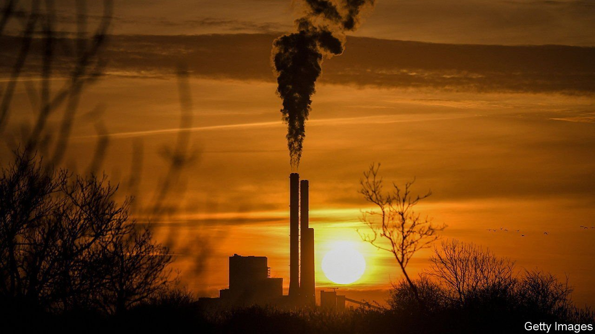
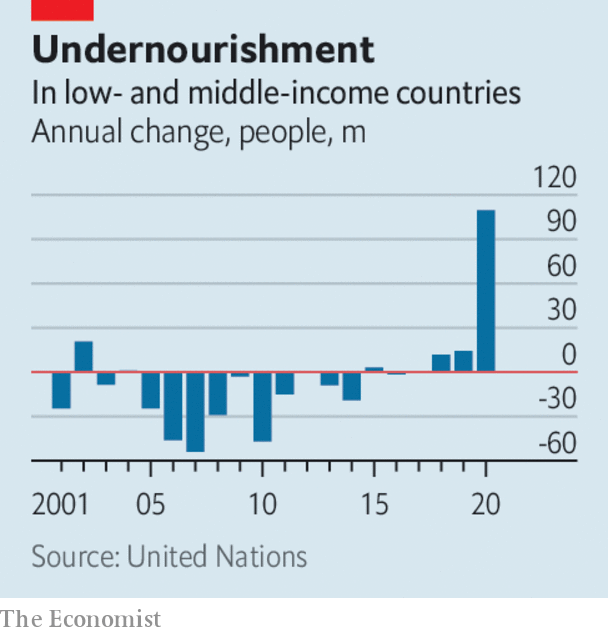

###### 

# Business this week 

#####  

 

> Jul 15th 2021 

The European Union unveiled ambitious goals to reduce greenhouse-gas emissions by 55% by 2030 (compared with 1990 levels) and to reach net zero by 2050. The plan sets out a range of policies to help meet the targets, but the main thrust is an expansion of the EU’s Emissions Trading Scheme, in which companies pay to pollute. It would also introduce a , in effect a tariff on goods from outside the EU that are not green-friendly. The announcement came days before China was expected to announce an emissions-trading scheme that will create the world’s largest carbon market.

Doing nicely


China’s economy expanded by 1.3% in the second quarter, compared with the previous three months, helped by growth in manufacturing, retail sales and investment. China’s exports, meanwhile, rose by 32% in June (in dollar terms) over June 2020. Although the rebound in trade reflects an easy comparison with the depths of the pandemic, it is much stronger than analysts had forecast.

America’s annual rate of  inflation hit 5.4% in June, another 13-year high.  have been driven up by higher energy costs, including for petrol, and also by demand for used cars. Prices for second-hand vehicles have accelerated as the production of new cars stalls amid a global shortage of chips.

The Bank of England scrapped the restrictions on banks’ dividend payouts and share buybacks that it imposed during the pandemic. The Federal Reserve has already removed similar curbs on most banks in America; the European Central Bank is expected to follow suit.

Meanwhile, the ECB gave the go-ahead for a pilot project for a digital version of the euro as an alternative to crypto currencies, such as bitcoin. In London police seized £180m-worth ($249m) of cryptocurrency linked to money-laundering and other nefarious activities. It was one of the biggest such seizures globally and came a few weeks after the city’s police confiscated £114m in cryptocurrency from other illicit gains.

The European Commission said it had put plans for a digital tax on hold. America has been lobbying hard for the proposal to be scrapped. Janet Yellen, America’s treasury secretary, suggested this week that the G20 agreement on a global minimum corporate tax of 15% depended on getting rid of “discriminatory” levies on digital companies.

 for the second quarter. Revenues dropped at Bank of America and Citigroup year on year; income from loans was down at both. Revenue also fell at JPMorgan Chase, but net profit doubled, to $11.9bn, as it released money set aside for loan losses that didn’t materialise. At Goldman Sachs revenue from asset management compensated for a drop in income from trading, by comparison with its gains from the market turmoil of a year ago.

 


The United Nations reported that efforts to end world hunger and malnutrition by 2030 were dealt a serious blow by covid-19. The prevalence of food insecurity has been rising slowly in recent years, but in 2020 an additional 320m people did not have regular access to food, as many as the increases for the previous five years combined. Last year also saw the biggest rise in undernourishment (food intake that is below the minimum needed) in two decades. The economic turmoil in 2020 that caused sharp rises in food prices has left 2.4bn people without adequate food.

Flipkart, India’s biggest e-commerce retailer, raised $3.6bn in its latest fundraising round, valuing it at $37.6bn as it reportedly prepares for a stockmarket listing. India’s army of middle-class online shoppers is growing fast.

REvil, a ransomware group operating in Russia, suddenly went offline. REvil has been behind a spate of recent cyberattacks on companies in America and elsewhere, demanding tens of millions of dollars in bitcoin payments to debug the computer networks it had infected. Its disappearance from the dark web came after Joe Biden warned Vladimir Putin that if Russia didn’t take any action, America would.

An industry ready to launch

Sir Richard Branson became the first among his cohort of  to take a flight to the edge of space. Sir Richard flew in the VSS Unity, a Virgin Galactic rocket plane, 85km above New Mexico before gliding down to land. Jeff Bezos is next, flying in one of his Blue Origin craft on July 20th.

Tech billionaires are not the only ones investing in futuristic transport. United Airlines struck a deal this week to buy electric planes being developed by Heart Aerospace, a Swedish startup, which will come into service in 2026 if they pass regulatory muster. The ES-19 aircraft will have a range of 250 miles (400km) and can carry 19 passengers.

