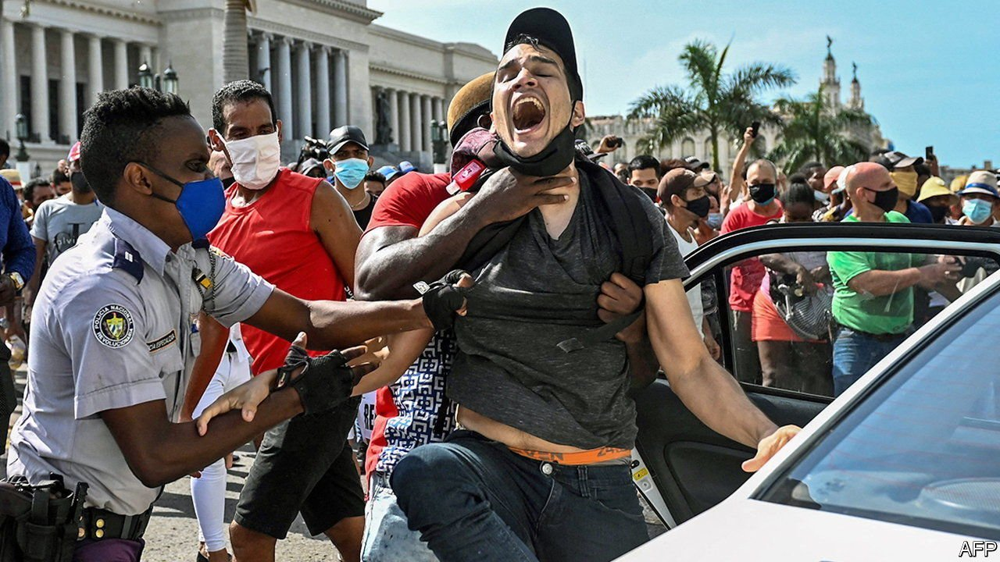
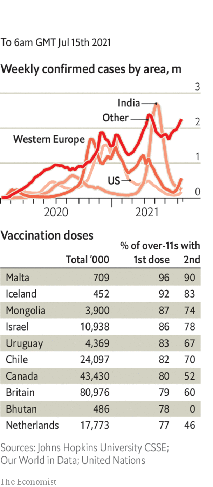

###### 

# Politics this week 

#####  

 

> Jul 15th 2021 

Thousands of demonstrators took to the streets all over . They have a long list of complaints, from the communist dictatorship’s inept handling of covid-19 to empty supermarket shelves and power cuts. Miguel Díaz-Canel, the president, decried the protests, the largest sign of popular revolt in six decades, and deployed riot police. Nearly 150 people have gone missing. Many of these are thought to have been arrested.

It remained unclear who was behind the murder last week of Jovenel Moïse, the president of . The national chief of police declared that a Haitian doctor who lives in Florida plotted the attack. More than a dozen former Colombian soldiers said to have been involved in the plot were paraded on Haitian television. Conspiracy theories abound, involving senior Haitian politicians. A power vacuum has been created; three men are vying for the top job.


In  scores of people were killed and hundreds of shops, factories and warehouses burnt in riots instigated by allies of Jacob Zuma, a former president who was jailed for refusing to appear before a commission investigating corruption during his term in office. The government has sent in the army to stop the worst violence since the end of apartheid in 1994.

With the country mired in an economic crisis, two of  Lebanon’s main power plants shut down, taking the entire national grid offline and leaving most Lebanese without electricity. The power plants unexpectedly found that their fuel supply had been cut off.

At least 92 people died when a covid-19 ward caught fire at a hospital in Iraq. It is the second such incident in three months.

France will end its 5,000-strong counter-terrorism operation in the Sahel in the first three months of 2022, President Emmanuel Macron said. The mission started in 2013 when jihadists were advancing on Bamako, the capital of Mali. Jihadists remain active throughout the region.

American prosecutors charged four Iranian intelligence agents with trying to kidnap a journalist based in New York who is critical of the regime in Tehran. The plotters, who are based in Iran, allegedly tried to lure Masih Alinejad to another country where they hoped to abduct her.

Chuck Schumer, the Democratic leader in the United States Senate, said his party had agreed on a  budget that proposes huge increases in spending on infrastructure, tackling climate change, health care and other issues.

Democratic members of the state legislature in  left the state to deny the Republicans a quorum for passing a bill on voting procedures that would, among other things, restrict access to postal ballots. The legislature’s Republicans passed a motion ordering officials to track and arrest the absent Democrats, who decamped to Washington.

Charlottesville quietly removed a statue of Robert E. Lee that had been the focus of a deadly protest in 2017. Four years ago, a first attempt by the college town in Virginia to take down the monument to the Confederate commander caused white supremacists to rally in its defence.

The number of people who died from drug overdoses in America soared by 30% last year, to 93,331, a record high. Experts blamed stresses related to the pandemic, as well as the closure of addiction-treatment centres during lockdown.

Boris Johnson, Britain’s prime minister, announced that no further prosecutions associated with the Troubles in , a wave of sectarian conflict that swept the province from the 1960s to 1998, would be allowed to proceed. That would allow a line to be drawn under the era, he said. Some of the outstanding cases related to actions taken by the army and police. Those who support the amnesty argue that attempts to prosecute members of the security forces had become politicised.

Vladimir Putin, Russia’s president, published a 5,000-word essay on the “historical unity” of Russians and Ukrainians. Russia-watchers worried that he might be planning to grab more Ukrainian territory.

A cameraman died after being beaten up by anti-gay protesters while covering an anti-gay march in Tbilisi, the capital of Georgia. More than 50 journalists were attacked. Threats were made to the city’s Pride event; it was cancelled.

Two weeks after he became the first prime minister in Sweden to lose a vote of confidence in parliament, Stefan Lofven was asked by the Speaker to form a new government because no one else could do so. Mr Lofven’s position is still uncertain; he is finding it hard to muster support for a budget that must pass later this year.

A state of emergency came into effect in Tokyo. Pandemic restrictions were reintroduced and will remain in place throughout . Restaurants and bars must shut early and may not serve alcohol. No commercial events may be held near the stadiums. All spectators have now been banned from Olympic stadiums in and close to Tokyo.

Coronavirus briefs

 


 recorded more than 50,000 new covid-19 infections on July 14th, the second-highest number (after Brazil) of any country. Cases have been rising rapidly and spreading throughout the archipelago. The government has ordered restaurants and places of worship to close in the worst-afflicted regions.

 after Emmanuel Macron announced that people who have not been jabbed will be barred from entering restaurants, cafés and shops and not allowed to travel on trains from August.

The British government confirmed that all remaining  on July 19th. Thanks to a successful vaccine roll-out, deaths from covid-19 are low, but rising as infections soar. London’s mayor said passengers will still have to wear masks on the city’s transport network.

