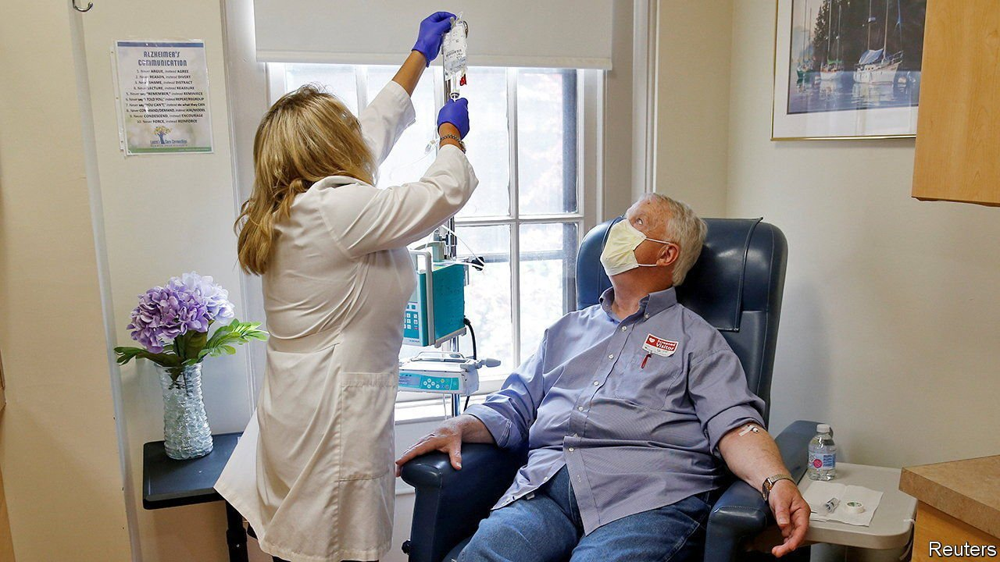

###### Blowing the inheritance

# Aduhelm may not cure Alzheimer’s, but it might help fix drug prices 

##### The controversial drug is so expensive that it has attracted the interest of Congress 

 

> Jul 15th 2021 

WHEN A LONG-AWAITED drug for Alzheimer’s was approved by the Food and Drug Administration (FDA) last month, controversy quickly followed. In November ten of 11 members of an FDA expert panel rejected the treatment, but it received accelerated approval anyway. Three panel members resigned in protest. It also has a large price tag: about $41,000 for year one and $56,000 for subsequent years. The unusual approval process and high cost has sparked a congressional investigation into the developer’s business practices. The treatment is also becoming the focus of new legislation which, if passed, would allow the government to negotiate drug prices for federal health-insurance plans.

About 6m Americans (one in nine old people) have Alzheimer’s disease, a form of dementia. Aducanumab, marketed as Aduhelm, successfully clears the brain of beta-amyloid, a protein that clumps between neurons and disrupts their functioning. Some researchers believe that this protein causes Alzheimer’s. Aduhelm is the first new drug for Alzheimer’s since 2003, so it will probably be popular despite its controversial approval. “There are so many people and their families who are suffering from this condition with no treatments, and that just leads to an understandably desperate situation,” says Meredith Rosenthal of Harvard University’s School of Public Health. “People are really willing to try anything, at almost any cost. But of course, that cost isn't just borne by the families, but by all of us.”


The cost is high, even for those with health insurance. Patients receive an intravenous infusion every four weeks at about $4,300 each for the average patient, totalling about $56,000 a year. Since dementia tends to hit older people, many patients will qualify for Medicare. The Centres for Medicare and Medicaid Services, the agency in charge of Medicare, has not decided if it will cover Aduhelm nationally yet. A decision is not likely until the spring. Until then, coverage will be determined by each of the 12 local jurisdictions.

If Aduhelm is included, Medicare will probably cover 80% of the price. Patients will need to pay the rest. That adds up to about $11,500 per year (about 40% of the median annual income of each Medicare beneficiary, according to the Kaiser Family Foundation, a health-research outfit). Since Aduhelm is not a cure, patients could pay for years. Most Medicare patients are protected by an annual out-of-pocket spending limit, but one in ten are not.

The high cost of this drug may raise premiums for everyone, says Tricia Neuman of the Kaiser Family Foundation. Ms Neuman and her colleague Juliette Cubanski estimate that if 500,000 Medicare patients receive Aduhelm, that could cost Medicare and its patients $29bn in one year (total Medicare spending for all doctor-administered drugs reached $37bn in 2019). And this estimate is probably conservative. Nearly 2m Medicare patients used an Alzheimer’s treatment in 2017, and Biogen, in an investors’ presentation, estimated that 1m-2m will use the drug. If 1m patients are treated, the cost could rise to $57bn.

That is why two committees in the House of Representatives, the Committee on Oversight and Reform and the Committee on Energy and Commerce, have launched an investigation into Aduhelm’s price. Drug pricing has been a political issue for years. HR3, a bill that would allow the Department of Health and Human Services to negotiate drug prices, passed the House of Representatives in 2019 and was reintroduced in April. Aduhelm, a triumph for the pharmaceutical industry, is now also the poster-child for this campaign. ■

