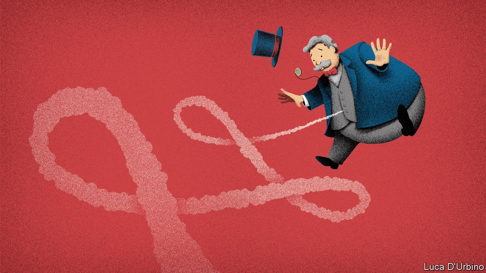

###### Anti-trust in me

# Can the federal bureaucracy resuscitate market dynamism in America? 

##### The Biden administration has plans for everything from non-compete clauses at McDonald’s to big-tech monopsonists 

 

> Jul 15th 2021 

TWO TRENDS in American capitalism in past decades are too stark to be ignored. The first is rising market concentration—a phenomenon observed in 75% of industries ranging from those that traffic in bodily fluids (kidney dialysis and blood-plasma donation centres) to those that traffic in data (broadband providers, credit-card companies, and the tech giants roaming Silicon Valley). The second trend is the declining share, up until the mid-2010s, of spoils going to the suppliers of labour. Whether these are unhealthy indicators has been hotly debated. Some argue that intense competition unleashed by globalisation and technological progress may destroy the least efficient firms, leaving only a small cadre of the most productive (the “winner take most” model). Others insist that it is a sure sign of market sclerosis.

On July 9th President Joe Biden indicated that he identifies fully with the critics. That was when he signed an executive order arguing that a lack of competition had been increasing prices for consumers and squashing wages for workers, and stating that the federal government would not stand for it. Casting himself as a latter-day Roosevelt (both Teddy and Franklin enjoyed a trust bust), Mr Biden vowed that the whole federal government would devote itself to “address over-concentration, monopolisation and unfair competition”. His order specified 72 initiatives for more than a dozen federal agencies to work on, alongside the creation of a new competition council made up of cabinet members and senior White House staff.


For this to have teeth, competition regulators would have to be more aggressive than usual in bringing cases, and judges more deferential to the newly expansive definition of antitrust action. Gauged by stockmarket movements on the day of Mr Biden’s executive orders, investors were undaunted. But analysts on a quarterly earning calls with Goldman Sachs were sufficiently perturbed to pepper David Solomon, the CEO, with questions about the possible effect on the .

The most consequential changes, if they materialise, would be to labour markets. One of the spicier debates among labour economists is over “monopsony power”, a rather ugly phrase meaning the degree to which concentration among the demanders of labour (otherwise known as firms) depresses the price paid for it (otherwise known as wages). The most irksome source of this are non-compete clauses, which prevent more than 36m workers from easily leaving their jobs for better-paying ones. These are prevalent among both highly paid and lowly paid workers, including, according to one study by the late Alan Krueger and Orley Ashenfelter, 58% of workers for low-wage franchises like McDonald’s and Jiffy Lube.

Mr Biden wants the Federal Trade Commission (FTC), which has broad but conservatively employed authority to limit anticompetitive behaviour, to ban or limit this practice. He also wants the FTC to end needless occupational licensing, onerous rules that turn some professions into glorified guilds. To be a certified interior designer in California, for instance, you must have more than six years of experience and pass an exam. The FTC has often issued advisory opinions to states contemplating these sorts of licensing requirements; Mr Biden is now urging it to intervene under its existing legal authority.

Most of the president’s other goals are more bite-sized. Mr Biden thinks, justifiably, that lack of competition among industry incumbents has led Americans to pay too much for things like off-patent drugs, hearing aids, internet connections, and journeys on trains and planes.

An equally consequential, if more arcane, debate is also raging within the legal academy over what justifies antitrust enforcement. Ever since its introduction by Robert Bork, a conservative legal scholar, the so-called consumer-welfare standard has dominated American jurisprudence. This holds that regulators and courts should mainly scrutinise the effects of corporate actions on prices paid by customers. Given that most big tech companies offer their services to consumers free, that standard would suggest little ability for regulators and state attorneys-general to contest their growing market share. Instead a more expansive definition of antitrust, sometimes called the neo-Brandeisian school after the ideas of the monopoly-hostile Supreme Court justice Louis Brandeis, is gaining ground.

“At that time, people were laughing at me,” says Barry Lynn, executive director of the Open Markets Institute and a longtime anti-monopoly agitator, about his testimony against the consumer-welfare standard in December 2017. Lina Khan, an affiliate of the Open Markets Institute for seven years, who wrote a law-review article making the case for antitrust action against Amazon while she was still a student at Yale, is now the head of the FTC. On her shoulders rests the fate of Mr Biden’s nascent competition-promoting agenda.

But it will also depend on whether judges are willing to accept more expansive antitrust action. So far the signs are not promising. In June a federal judge dismissed a complaint against Facebook filed by the FTC and 46 state governments arguing that the social-media giant had tried to stymie competition by buying Instagram and WhatsApp. However, Mr Lynn thinks that the judiciary can be brought round. “We’re going to get them into the 21st century. We’re going to get them out of Bork’s garage. Justices of the Supreme Court, judges in the US judiciary—these people don’t read! They just bask in the adoration of lesser people. Educating these people, it ain’t easy. But we will.” ■

