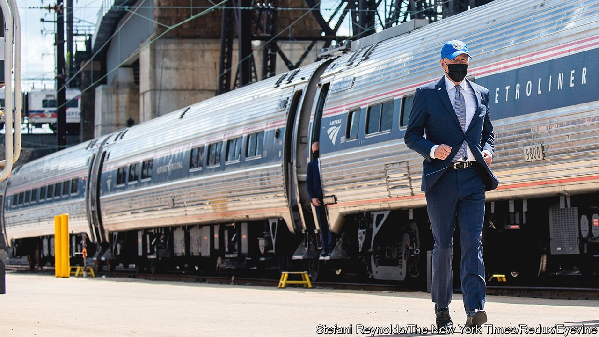

###### Infrastructure year

# Joe Biden’s agenda depends on steering two trains at once 

##### So far this has been more Buster Keaton than Lyndon Johnson 

 

> Jul 17th 2021 

“INFRASTRUCTURE WEEK” was one of the triter gags of the Trump era: like Samuel Beckett’s Godot, it was perennially promised and never arrived. President Joe Biden’s go at infrastructure investment has started to acquire a similar feeling of interminability, with fitful progress and no legislative text since he announced his plans more than three months ago. Fidgety Democrats vow serious progress before Congress decamps for its August recess. On July 13th Chuck Schumer, their Senate leader, announced the headline cost of the mammoth package being prepared: $3.5trn. Delivering it will require deft and perfectly executed legislative manoeuvres.

Back in April, Mr Biden packaged his infrastructure ambitions differently. There were to be two parts. One piece of legislation would be devoted to “hard” infrastructure—such as roads, bridges, broadband fibre, and water pipes—and climate: building rehabilitation, an electric-vehicle charging network and other necessary investments that the private sector was poorly placed to make. The second portion was to be “human infrastructure” (the concept has acquired a certain plasticity in Democratic messaging). The striking components of this package included an expanded child benefit, universal pre-school, paid family leave, and hefty subsidies for child care and community college. The hard and the soft parts would each cost about $2trn, and would be just about paid for (the White House employed some artful accounting) by raising taxes on wealthy Americans and businesses, especially multinationals.


But Washington specialises in the crushing of beautiful visions. Though Democrats hold the White House and both chambers of Congress, their narrow majorities mean they must stick together to pass legislation unilaterally, as with the president’s $1.9trn covid-19 stimulus bill, passed by reconciliation (a provision that allows budget bills to circumvent the de facto 60-vote threshold in the Senate). Since then, the moderate and progressive factions of the party have become more willing to exert their implicit veto powers. Mr Biden’s response is another two-part plan: a bipartisan bill focused on hard infrastructure, without much in the way of climate expenditures or compensating tax increases; and a reconciliation bill stuffed with everything else (the Big Bertha recently announced by Mr Schumer).

Because of the filibuster, a bipartisan bill, which moderate Democrats want, needs ten Republican votes in the Senate. The framework for such a compromise has already been agreed on, though its size—$579bn in new spending—is modest in comparison to the president’s stated ambitions. Hence the second part of the plan: stuffing the leftover policies into an immense omnibus bill. It will probably include vast climate-related expenditures, trillions for the safety-net and tweaks to the health-insurance regime, all balanced out by increased taxes that Republicans have declared a non-starter, and all passed through budget reconciliation.

Both legislative tracks are fraught with hazards and obstruction, but Mr Biden needs both trains to arrive simultaneously. Progressives are threatening to block the compromise measure unless the Senate passes the maximalist bill. And on this point they have an unlikely and powerful ally in Nancy Pelosi, the Democratic speaker of the House, who said: “Let me be really clear on this: We will not take up a bill in the House until the Senate passes the bipartisan bill and a reconciliation bill.” Republicans who agreed to the compromise legislation, meanwhile, fear looking like patsies. Lindsey Graham, a Republican senator from South Carolina, angrily broke away from the deal after news of the two-track approach emerged, telling a reporter that “There’s no way. You look like a fucking idiot now.”

Mr Biden’s initial attempt to drive both trains was more Buster Keaton than Lyndon Johnson. “If they don’t come, I’m not signing,” he threatened. That nearly killed the compromise deal entirely; Mr Biden walked back those words, admitting that “my comments also created the impression that I was issuing a veto threat on the very plan I had just agreed to, which was certainly not my intent,” He then promised to sign an unpaired bill if it were the only one to pass the House and Senate.

For now the plans remain abstract. No legislative text has yet emerged from the bipartisan framework agreed to by the president and a contingent of senators. A separate surface-transport bill passed by the House, costing $715bn, may give the Senate a starting point—though despite spending on hard rather than soft infrastructure, and earmarks to sweeten the deal for Republicans, only two members of the opposition actually voted for it.

Announcing that $3.5trn headline figure of a reconciliation bill is only the first in a sequence of technical legislative manoeuvres. “Reconciliation instructions” on total spending must be agreed and disseminated to the various committees. Europeans will not be surprised to learn that trains, literal and metaphorical, run slow in America. The lengthy parliamentary procedure may not yield an actual package until the autumn.

This tortuous, incremental procedure may give Mr Biden flashbacks: his presidency is starting to resemble Barack Obama’s. Momentum from passing a large, hasty stimulus package is grinding to a halt as partisanship places obstacles on the track. The main achievement of Mr Obama’s day, the Affordable Care Act, took more than a year of shunting to and fro. A landmark climate-change bill, meanwhile, went down to defeat. Perhaps one train will arrive many months from now. But that would still be shy of Biden’s huge policy ambitions when he came to office. ■

For more coverage of Joe Biden’s presidency, visit our dedicated 

