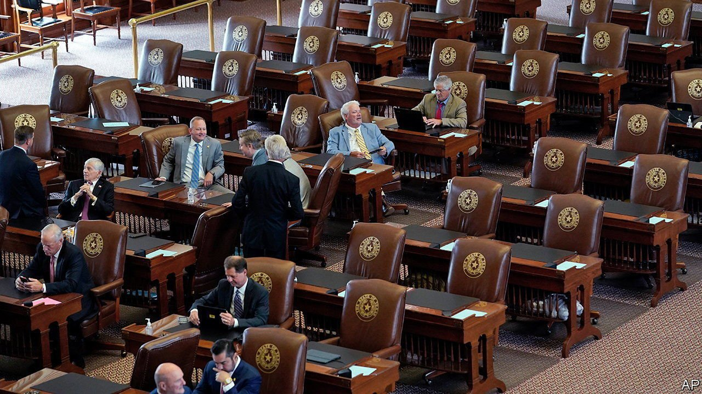

###### Texodus

# Texas Democrats suspend democracy in the name of upholding it 

##### Weighing one kind of norm-breaking against another 

 

> Jul 17th 2021 

STATE REPRESENTATIVE Armando Walle, a Democrat from Houston, brought an unusually big suitcase when he travelled to Washington, DC, this week. For several months Democrats in the Texas legislature have been fighting an uphill battle against an “election integrity” bill touted by Republicans, including Governor Greg Abbott. The flight of the Democratic caucus to the capital temporarily halts a measure that would have been controversial at any time. Now, when so many Republicans are still repeating the former president’s lie that the last election was fraudulent, the struggle has assumed Texan proportions.

In May, on the final day of this year’s regular legislative session, Democrats walked out of the Texas House, denying Republicans the quorum they needed to pass the bill, or any other (the Texas House has a rule stating that two-thirds of members need to be present for the chamber to pass laws). Mr Abbott responded by vowing to summon the legislators back for a special session to tackle the issue, and to veto funding for the legislative branch of state government in the meantime. He followed through, calling legislators back to Austin for a special session which began July 8th, triggering the events that led to Democratic lawmakers leaving the state by private planes, and could, perhaps, end with an outright constitutional crisis in Texas.


Republicans control both chambers of the state legislature by healthy margins. If Congress remains unmoved by the pleas of the refugees to pass a new federal voting law, the Democratic state lawmakers will soon find themselves in an awkward limbo, counting down the days until the special session ends on August 7th, with no clear plan after that point. “We are living on borrowed time,” a group of Democratic leaders said in a statement.

Meanwhile, in Austin, Republicans are fuming. “As soon as they come back in the state of Texas, they will be arrested,” Mr Abbott declared on a local news station (thereby rather undermining his claim to be upholding democratic standards). “They will be cabined inside the Texas Capitol until they get their job done.” He also vowed to call as many special sessions as necessary until the end of next year to ensure that the legislation is passed.

Stopping the state legislature from functioning in the name of saving democracy puts Mr Walle and his Democratic colleagues on tricky ground. There is precedent for quorom-breaking flights, but breaking one norm to save another one requires a weighing of relative damage. The Democrats argue, fairly, that the Republican bill is motivated by the Trump-boosted myth about a stolen election and, perhaps less fairly, that Republicans cannot win Texas without suppressing the votes of non-white Texans, who lean Democratic. That the first version of the elections bill targeted early voting on Sundays, when many African-Americans go to the polling station after church, was the tell.

The current version of the bill is better. A couple of provisions would bar innovations that Houston’s Harris County pioneered last year (such as 24-hour and drive-through voting). These proved popular and worked well, but banning them would be failing to encourage voting rather than suppressing it. However the bill also seeks to expand the power of partisan poll watchers, which could facilitate voter harassment and intimidation. In the 2020 election some local Republican officials tried to recruit poll watchers to volunteer in heavily black and Hispanic precincts.

“I’m OK having a battle of ideas and losing; that happens to me, as a Democrat, all the time,” says Diego Bernal, a Democrat representing San Antonio. “This is about rigging the system to produce a certain outcome.” This view is so widely held by Texas Democrats that they will happily take a stance that looks doomed. “We live on these ideals of freedom—well, not everybody was free in this country when it was created,” says Mr Walle. “Not everybody had the right to vote. We had a civil war; we had Reconstruction; we had Jim Crow, we had state-sanctioned discrimination.” His grandfather, born in 1930, lived through some of those experiences, and is now, at age 91, still a Texas voter. Hence the big suitcase. ■

For more coverage of Joe Biden’s presidency, visit our dedicated 

