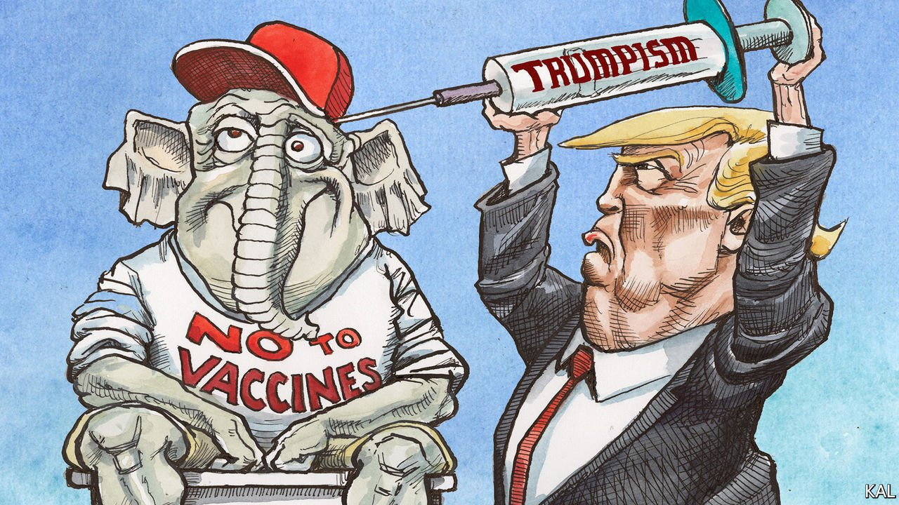

###### Lexington

# The Republican anti-vax delusion 

##### America’s vaccination programme is stalling. Populist conservatives are to blame 

 

> Jul 17th 2021 

IN EARLY MAY, with the Food and Drug Administration expected to approve the first covid-19 vaccine for teens any day, Michelle Fiscus found herself fielding questions from Tennessee vaccine dispensers on what this would mean in practice. Could 12- to 15-year-olds be vaccinated without parental consent, for example? Dr Fiscus, the state official in charge of immunisations, sent back the official legal advice on that. Referring to a 34-year-old ruling of the Tennessean Supreme Court, it noted that any sensible 14-year-old could request a vaccine of their own accord. What happened next, according to Dr Fiscus, “can only be described as bizarre”.

Her memo was shared on social media, seized on by angry conservatives and the Tennessee Department of Health duly accused of machinating to destroy families and subvert children. Scenting an opportunity, Tennessee’s Republican legislature summoned the state’s public-health officials to explain why they were “targeting” the young and innocent in this “reprehensible” way. One lawmaker demanded the health department be disbanded.


The department vowed to try less hard to vaccinate Tennesseans against covid-19 and other diseases. According to reports and internal emails shown to Lexington by Dr Fiscus, this has involved ending all vaccine outreach to teens. Any Tennessean adolescent who has received a first covid jab is no longer being sent a reminder to show up for the second; the department has stopped sending information about immunisations—against measles and meningitis as well as covid-19—to schools. This week Dr Fiscus was asked to resign. When the veteran paediatrician refused, she was fired.

America has a long history of anti-vax conspiracy theories. But the vaccine denialism that has gripped the Republican Party in Tennessee and everywhere is unprecedented. Past anti-vax movements have been disparate, fringe and, at least on an individual basis, responsive to patient dissuasion. Their adherents have included rich Californian suburban moms, gulled by misinformation about the risks of immunising babies, and poor African-Americans, with a part-justified suspicion of the medical profession. The results, by and large, have been small measles outbreaks and a marginal contribution to black Americans’ poor health.

Anti-covid vax sentiment on the right, by contrast, is fuelled by the country’s deepest divisions and the conservative entrepreneurs, in media and politics, who aggravate them. It explains why America’s vaccination rate has slowed in recent weeks, despite the availability of vaccines, an uptick in infections and deaths, and the fact that a third of adults have not received a first dose. Surveys suggest this large minority is overwhelmingly Republican. It represents half the party’s voters, predictably dominated by its most pessimistic and conspiracy-prone groups, white evangelicals and rural folk: the Trumpian base.

The problem looks even worse—politically, economically and health-wise—where such voters are concentrated. Vaccination rates are lowest wherever Donald Trump romped to victory last November. In Tennessee, where he won 61% of the vote, 43% have had a first dose. In Ohio, a more divided state with a pragmatic governor in Mike DeWine, it is a slightly more hopeful 48%. But in the most conservative Ohioan counties, the rate plummets. In Holmes County where the former president won 83% of the vote, 15% of people have had a first dose. The chances of succumbing to the virus in such places is correspondingly high; 99% of America’s recent covid-19 fatalities had not been vaccinated.

It is tempting to see this calamity as a predictable development in the politicisation of American identity, whether concerning race, sexuality or attitudes to health care. Yet it was not inevitable. The one thing Mr Trump got impressively right in his handling of the pandemic was his early investment in the vaccines his voters now consider to be unnecessary or part of a Democratic plot to spy on their innards. Poisoning the minds and jeopardising the bodies of so many Republican voters has taken a concerted campaign.

Mr Trump is chiefly responsible for it. Analysis by Shana Gadarian, a political scientist, suggests scepticism about covid-19 vaccines is largely a consequence of his efforts to play down the virus and mitigation measures such as mask-wearing. As so often with Mr Trump, it was an approach that mingled conservative ideology with demagoguery and personal strangeness. Conservatives prize freedom of choice over the common good; demagogues rubbish expert advice in order to propagate their own reality; and Mr Trump, a conservative demogogue but also a lifelong conspiracy theorist, probably believed some of his own misinformation.

Just a small prick

He was once a noted anti-vaxxer—which may explain why he did not publicise his own covid jab until weeks after it took place. By thus minimising his role in the vaccinations he made it easier for like-minded entrepreneurs, such as Tucker Carlson, to denigrate and blame the jabs —one of the biggest successes of Republican government in years—on Joe Biden. Fox News’s biggest star calls a Biden administration effort to step up local vaccination campaigns “the greatest scandal in my lifetime.”

This extreme politicisation has encouraged vaccine-hesitant Republicans to dig in. To be conservative is now to a great degree to be against covid-19 vaccination. And interviews with senior officials in Ohio and Tennessee (including Mr DeWine, who recently completed a statewide tour of vaccine centres) suggested there is little confidence that this can be reversed.

Some public-health experts wondered whether the accelerating Delta variant might tip the balance. But it seems unlikely. Tennessee, like other states, has already seen so much death. “It is a mystery to me why watching your loved ones die of an infectious disease that we can easily prevent doesn’t move more people to reconsider,” said Dr Fiscus, revealing, yet again, the insidious pro-life sentiment that got her fired. ■

For more coverage of Joe Biden’s presidency, visit our dedicated 

